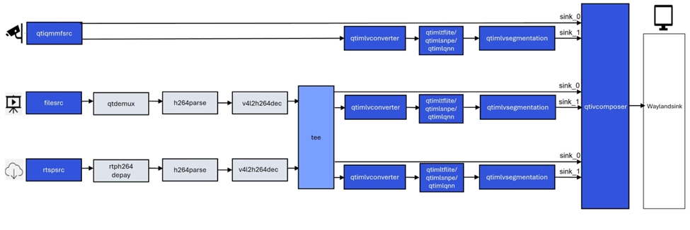

import Tabs from '@theme/Tabs';
import TabItem from '@theme/TabItem';

<a id="setupdev"></a>
# Set up your device

RUBIK Pi 3 comes preloaded with software, allowing for quick device setup. You can seamlessly configure your RUBIK Pi 3 using a host computer running Ubuntu, Windows(®), or macOS(®).

:::note
Install the latest Ubuntu 24.04 operating system on your RUBIK Pi 3 based on the information provided in the [Update software](4.update-software.md) section.
:::

## Power on the device

Connect a 12V 3A Type-C power adapter, then perform one of the following operations:

* Press and hold the power button for two seconds until the green LED blinks once.

* Plug in a USB Type-C to USB Type-A or a Type-C cable to establish an ADB connection and flash the software.

:::note

RUBIK Pi 3 supports Power Delivery (PD) 3.0 power input. A Type-C **12V 3A** power adapter compliant with **PD 3.0** is recommended for input power.
The power indicator LED near the power port will turn on if the power adapter meets requirements and power negotiation succeeds. If the adapter does not meet requirements, the LED will remain off and the device will not boot.
:::
Board versions v02 and later support automatic power-on after the power adapter is connected.

If the blue LED on the board is constantly lit, it indicates that the power button was pressed for too long, and the board is in fastboot mode.

To exit fastboot mode, use one of the following methods:

1. Press **Enter** in the serial terminal.

2. On the host, enter the `fastboot reboot` command.

3. Unplug the power, and then restart the device.

<a id="setUART"></a>
## Set up the debug UART

The debug UART displays diagnostic messages and provides access to the device via a UART shell.

1. Connect a Micro-USB cable to the Micro-USB port on your RUBIK Pi 3.


2. Connect the other end of the Micro-USB cable to the host.
   Follow one of the following instructions based on the host operating system.

<Tabs>
<TabItem value="Ubuntuhost" label="Ubuntu host">

1. Run the following commands to install minicom:

   ```shell
   sudo apt update
   sudo apt install minicom
   ```

2. Run the following command to check the USB port:

   ```shell
   ls /dev/ttyACM*
   ```

   Sample output

   ```shell
   /dev/ttyACM0
   ```

3. Run the following command to enable debug UART.

   ```shell
   sudo minicom -D <serial_port>
   ```

Sample command: `sudo minicom -D /dev/ttyACM0`

4. Open the debug UART and press **Enter** to bring up the authentication prompt.

5. Log in to the UART console and follow the prompts to reset the password.

    * Account: `ubuntu`

    * Password: `ubuntu`

:::tip

 If you do not see the authentication console as expected, please check the USB connection. If necessary, disconnect and reconnect the Micro USB cable.
::: 
</TabItem>
<TabItem value="winhost" label="Windows host">

1. Download [PuTTY](https://www.putty.org/) for your Windows host. Make sure you select the correct version (32-bit or 64-bit).

2. Run the installation wizard and follow the prompts.

3. After installation, open the PuTTY application from the list of installed programs in the **Start** menu, or search for it in the search bar on the taskbar.

4. In the PuTTY Configuration dialog box, perform the following actions:

   1. Select Serial.

   2. Specify the serial line based on the UART port detected in Windows Device Manager.

   :::note
   
   If the UART port is not detected, download the driver and update it using Windows Device Manager:
   
   * On x86 systems: [USB to UART serial driver](https://ftdichip.com/wp-content/uploads/2023/09/CDM-v2.12.36.4-WHQL-Certified.zip).
   
   * On Arm(®) systems: Visit https://oemdrivers.com/usb-ft232r-usb-uart-arm64. Under **Drivers**, click **FTDI CDM VCP Drivers**.
   :::

   3. Set the baud rate to 115200.

   4. Click **Open** to start the PuTTY session.

    

5. Open the serial device and press **Enter** to bring up the authentication prompt.

6. Log in to the UART console and follow the prompts to reset the password.

    * Account: `ubuntu`

    * Password: `ubuntu`

:::tip

 If you do not see the authentication console as expected, please check the USB connection. If necessary, disconnect and reconnect the Micro USB cable.
:::
</TabItem>
<TabItem value="machost" label="macOS host">

1. Run the following command to check the serial device connected to the macOS host.

   ```shell
   ls /dev/cu.*
   ```

2. Find your device in the list of serial devices.

    

3. Run the following command to open the serial device.

    ```shell
    screen <serial_device_node> <baud_rate>
    ```

    :::note

    * Replace `<serial_device_node>` with the device node name.

    * Replace `<baud_rate>` with an appropriate baud rate.
    :::

Sample command: `ceteam@Qualcomms-MacBook-Pro ~ % screen /dev/cu.usbserial-DM03SDQQ 115200`

4. Open the serial device and press **Enter** to bring up the authentication prompt.

5. Log in to the UART console and follow the prompts to reset the password.

    * Account: `ubuntu`

    * Password: `ubuntu`

:::tip

 If you do not see the authentication console as expected, please check the USB connection. If necessary, disconnect and reconnect the Micro USB cable.
::: 
</TabItem>
</Tabs>

## Verify the software version

Run the following command in the device shell to verify the Ubuntu 24.04 version:

```shell
 cat /etc/os-release 
```

The Ubuntu version is output:

```json
NAME="Ubuntu"
VERSION_ID="24.04"
VERSION="24.04.2 LTS (Noble Numbat)"
VERSION_CODENAME=noble
ID=ubuntu
ID_LIKE=debian
HOME_URL="https://www.ubuntu.com/"
SUPPORT_URL="https://help.ubuntu.com/"
BUG_REPORT_URL="https://bugs.launchpad.net/ubuntu/"
PRIVACY_POLICY_URL="https://www.ubuntu.com/legal/terms-and-policies/privacy-policy"
UBUNTU_CODENAME=noble
LOGO=ubuntu-logo
```

<a id="conNET"></a>
## Connect to the network

Use one of the following methods to establish an Internet connection and obtain the device's IP address.

<Tabs>
   <TabItem value="ETH" label="Use an Ethernet connection">

1. Connect one end of an Ethernet cable to the Ethernet port (RJ45) on your RUBIK Pi 3, and the other end to the network router.


2. After establishing the connection, run the following command on the UART serial console to obtain the IP address:

    ```shell
    ip addr
    ```

    
  </TabItem>
  <TabItem value="WiFi" label="Use a Wi-Fi connection">

The device is running in Station mode for Wi-Fi. When the device boots up, it initializes the Wi-Fi host driver and performs network management authentication. Users can establish a wireless connection using the nmcli command-line tool.

1. Run the following command to connect to the wireless access point (Wi-Fi router):

   ```shell
   nmcli dev wifi connect <WiFi-SSID> password <WiFi-password>
   ```

    Example

    ```
    nmcli dev wifi connect RUBIKPiWiFi password 1234567890
    ```
    ```
    Device 'wlan0' successfully activated with 'd7b990bd-3b77-4b13-b239-b706553abaf8'.
    ```

2. Run the following command to verify the connection and device status:

      ```shell
      nmcli -p device
      ```

    

3. Run the following command to verify the WLAN connection status and IP address.

    ```shell
    ip addr
     ```

     

4. To ensure the connection is active, perform a ping operation to a website such as that of RUBIK Pi:

     ```shell
    ping rubikpi.ai
     ```
 </TabItem>
</Tabs>

## Connect to SSH

Secure Shell (SSH) is used for secure file transfer between the host and RUBIK Pi.

Before connecting to SSH, ensure that the network connection is established.

1. To find the RUBIK Pi's IP address based on the network connection type, run the following command in the UART console:

   ```shell
   ip addr
   ```

2. Run the following command from the host to establish an SSH connection with the device. Use the IP address obtained in step 1.

   ```shell
   ssh <user name>@ip-address
   ```

    Example:
    ```
    ssh ubuntu@192.168.0.222
    ```

3. To connect to SSH, enter the user's password when prompted.

:::note

Ensure that the host is connected to the same Wi-Fi access point as the device.
:::

<a id="conHDMI"></a>
## Connect an HDMI display

To use an HDMI display and view the Ubuntu 24.04 desktop display and output of sample applications, follow the steps below:

1. Connect one end of the HDMI cable to the HDMI port on RUBIK Pi 3.

2. Connect the other end of the HDMI cable to the display.

This allows you to view the Ubuntu 24.04 desktop display and the output of the sample applications on the connected display.


Power on the device and check the HDMI display.

 