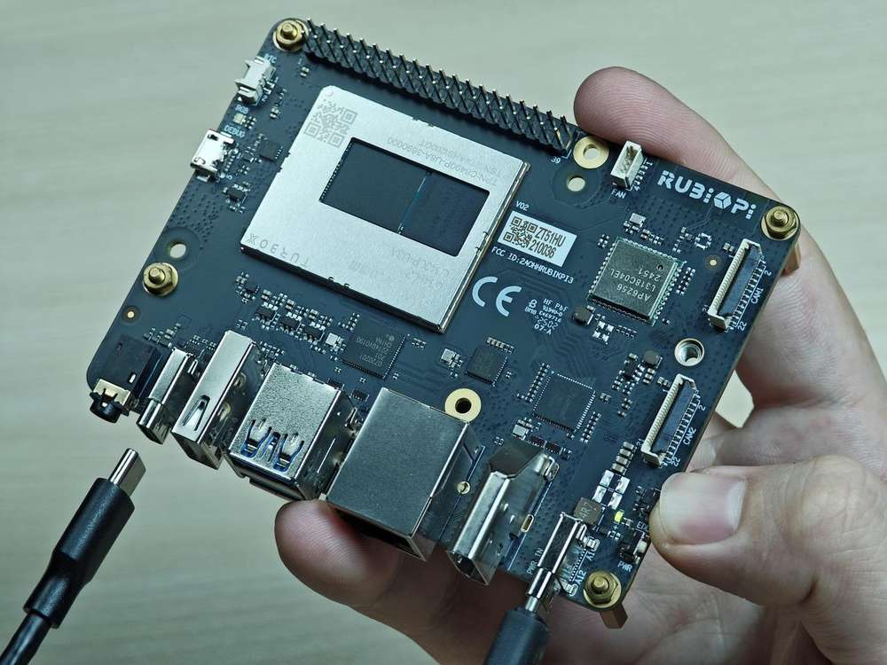

import Tabs from '@theme/Tabs';
import TabItem from '@theme/TabItem';

# Quick Start

## Get started with RUBIK Pi 3

This quick start guide helps you set up your RUBIK Pi 3 to explore and use end-to-end multimedia and AI applications in an Ubuntu 24.04-based environment. Additionally, this guide provides instructions on how to establish communication with hosts running Linux, Windows(®), or macOS(®).

RUBIK Pi 3 is developed based on the Qualcomm QCS6490 processor, which features the Qualcomm® Kryo™ 670 CPU and the Qualcomm® Hexagon™ Processor with fused AI-accelerator architecture. The processor provides exceptional AI performance of 12 TOPS and offers the capability for various machine learning and AI application scenarios.

RUBIK Pi 3 is designed with a wide range of interfaces and functions, such as USB, camera, DisplayPort, HDMI, Ethernet, 3.5mm headphone jack, Wi-Fi, Bluetooth, M.2 connector, fan, RTC, and 40-pin LS connector. These features cater to diverse development needs while facilitating rapid development and efficient debugging.&#x20;

RUBIK Pi 3 is compatible with various systems, such as Qualcomm Linux, Debian 13, Android 13, and Canonical Ubuntu for Qualcomm Platforms, providing developers with the flexibility to meet their specific application needs.


<Tabs>
<TabItem value="packaging" label="Packaging">


* RUBIK Pi 3

* RUBIK Pi sticker

* Quick Start Guide
</TabItem>
<TabItem value="Intro" label="Introduction to the board">


</TabItem>
<TabItem value="typflow" label="Typical workflow">


| Task                | Operation                                                                 |
|---------------------|--------------------------------------------------------------------------|
| Set Up the Device   | <p>1. Set up the debug UART.</p><p>2. Verify the Ubuntu 24.04 version.</p><p>3. Connect to the network, connect to SSH, and connect an HDMI display.</p> |
| Run Demo Applications | Run multimedia and AI demo applications.                                |
| Update Software     | <p>1. Download the image.</p><p>2. Put the device into Emergency Download (EDL) mode.</p><p>3. Configure Universal Flash Storage (UFS) and flash the Configuration Data Table (CDT).</p><p>4. Flash using the Qualcomm Download (QDL) tool.</p> |
</TabItem>
<TabItem value="accessory" label="List of supported accessories">

The following accessories have been verified to work normally with RUBIK Pi 3:

* [Raspberry Pi Active Cooler](https://www.raspberrypi.com/products/active-cooler/)

* [Raspberry Pi High Quality Camera（IMX477/M12 Mount）](https://www.raspberrypi.com/products/raspberry-pi-high-quality-camera/)

* [Raspberry Pi Camera Module 2 (IMX219)](https://www.raspberrypi.com/products/camera-module-v2/)

* [Sense HAT](https://www.raspberrypi.com/products/sense-hat/)

* [Raspberry Pi 45W USB-C Power Supply](https://www.raspberrypi.com/products/45w-power-supply/)

* [Raspberry Pi 27W USB-C Power Supply](https://www.raspberrypi.com/products/27w-power-supply/)
</TabItem>
</Tabs>

<a id="setupdev"></a>
## Set up your device

RUBIK Pi 3 comes preloaded with software, allowing for quick device setup. You can seamlessly configure your RUBIK Pi 3 using a host computer running Ubuntu, Windows(®), or macOS(®).

:::note
Install the latest Ubuntu 24.04 operating system on your RUBIK Pi 3 based on the information provided in the [Update software](./1.Quick%20Start.md#updateSW) section.
:::

### Power on the device

&#x20;Connect a 12V 3A Type-C power adapter, then perform one of the following operations:

* Press and hold the power button for two seconds until the green LED blinks once.

* Plug in a USB Type-C to USB Type-A or a Type-C cable to establish an ADB connection and flash the software.

:::note

RUBIK Pi 3 supports Power Delivery (PD) 3.0 power input. A Type-C **12V 3A** power adapter compliant with **PD 3.0** is recommended for input power.
The power indicator LED near the power port will turn on if the power adapter meets requirements and power negotiation succeeds. If the adapter does not meet requirements, the LED will remain off and the device will not boot.
:::
Board versions v02 and later support automatic power-on after the power adapter is connected.

If the blue LED on the board is constantly lit, it indicates that the power button was pressed for too long, and the board is in fastboot mode.

To exit fastboot mode, use one of the following methods:

1. Press **Enter** in the serial terminal.

2. On the host, enter the `fastboot reboot` command.

3. Unplug the power, and then restart the device.

<a id="setUART"></a>
### Set up the debug UART

The debug UART displays diagnostic messages and provides access to the device via a UART shell.

1. Connect a Micro-USB cable to the Micro-USB port on your RUBIK Pi 3.


2. Connect the other end of the Micro-USB cable to the host.
   Follow one of the following instructions based on the host operating system.

<Tabs>
<TabItem value="Ubuntuhost" label="Ubuntu host">

1. Run the following commands to install minicom:&#x20;

   ```shell
   sudo apt update
   sudo apt install minicom
   ```

2. Run the following command to check the USB port:

   ```shell
   ls /dev/ttyACM*
   ```

   Sample output

   ```shell
   /dev/ttyACM0
   ```

3. Run the following command to enable debug UART.

   ```shell
   sudo minicom -D <serial_port>
   ```

Sample command: `sudo minicom -D /dev/ttyACM0`

4. Open the debug UART and press **Enter** to bring up the authentication prompt.

5. Log in to the UART console and follow the prompts to reset the password.

    * Account: `ubuntu`

    * Password: `ubuntu`

:::tip

 If you do not see the authentication console as expected, please check the USB connection. If necessary, disconnect and reconnect the Micro USB cable.
::: 
</TabItem>
<TabItem value="winhost" label="Windows host">

1. Download [PuTTY](https://www.putty.org/) for your Windows host. Make sure you select the correct version (32-bit or 64-bit).

2. Run the installation wizard and follow the prompts.

3. After installation, open the PuTTY application from the list of installed programs in the **Start** menu, or search for it in the search bar on the taskbar.

4. In the PuTTY Configuration dialog box, perform the following actions:

   1. Select Serial.

   2. Specify the serial line based on the UART port detected in Windows Device Manager.

   :::note
   
   If the UART port is not detected, download the driver and update it using Windows Device Manager:
   
   * On x86 systems: [USB to UART serial driver](https://ftdichip.com/wp-content/uploads/2023/09/CDM-v2.12.36.4-WHQL-Certified.zip).
   
   * On Arm(®) systems: Visit https://oemdrivers.com/usb-ft232r-usb-uart-arm64. Under **Drivers**, click **FTDI CDM VCP Drivers**.
   :::

   3. Set the baud rate to 115200.

   4. Click **Open** to start the PuTTY session.

    

5. Open the serial device and press **Enter** to bring up the authentication prompt.

6. Log in to the UART console and follow the prompts to reset the password.

    * Account: `ubuntu`

    * Password: `ubuntu`

:::tip

 If you do not see the authentication console as expected, please check the USB connection. If necessary, disconnect and reconnect the Micro USB cable.
:::
</TabItem>
<TabItem value="machost" label="macOS host">

1. Run the following command to check the serial device connected to the macOS host.

   ```shell
   ls /dev/cu.*
   ```

2. Find your device in the list of serial devices.

    

3. Run the following command to open the serial device.

    ```shell
    screen <serial_device_node> <baud_rate>
    ```

    :::note

    * Replace `<serial_device_node>` with the device node name.

    * Replace `<baud_rate>` with an appropriate baud rate.
    :::

Sample command: `ceteam@Qualcomms-MacBook-Pro ~ % screen /dev/cu.usbserial-DM03SDQQ 115200`

4. Open the serial device and press **Enter** to bring up the authentication prompt.

5. Log in to the UART console and follow the prompts to reset the password.

    * Account: `ubuntu`

    * Password: `ubuntu`

:::tip

 If you do not see the authentication console as expected, please check the USB connection. If necessary, disconnect and reconnect the Micro USB cable.
::: 
</TabItem>
</Tabs>
### Verify the software version

Run the following command in the device shell to verify the Ubuntu 24.04 version:

```shell
 cat /etc/os-release 
```

The Ubuntu version is output:

```json
NAME="Ubuntu"
VERSION_ID="24.04"
VERSION="24.04.2 LTS (Noble Numbat)"
VERSION_CODENAME=noble
ID=ubuntu
ID_LIKE=debian
HOME_URL="https://www.ubuntu.com/"
SUPPORT_URL="https://help.ubuntu.com/"
BUG_REPORT_URL="https://bugs.launchpad.net/ubuntu/"
PRIVACY_POLICY_URL="https://www.ubuntu.com/legal/terms-and-policies/privacy-policy"
UBUNTU_CODENAME=noble
LOGO=ubuntu-logo
```

<a id="conNET"></a>
### Connect to the network

Use one of the following methods to establish an Internet connection and obtain the device's IP address.

<Tabs>
   <TabItem value="ETH" label="Use an Ethernet connection">

1. Connect one end of an Ethernet cable to the Ethernet port (RJ45) on your RUBIK Pi 3, and the other end to the network router.


2. After establishing the connection, run the following command on the UART serial console to obtain the IP address:

    ```shell
    ip addr
    ```

    
  </TabItem>
  <TabItem value="WiFi" label="Use a Wi-Fi connection">

The device is running in Station mode for Wi-Fi. When the device boots up, it initializes the Wi-Fi host driver and performs network management authentication. Users can establish a wireless connection using the nmcli command-line tool.

1. Run the following command to connect to the wireless access point (Wi-Fi router):

   ```shell
   nmcli dev wifi connect <WiFi-SSID> password <WiFi-password>
   ```

    Example

    ```
    nmcli dev wifi connect RUBIKPiWiFi password 1234567890
    ```
    ```
    Device ‘wlan0’ successfully activated with ‘d7b990bd-3b77-4b13-b239-b706553abaf8’.
    ```

2. Run the following command to verify the connection and device status:

      ```shell
      nmcli -p device
      ```

    

3. Run the following command to verify the WLAN connection status and IP address.

    ```shell
    ip addr
     ```

     

4. To ensure the connection is active, perform a ping operation to a website such as that of RUBIK Pi:

     ```shell
    ping rubikpi.ai
     ```
 </TabItem>
</Tabs>

### Connect to SSH

Secure Shell (SSH) is used for secure file transfer between the host and RUBIK Pi.

Before connecting to SSH, ensure that the network connection is established.

1. To find the RUBIK Pi's IP address based on the network connection type, run the following command in the UART console:

   ```shell
   ip addr
   ```

2. Run the following command from the host to establish an SSH connection with the device. Use the IP address obtained in step 1.

   ```shell
   ssh <user name>@ip-address
   ```

    Example:
    ```
    ssh ubuntu@192.168.0.222
    ```

3. To connect to SSH, enter the user's password when prompted.

:::note

Ensure that the host is connected to the same Wi-Fi access point as the device.
:::

<a id="conHDMI"></a>
### Connect an HDMI display

To use an HDMI display and view the Ubuntu 24.04 desktop display and output of sample applications, follow the steps below:

1. Connect one end of the HDMI cable to the HDMI port on RUBIK Pi 3.

2. Connect the other end of the HDMI cable to the display.

This allows you to view the Ubuntu 24.04 desktop display and the output of the sample applications on the connected display.


Power on the device and check the HDMI display.


<a id="runsample"></a>
## Run sample applications

RUBIK Pi 3 Ubuntu 24.04 includes various sample applications.

You can run these applications using one of the following methods:

* Use the RUBIK Pi Tools (a GUI-based application) to run the sample applications.


* Manually run the sample applications:

  * [Run multimedia sample applications](1.Quick%20Start.md#runmediaapp)

  * [Run AI sample applications](1.Quick%20Start.md#runsampleapp)

:::note
  
  * To run the multimedia and AI applications, set up the Wi-Fi connection and establish an SSH connection.
  
  * To view the display output, connect an HDMI display to the HDMI port of RUBIK Pi 3 (refer to [Connect an HDMI display](1.Quick%20Start.md#conHDMI).
  
  * To enable audio, please refer to Audio.
::: 

<a id="prererunsample"></a>
### Prerequisites for running sample applications

Before running the sample applications, enable the Weston display to activate the full functionality of the camera and AI capabilities. The steps are as follows:

1. Add the Qualcomm PPA to the Ubuntu sources.

   1. Add the Qualcomm Public Personal Package Archive (PPA) to the software sources of your RUBIK Pi 3 Ubuntu.

   ```shell
   sudo add-apt-repository ppa:ubuntu-qcom-iot/qcom-noble-ppa
   ```

   

   2. Update and install the dependencies.

   ```shell
   sudo apt update && sudo apt upgrade
   ```

2. Install Weston and test the basic display functionality.

   1. Install Weston and the related software packages.

   ```shell
   sudo apt install weston-autostart gstreamer1.0-qcom-sample-apps gstreamer1.0-tools qcom-fastcv-binaries-dev qcom-video-firmware weston-autostart libgbm-msm1 qcom-adreno1
   sudo reboot
   ```

   2. Set up the display environment as the root user.

   ```shell
   sudo -i
   export XDG_RUNTIME_DIR=/run/user/$(id -u ubuntu)
   ```

3. Connect the HDMI display and wait a moment. The Weston desktop will be displayed on the screen.

   :::note
   
   If the Weston desktop is not displayed properly, try entering the `sudo dpkg-reconfigure weston-autostart` command in the RUBIK Pi terminal.
   :::

4. To test the graphics, run the sample application. The following example runs the Weston-simple-egl:

   ```shell
   weston-simple-egl
   ```

   

### Run sample applications using RUBIK Pi Tools

RUBIK Pi Tools is a GUI-based application that provides an easy way to experience the AI and multimedia features of the RUBIK Pi development kit. With just a single click, you can start using this application without the need to set up a host system. It also has the capability to connect directly to Wi-Fi.


<a id="runmediaapp"></a>
### Run multimedia sample applications

The multimedia sample applications show various use cases for the camera, display, and video streaming capabilities of RUBIK Pi.

<Tabs>
   <TabItem value="dashcam" label="Multi-camera streaming or encoding (dashcam)">

The `gst-multi-camera-example` command-line application demonstrates simultaneous streaming from two camera sensors on RUBIK Pi 3. This application composites the video streams side by side and displays them on a monitor, or encodes the video streams and saves them to a file.


**Example**

Before running the application, make sure the [Weston display is enabled](1.Quick%20Start.md#prererunsample). To launch the application, run the following use case from the SSH terminal:

1. Install the camera-related software.

   1. Add the RUBIK Pi PPA to Ubuntu sources and update the package list:

       ```shell
       sudo sed -i '$a deb http://apt.rubikpi.ai ppa main' /etc/apt/sources.list
       sudo apt update
       ```

   2. Install the camera software.

       ```shell
       sudo apt install -y qcom-ib2c qcom-camera-server qcom-camx
       sudo apt install -y rubikpi3-cameras
       sudo chmod -R 777 /opt
       sudo mkdir -p /var/cache/camera/
       sudo touch /var/cache/camera/camxoverridesettings.txt
       echo  enableNCSService=FALSE >> /var/cache/camera/camxoverridesettings.txt
       ```

2. To view the sample application on the HDMI display, run the following export command:

    ```shell
    export XDG_RUNTIME_DIR=/run/user/$(id -u ubuntu)/ && export WAYLAND_DISPLAY=wayland-1
    ```

   :::note
   
   If Weston is not automatically enabled, start two secure shell instances - one to enable Weston, and another to run the application.
   1. To enable Weston, run the following command in the first shell:
   
       `export GBM_BACKEND=msm && export XDG_RUNTIME_DIR=/run/user/$(id -u ubuntu)/ && mkdir -p $XDG_RUNTIME_DIR && weston --continue-without-input --idle-time=0`

   2. To set up the Wayland Display environment, run the following command in the second shell:
   
       `export XDG_RUNTIME_DIR=/run/user/$(id -u ubuntu)/ && export WAYLAND_DISPLAY=wayland-1`

   :::

3. To view the `waylandsink` output, run the following command:

   ```shell
   gst-multi-camera-example -o 0
   ```

4. To store the encoder output, follow these steps:

    1. Run the following command:

       ```shell
       gst-multi-camera-example -o 1
       ```

       The device will store the encoded files in `/opt/cam1_vid.mp4` and `/opt/cam2_vid.mp4`, for camera 1 and camera 2 respectively.

    2. Run the following command to extract the files from the host:
   
        ```shell
        scp ubuntu@<IP address of target device>:/opt/cam1_vid.mp4 <destination directory>
        ```

    3. To play the encoder output, use any media player that supports MP4 files.
   
* To stop the use case, press **Ctrl** + **C**.

* To display the available help options, run the following command:

    ```shell
    gst-multi-camera-example --help
    ```

* The `GST_DEBUG` environment variable controls the GStreamer debug output. Set the desired level to allow logging. For example, to log all warnings, run the following command:

    ```shell
    export GST_DEBUG=2
    ```
</TabItem>
<TabItem value="wall" label="Multichannel video decode and compose (Video wall)">

The gst-concurrent-videoplay-composition command-line application allows concurrent video decoding and playback for AVC-coded videos and composes them on a display for video wall applications. The application requires at least one input video file, which should be an MP4 file with the AVC codec.


Before running the application, make sure the [Weston display is enabled](1.Quick%20Start.md#prererunsample). To launch the application, run the following use case from the SSH terminal:

1. Install the camera-related software.

   1. Add the RUBIK Pi PPA to Ubuntu sources and update the package list:

       ```shell
       sudo sed -i '$a deb http://apt.rubikpi.ai ppa main' /etc/apt/sources.list
       sudo apt update
       ```

   2. Install the camera software.

       ```shell
       sudo apt install -y qcom-ib2c qcom-camera-server qcom-camx
       sudo apt install -y rubikpi3-cameras
       sudo chmod -R 777 /opt
       sudo mkdir -p /var/cache/camera/
       sudo touch /var/cache/camera/camxoverridesettings.txt
       echo  enableNCSService=FALSE >> /var/cache/camera/camxoverridesettings.txt
      ```

2. To transfer prerecorded or test videos that are in the AVC-encoded MP4 (H.264) format (with the filename as `<file_name>`) to your device, run the following command on the host computer:

    ```shell
    scp <file_name> ubuntu@[DEVICE IP-ADDR]:/opt/
    ```

3. To view the sample application on the HDMI display, run the following export command from the SSH terminal:

    ```shell
    export XDG_RUNTIME_DIR=/run/user/$(id -u ubuntu)/ && export WAYLAND_DISPLAY=wayland-1
    ```

:::note

If Weston is not automatically enabled, start two secure shell instances - one to enable Weston, and another to run the application.

  1. To enable Weston, run the following command in the first shell:
   
     `export GBM_BACKEND=msm && export XDG_RUNTIME_DIR=/run/user/$(id -u ubuntu)/ && mkdir -p $XDG_RUNTIME_DIR && weston --continue-without-input --idle-time=0`

  2. To set up the Wayland Display environment, run the following command in the second shell:
   
     `export XDG_RUNTIME_DIR=/run/user/$(id -u ubuntu)/ && export WAYLAND_DISPLAY=wayland-1`
:::

4. To start concurrent playback for four channels, run the following command:

```shell
gst-concurrent-videoplay-composition -c 4 -i /opt/<file_name1>.mp4 -i /opt/<file_name2>.mp4 -i /opt/<file_name3>.mp4 -i /opt/<file_name4>.mp4
```

:::note

 * `-c`: specifies the number of streams to be decoded for composition can be either 2, 4, or 8.

 * `-i`: specifies the absolute path to the input video file.
::: 

* To stop the use case, pres&#x73;**&#x20;Ctrl** + **C**.

* To display the available help options, run the following command:

```shell
gst-concurrent-videoplay-composition --help
```

* The `GST_DEBUG` environment variable controls the GStreamer debug output. Set the required level to allow logging. For example, to log all warnings, run the following command:

```shell
export GST_DEBUG=2
```
</TabItem>
</Tabs>

<a id="runsampleapp"></a>
### Run AI sample applications

AI sample applications show use cases for object detection and parallel inferencing on input streams from a camera, video file, or Real-Time Streaming Protocol (RTSP) stream on the RUBIK Pi 3 device. To run these sample applications, you must obtain AI models from [Qualcomm® AI Hub](https://aihub.qualcomm.com/iot/models) and labels from GitHub. The procedure involves downloading the models and labels, transferring them to RUBIK Pi 3, and running the sample applications.


**Prerequisites**

The device requires models and label files to run the AI sample applications.

<a id="proced"></a>
**Procedure**

Before running the application, make sure the [Weston display is enabled](1.Quick%20Start.md#prererunsample). To launch the application, run the following use case from the SSH terminal:

1. Install the camera-related software.

   1. Add the RUBIK Pi PPA to Ubuntu sources and update the package list:

       ```shell
       sudo sed -i '$a deb http://apt.rubikpi.ai ppa main' /etc/apt/sources.list
       sudo apt update
       ```

   2. Install the camera software.

       ```shell
       sudo apt install -y qcom-ib2c qcom-camera-server qcom-camx
       sudo apt install -y rubikpi3-cameras
       sudo chmod -R 777 /opt
       sudo mkdir -p /var/cache/camera/
       sudo touch /var/cache/camera/camxoverridesettings.txt
       echo  enableNCSService=FALSE >> /var/cache/camera/camxoverridesettings.txt
       ```

2. You need the following models for the AI sample applications:

    | Sample Application         | Required Model                          | Required label file          |
    |----------------------------|-----------------------------------------|------------------------------|
    | AI object detection        | yolov8_det_quantized.tflite             | yolonas.labels               |
    | Parallel AI inference      | yolov8_det_quantized.tflite             | yolov8.labels                |
    | Parallel AI inference      | inception_v3_quantized.tflite           | classification.labels        |
    | Parallel AI inference      | hrnet_pose_quantized.tflite             | hrnet_pose.labels            |
    | Parallel AI inference      | deeplabv3_plus_mobilenet_quantized.tflite | deeplabv3_resnet50.labels    |

3. Download and run the automated script to get the model and label files on the device:

    ```shell
    curl -L -O https://raw.githubusercontent.com/quic/sample-apps-for-qualcomm-linux/refs/heads/main/download_artifacts.sh
    ```

    ```shell
    chmod +x download_artifacts.sh
    ```

    ```shell
    ./download_artifacts.sh -v GA1.4-rel -c QCS6490
    ```

:::note

 The YOLOv8 models are not part of the script. You need to export these models using the Qualcomm AI Hub APIs.
:::

4. Export YOLOv8 from Qualcomm AI Hub.

    Follow these validated instructions to export models on your host computer using Ubuntu 22.04. You can also run these instructions on Windows through Windows Subsystem for Linux (WSL) or set up an Ubuntu 22.04 virtual machine on macOS. For more details, see Virtual Machine Setup Guide.&#x20;

       1. Obtain the shell script for exporting the models:
    
          ```shell
          wget https://raw.githubusercontent.com/quic/sample-apps-for-qualcomm-linux/refs/heads/main/scripts/export_model.sh
          ```

       2. Update the script permissions to make it executable:
    
          ```shell
          chmod +x export_model.sh
          ```

       3. Run the export script with your Qualcomm AI Hub API token as the value for the --api-token argument:
   
          ```shell
          ./export_model.sh --api-token=<Your AI Hub API Token>
          ```

       :::note
       You can find your Qualcomm AI Hub API token in your [account settings](https://app.aihub.qualcomm.com/account/).
       :::
   
       4. The script downloads the models to the `build` directory. Copy these models to the */etc/models/* directory of your device using the following commands:
   
          ```shell
          scp <working directory>/build/yolonas_quantized/yolonas_quantized.tflite ubuntu@<IP address of target device>:/etc/models/
          ```

          ```shell
          scp <working directory>/build/yolov8_det_quantized/yolov8_det_quantized.tflite ubuntu@<IP address of target device>:/etc/models/
          ```
   

5. Update the `q_offset` and `q_scale` constants of the quantized LiteRT model in the JSON file. For instructions, refer to Get the model constants.

6. Use the following command to push the downloaded model files to the device:

    ```shell
    scp <model filename> ubuntu@<IP addr of the target device>:/etc/models
    ```

Example

```shell
unzip rubikpi3_ai_sample_apps_models_labels.zip
cd rubikpi3_ai_sample_apps_models_labels
scp inception_v3_quantized.tflite ubuntu@<IP addr of the target device>:/etc/models/
scp yolonas.labels ubuntu@<IP addr of the target device>:/etc/labels/
```

7. Create a directory for test videos using the following commands:

    ```shell
    ssh ubuntu@<ip-addr of the target device>
    ```

    ```shell
    mount -o remount, rw /usr
    ```

    ```shell
    mkdir /etc/media/
    ```

8. From the host computer, push the test video files to the device:
 
    ```shell
    scp <filename>.mp4 ubuntu@<IP address of target device>:/etc/media/
    ```


<Tabs>
<TabItem value="AIobject" label="AI object detection">

The gst-ai-object-detection sample application shows the hardware capability to detect objects on input streams from a camera, video file, or RTSP stream. The pipeline receives the input stream, preprocesses it, runs inferences on AI hardware, and displays the results on the screen.


**Example**

You must push the model and label files to the device to run the sample application. For details, see [Procedure](1.Quick%20Start.md#proced).

1. Begin a new SSH session and start the HDMI display monitor if you haven't already:

    ```xml
    ssh ubuntu@<ip-addr of the target device>
    ```

2. To view the sample application on the HDMI display, run the following export command from the SSH terminal:

    ```typescript
    export XDG_RUNTIME_DIR=/run/user/$(id -u ubuntu)/ && export WAYLAND_ DISPLAY=wayland-1
    ```

:::note

If Weston is not automatically enabled, start two secure shell instances - one to enable Weston, and another to run the application.
  1. To enable Weston, run the following command in the first shell:
   
     `export GBM_BACKEND=msm && export XDG_RUNTIME_DIR=/run/user/$(id -u ubuntu)/ && mkdir -p $XDG_RUNTIME_DIR && weston --continue-without-input --idle-time=0`

  2. To set up the Wayland Display environment, run the following command in the second shell:
   
     `export XDG_RUNTIME_DIR=/run/user/$(id -u ubuntu)/ && export WAYLAND_DISPLAY=wayland-1`
:::

3. Modify the `/etc/configs/config_detection.json` file on your device.

```json
{
   "file-path": "/etc/media/video.mp4",
   "ml-framework": "tflite",
   "yolo-model-type": "yolov8",
   "model": "/etc/models/yolov8_det_quantized.tflite",
   "labels": "/etc/labels/yolonas.labels",
   "constants": "YOLOv8,q-offsets=<21.0, 0.0, 0.0>,q-scales=<3.0546178817749023, 0.003793874057009816, 1.0>;",
   "threshold": 40,
   "runtime": "dsp"
}
```
| Field           | Values/description |
|-----------------|--------------------|
| **ml-framework** | |
| snpe           | Uses the Qualcomm® Neural Processing SDK models |
| tflite         | Uses the LiteRT models |
| qnn            | Uses the Qualcomm® AI Engine direct models |
| **yolo-model-type** | |
| yolov5 yolov8 yolonas | Runs the YOLOv5, YOLOv8, and YOLO-NAS models, respectively. See Sample model and label files. |
| **runtime** | |
| cpu            | Runs on the CPU |
| gpu            | Runs on the GPU |
| dsp            | Runs on the digital signal processor (DSP) |
| **Input source** | |
| camera         | <p>0 – Primary camera</p><p>1 – Secondary camera</p> |
| file-path      | Directory path to the video file |
| rtsp-ip-port   | Address of the RTSP stream in `rtsp://<ip>:/<stream>` format |

4. To start the application, run the following command:

    ```python
    gst-ai-object-detection
    ```

* To stop the use case, pres&#x73;**&#x20;Ctrl** + **C**.

* To display the available help options, run the following command:

    ```python
    gst-ai-object-detection -h
    ```

* The `GST_DEBUG` environment variable controls the GStreamer debug output. Set the required level to allow logging. For example, to log all warnings, run the following command:

    ```c++
    export GST_DEBUG=2
    ```
</TabItem>

<TabItem value="parallelAI" label="Parallel AI inference">

The gst-ai-parallel-inference command-line application shows the hardware capability to perform four parallel AI inferences on input streams from a camera, video file, or RTSP stream. The pipeline detects objects, classifies objects, detects poses, and segments images on the input stream. The screen displays the results side-by-side.


**Example**

You must push the model and label files to the device to run the sample application. For details, see [Procedure](1.Quick%20Start.md#proced).

1. Begin a new SSH session and start the HDMI display monitor if you haven't already:

```xml
ssh ubuntu@<ip-addr of the target device>
```

2. To view the sample application on the HDMI display, run the following export command from the SSH terminal:

```typescript
export XDG_RUNTIME_DIR=/run/user/$(id -u ubuntu)/ && export WAYLAND_ DISPLAY=wayland-1
```

:::note

 If Weston is not automatically enabled, start two secure shell instances - one to enable Weston, and another to run the application.

  1. To enable Weston, run the following command in the first shell:
   
     `export GBM_BACKEND=msm && export XDG_RUNTIME_DIR=/run/user/$(id -u ubuntu)/ && mkdir -p $XDG_RUNTIME_DIR && weston --continue-without-input --idle-time=0`

  2. To set up the Wayland Display environment, run the following command in the second shell:
   
     `export XDG_RUNTIME_DIR=/run/user/$(id -u ubuntu)/ && export WAYLAND_DISPLAY=wayland-1`

:::

3. Run the following command to push the downloaded model file to the device:

```shell
scp <model filename> ubuntu@<IP addr of the target device>:/etc/models
```

Example

```shell
unzip rubikpi3_ai_sample_apps_models_labels.zip
cd rubikpi3_ai_sample_apps_models_labels
scp yolov8_det_quantized.tflite ubuntu@<IP addr of the target device>:/etc/models/
scp yolov8.labels ubuntu@<IP addr of the target device>:/etc/labels/

scp inception_v3_quantized.tflite ubuntu@<IP addr of the target device>:/etc/models/
scp classification.labels ubuntu@<IP addr of the target device>:/etc/labels/

scp hrnet_pose_quantized.tflite ubuntu@<IP addr of the target device>:/etc/models/
scp hrnet_pose.labels ubuntu@<IP addr of the target device>:/etc/labels/

scp deeplabv3_plus_mobilenet_quantized.tflite ubuntu@<IP addr of the target device>:/etc/models/
scp deeplabv3_resnet50.labels ubuntu@<IP addr of the target device>:/etc/labels/
```

4. To start the application, run the following command:

```plain&#x20;text
gst-ai-parallel-inference
```

* To stop the use case, pres&#x73;**&#x20;Ctrl** + **C**.

* To display the available help options, run the following command:

```plain&#x20;text
gst-ai-parallel-inference -h
```

* Qualcomm AI Hub often updates models with the latest SDK versions. Using wrong model constants may lead to inaccurate results. If you face such issues, update the model constants. Provide the model constants for the sample application using the following command:

```python
gst-ai-parallel-inference -s /etc/media/video.mp4 \
--object-detection-constants="YOLOv8,q-offsets=<21.0, 0.0, 0.0>,q-scales=<3.0546178817749023, 0.003793874057009816, 1.0>;" \
--pose-detection-constants="Posenet,q-offsets=<8.0>,q-scales=<0.0040499246679246426>;" \
--segmentation-constants="deeplab,q-offsets=<0.0>,q-scales=<1.0>;" \
--classification-constants="Inceptionv3,q-offsets=<38.0>,q-scales=<0.17039915919303894>;"
```

* The `GST_DEBUG` environment variable controls the GStreamer debug output. Set the required level to allow logging. For example, to log all warnings, run the following command:

```c++
export GST_DEBUG=2
```

Known issue

In pose detection, the model detects only one person, even if many people are present in the frame.

:::note

Image classification using the Inception v3 model trains on the ImageNet data set. As a result, the model can't detect a person because this class isn't included in the data set.
:::
</TabItem>
</Tabs>

### More applications

The release offers various sample applications. To explore more, see Sample applications. 


## Develop your own application

You can create applications using the Qualcomm(®) Visual Studio Code Extension.

For more information, refer to [Qualcomm Visual Studio Code Extension Reference Guide](https://docs.qualcomm.com/bundle/publicresource/topics/80-79972-1/quick_start.html).

Qualcomm(®) Visual Studio Code Extension may not support the Ubuntu 24.04 software version.

<a id="updateSW"></a>
## Update software

This section describes how to download and flash the prebuilt images onto the RUBIIK Pi 3 device from different host computers running Ubuntu, Windows, or mac operating systems.


:::warning

 Updating the software with the prebuilt images erases all data on your device and installs a newer image. Ensure you back up important data before you start.
::: 

### Download software

Visit the [RUBIK Pi 3 official website](https://www.thundercomm.com/rubik-pi-3/en/docs/image) to download the Ubuntu 24.04 software version.

<a id="enterEDL"></a>
### Enter EDL mode


<Tabs>
<TabItem value="method1" label="Method 1">

1. Press and hold the **\[EDL]** button (No. 12 in the figure above).

   

2. Connect the power supply into port 10, as shown in the figure below.&#x20;

   

3. Insert the Type-C cable into port 5 and wait three seconds to enter 9008 mode.

   
</TabItem>
<TabItem value="method2" label="Method 2">

1. Connect the power supply into port 10.

   

2. Insert the Type-C cable into port 5.

   

3. After RUBIK Pi 3 boots up, run the following command to enter 9008 mode.

   ```shell
   adb shell reboot edl
   ```
</TabItem>
</Tabs>

<a id="flashQDL"></a>
### Flash using the QDL tool

The Qualcomm Device Loader (QDL) tool is a flashing utility that can be used to flash images to RUBIK Pi 3.

Click [here](https://softwarecenter.qualcomm.com/api/download/software/tools/Qualcomm_Device_Loader/All/2.3.4/Qualcomm_Device_Loader.Core.2.3.4.All-AnyCPU-qdl_2.3.4.zip) to download QDL and decompress it. The contents of the package are as follows. QDL supports multiple platforms and architectures. For details about how to use QDL, refer to *QDL\_User\_Guide.pdf.*


<Tabs>
<TabItem value="uhost" label="Ubuntu host">

1. Install libusb and libxml2 by executing the following command. (Skip this step if they are already installed.)

```shell
sudo apt-get install libxml2-dev libudev-dev libusb-1.0-0-dev
```

2. Go to the *ufs* directory of the FlatBuild package.

3. Based on the host architecture, copy the *qdl* from either the *QDL\_Linux\_x64* or *QDL\_Linux\_ARM* directory into th&#x65;*&#x20;ufs* directory.

4. Execute the following command to perform the flashing.

```shell
./qdl --storage ufs prog_firehose_ddr.elf rawprogram*.xml patch*.xml
```


5. If your RUBIK Pi 3 fails to boot up after flashing, go to the *provision* directory of the FlatBuild package and run the following command to try provisioning UFS.&#x20;

:::warning
 * After provisioning, some information stored in the UFS, such as the SN and Ethernet MAC address, may be lost.

 * Before configuration, copy the *qdl* from either the *QDL\_Linux\_x64* or *QDL\_Linux\_ARM* directory to the *provision* directory, depending on your host architecture.
::: 

```shell
./qdl prog_firehose_ddr.elf provision_ufs_1_3.xml
```


:::note
 After provisioning, remove and plug in the power supply and USB cable to restart your RUBIK Pi 3 and perform the image flashing again.
:::
</TabItem>
<TabItem value="whost" label="Windows host">

1. Install the WinUSB driver. (Skip this step if it is already installed.)

   1. Uninstall any other driver programs for the device. Ensure that Qualcomm USB drivers or other drivers are not installed.

      * The RUBIK Pi device should not exist under the COM ports in Device Manager. If you see the device under the COM ports, right-click it and select **Uninstall device**.

      

      * Ensure that you check **Delete the driver software for this device**.

      

   2. Power off the device, then reenter flashing mode. Use the following instructions/screenshots to install the Microsoft WinUSB driver:

      * In Device Manager, right-click the USB port for RUBIK Pi 3 and select **Update driver**.

      

      * Select **WinUsb Device&#x20;**&#x75;nde&#x72;**&#x20;Model.**

      

      * Click **Yes** to complete the driver update.

      

2. In the terminal, use the following command to run the QDL executable from either the *QDL\_Win\_x64* or *QDL\_Win\_ARM64* directory, based on your host architecture, to flash the image. The device will automatically reboot once the flashing is complete.

:::note
 * The program file names do not support wildcards. The command must list each image file explicitly.
 
 * Replace `<pathToQDL>` with the actual location of the *QDL\_Win\_x64* or *QDL\_Win\_ARM64* directory.
::: 

```shell
<pathToQDL>\QDL.exe prog_firehose_ddr.elf rawprogram0.xml rawprogram1.xml rawprogram2.xml rawprogram3.xml rawprogram4.xml rawprogram5.xml rawprogram6.xml patch0.xml patch1.xml patch2.xml patch3.xml patch4.xml patch5.xml patch6.xml
```


3. If your RUBIK Pi 3 fails to boot up after flashing, go to the *provision* directory of the FlatBuild package and run the following command to try provisioning UFS.&#x20;

:::warning
 * After provisioning, some information stored in the UFS, such as the SN and Ethernet MAC address, may be lost.

 * Replace `<pathToQDL>` with the actual location of the *QDL\_Win\_ARM64* or *QDL\_Win\_x64* directory.
::: 

```shell
<pathToQDL>\QDL.exe prog_firehose_ddr.elf provision_ufs_1_3.xml
```


:::note
 After provisioning, remove and plug in the power supply and USB cable to restart your RUBIK Pi 3 and perform the image flashing again.
:::
</TabItem>
<TabItem value="mhost" label="macOS host">

1. Install Homebrew using the following method. (Skip this step if it is already installed.)

```shell
/bin/bash -c "$(curl -fsSL https://raw.githubusercontent.com/Homebrew/install/HEAD/install.sh)"
```

2. Run the following commands to install libusb and libxml2.

```shell
brew install libusb
brew install libxml2
```

3. Go to the *ufs* directory of the FlatBuild package.

4. Based on the host architecture, copy the contents from either the *QDL\_Mac\_x64* or *QDL\_Mac\_ARM* directory into th&#x65;*&#x20;ufs* directory.

5. Execute the following command to perform the flashing.

```shell
./qdl --storage ufs prog_firehose_ddr.elf rawprogram*.xml patch*.xml
```


6. If your RUBIK Pi 3 fails to boot up after flashing, go to the *provision* directory of the FlatBuild package and run the following command to try provisioning UFS.&#x20;

:::note
 * After provisioning, some information stored in the UFS, such as the SN and Ethernet MAC address, may be lost.

 * Before configuration, copy the *qdl* from either the *QDL\_Mac\_x64* or *QDL\_Mac\_ARM* directory to the *provision* directory, depending on your host architecture.
::: 

```shell
./qdl prog_firehose_ddr.elf provision_ufs_1_3.xml
```


:::note
 After provisioning, remove and plug in the power supply and USB cable to restart your RUBIK Pi 3 and perform the image flashing again.
:::
</TabItem>
</Tabs>

### Subsequent steps

1. [Set up your device](1.Quick%20Start.md#setupdev)

2. [Run sample applications](1.Quick%20Start.md#runsample)

## FAQ

* How can I restore the device?

  1. Download the software.

  2. Force the device into Emergency Download (EDL) mode.

  3. Flash the downloaded software.

* How can I flash the Configuration Data Table (CDT)?

  The CDT provides platform or device-related data, such as the platform ID, subtype, and version. Various software (driver/firmware) modules can use this information to dynamically detect and initialize the platform. It is already integrated into the software package by default, and the following steps can be performed if needed.

  :::note
  
  Ensure that the device is in EDL mode. For more information, refer to [Enter EDL mode.](1.Quick%20Start.md#enterEDL)
  :::

  1. Click [here](https://thundercomm.s3.dualstack.ap-northeast-1.amazonaws.com/uploads/web/rubik-pi-3/tools/RUBIKPI_CDT.zip) to download the required CDT.

  2. To flash the CDT, run the following command:

  ```xml
  ./qdl prog_firehose_ddr.elf rawprogram3.xml patch3.xml
  ```

* How can I configure Universal Flash Storage (UFS)?

  * Refer to [Flash using the QDL tool.](1.Quick%20Start.md#flashQDL)

* How can I force the device into Emergency Download (EDL) mode?

  * Refer to [Enter EDL mode.](1.Quick%20Start.md#enterEDL)

* How can I install and connect Android Debug Bridge (ADB) on the host?

  The `adb` command can simplify various device operations, such as debugging, capturing kernel logs, and pushing applications and files to the target device.

  1. Click [here](https://thundercomm.s3.ap-northeast-1.amazonaws.com/uploads/web/rubik-pi-3/tools/qud/qud.win.1.1_installer_10061.1.zip) to download the QUD driver.

  2. Run the following command on the Linux host.

  ```powershell
  sudo apt install git android-tools-adb android-tools-fastboot wget
  ```

  3. To verify the version of ADB on the Linux host, run the following command:

  ```css
  adb --version
  ```

  4. Connect the RUBIK Pi device to the host using a USB Type-C cable. Ensure that the device is displayed as an ADB device.

  ```plain&#x20;text
  adb devices
  ```

  5. Run the following command to enter the shell:

  ```plain&#x20;text
  adb shell
  ```

* When already connected to a network, how do I reconnect to a different one?

  1. To disconnect from the current network, run the following command:

  ```plain&#x20;text
  sudo nmcli c down <WiFi-SSID>
  ```

  Example

  ```shell
  sudo nmcli c down RUBIKPiWiFi
  ```
  ```shell
  Connection 'RUBIKPiWiFi' successfully deactivated (D-Bus active path: /org/freedesktop/NetworkManager/ActiveConnection/2)
  ```

  2. To verify that you have disconnected, run the following command:

  ```css
  nmcli -p device
  ```

  

  3. To connect to a different Wi-Fi network, run the following command:

  ```shell
  nmcli dev wifi connect <WiFi-SSID> password <WiFi-password>
  ```

  Example

  ```shell
  nmcli dev wifi connect RUBIKPiWiFi password 1234567890
  ```
  ```shell
  Device ‘wlan0’ successfully activated with ‘d7b990bd-3b77-4b13-b239-b706553abaf8’.
  ```

* How can I use Minicom to set up the debug UART?

  * Refer to [Set up the debug UART](1.Quick%20Start.md#setUART).

* How do I switch to the root user?

  Run the following command:

  ```shell
  sudo -i
  ```

* How can I switch from the desktop version to the service version?

  1. Refer to [Connect to the network.](1.Quick%20Start.md#conNET) Ensure that the network connection is normal.

  2. Run the following commands to switch from the desktop version to service version.

  ```shell
  sudo add-apt-repository ppa:ubuntu-qcom-iot/qcom-noble-ppa 
  sudo apt update
  sudo apt upgrade -y
  sudo apt-get install qcom-adreno1
  sudo apt-get remove ubuntu-desktop
  sudo apt remove gdm3
  sudo reboot
  ```

* How can I switch from the service version to the desktop version?

  1. Refer to [Connect to the network.](1.Quick%20Start.md#conNET) Ensure that the network connection is normal.

  2. Run the following commands to switch from the service version to desktop version.

  ```shell
  sudo add-apt-repository ppa:ubuntu-qcom-iot/qcom-noble-ppa
  sudo apt update
  sudo apt upgrade -y
  sudo apt install qcom-adreno1- libgbm-msm1- libegl-mesa0 libegl1 libgles2 libglvnd0 libvulkan1
  sudo apt install ubuntu-desktop
  sudo reboot
  ```

* How do I update the USB and Ethernet controller firmware?

  1. To download the firmware, register and log in to the [Renesas](https://www.renesas.com/) website. After logging in, you can access the firmware from this [link](https://www.renesas.com/us/en/products/interface/usb-switches-hubs/upd720201-usb-30-host-controller#design_development).

  2. On the Linux host, use the scp command to copy the firmware to the device.

  ```python
  scp renesas_usb_fw.mem ubuntu@<WIFI-IP>:~
  ```

  3. Add the firmware to the device's image.

  ```python
  sudo cp ~ubuntu/renesas_usb_fw.mem /lib/firmware
  sudo mkinitramfs -o /boot/initrd.img-$(uname -r)
  sudo reboot
  ```

  4. Check that the firmware is added successfully.

  ```python
  sudo lsinitramfs /boot/initrd.img-$(uname -r) | grep renesas
  ```

* How do I troubleshoot issues related to flashing?

    :::note
    Ensure that the host is not running the ModemManager tool, as it can interfere with QDL flashing.
    :::

  If you are using a Linux distribution with systemd, use the following command to stop the ModemManager tool:

  ```css
  sudo systemctl stop ModemManager
  ```

  * If you need to use the ModemManager tool, restart it after the flashing process is complete.

  If the flashing process fails, follow these steps and then retry the flashing procedure:

  1. Power off the device.

  2. Disconnect the device from the host.

  3. Restart the host.


* How can I do 3D printing using the case design material provided by RUBIK Pi?

### Further support

Post your questions on the [RUBIK Pi forum](https://community.rubikpi.ai/).

## Further study

To gain a deeper understanding, please carefully read the following documents.

| Document               | Description |
|------------------------|-------------|
| Linux kernel           | Configure and build a custom kernel for your RUBIK Pi |
| Camera software        | Describes the camera software architecture on the RUBIK Pi platform and provide guidance for developing camera applications on the RUBIK Pi platform |
| RUBIK Pi hardware      | Introduces how to use RUBIK Pi hardware resources |
| Artificial Intelligence | Assists with developing AI applications on the RUBIK Pi platform using the Qualcomm Intelligent Multimedia Product (QIMP) SDK |
| Robotics development   | Helps you provide an environment to develop common robotics use cases using the Qualcomm Intelligent Robotics Product (QIRP) |
| Troubleshooting        | Common issues and fixes |
| IoT connectivity       | Helps you run IoT applications on the RUBIK Pi platform |
| Datasheet             | Access the hardware specifications for the RUBIK Pi device |


## Development regulatory notice

This development device contains RF/digital hardware and software intended for engineering development, engineering evaluation, or demonstration purposes only and is intended for use in a controlled environment. This device is not being placed on the market, leased or sold for use in a residential environment or for use by the general public as an end user device.

This development device is not intended to meet the requirements of a commercially available consumer device including those requirements specified in the European Union directives applicable for Radio devices being placed on the market, FCC equipment authorization rules or other regulations pertaining to consumer devices being placed on the market for use by the general public.

The device should be installed and operated with a minimum distance of 8 inches (20 cm) between radiating antennas and bystanders. Additional RF exposure information can be found on the FCC website at http://www.fcc.gov/encyclopedia/radio-frequency-safety.

FCC NOTICE: This kit is designed to allow:

1. Product developers to evaluate electronic components, circuitry, or software associated with the kit to determine whether to incorporate such items in a finished product and

2. Software developers to write software applications for use with the end product. This kit is not a finished product and when assembled may not be resold or otherwise marketed unless all required FCC equipment authorizations are first obtained. Operation is subject to the condition that this product not cause harmful interference to licensed radio stations and that this product accept harmful interference. Unless the assembled kit is designed to operate under Part 15, Part 18, or Part 95 of the U.S. Federal Communications Commission (FCC) rules in Title 47 of the Code of Federal Regulations (CFR), the operator of the kit must operate under the authority of an FCC license holder or must secure an experimental authorization under Part 5 of the FCC's rules.

If the kit is modified through the addition of external RF components such as high gain antennas then the owner must ensure operation with existing rules.
