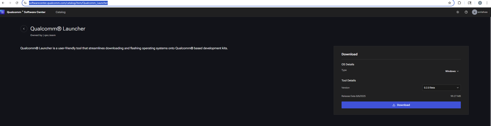
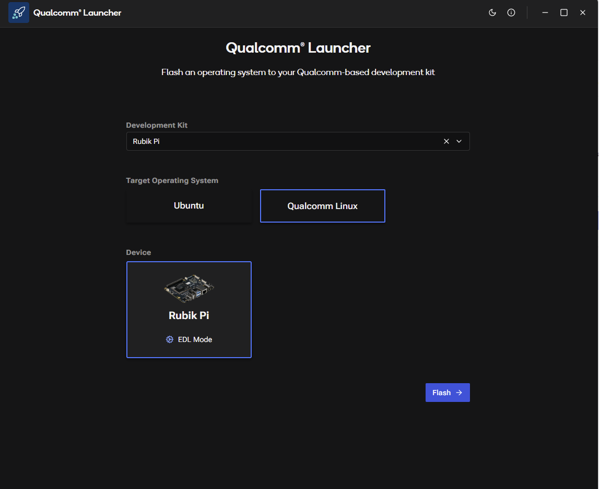
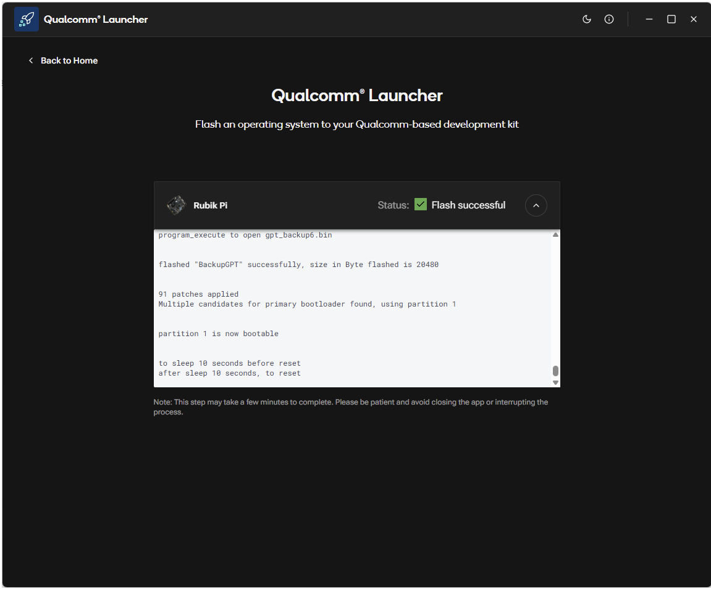

import Tabs from '@theme/Tabs';
import TabItem from '@theme/TabItem';

# Updating Your Device Software

This guide walks you through the steps to update your Rubik Pi device **after** the production release has been deployed.

## 0. Verify the Operating System on Your Board
:::tip
**Note:** If your board was shipped with Ubuntu pre-installed, you can skip this section.
:::


    :::note 
    If your board is running Ubuntu from the factory then you can skip this Page
    :::
    To check if your board is running Ubuntu, follow the steps in[Set up your device](./2.set-up-your-device.md) then run:
    ```
    cat /etc/os-release
    ```

1.  **Download the Installer:**
Visit the QSC web portal: https://softwarecenter.qualcomm.com/catalog/item/Qualcomm_Launcher
The OS type and latest version are selected by default. Click **Download** to get the installer.    
:::warning
**Caution:** Ensure you download the correct version for your host operating system.
:::

    

## 2. Install the Qualcomm Launcher App
Follow the guided installation steps to complete the setup of the Qualcomm Launcher application.
## 3. Flash the Device
Open the app, choose the appropriate **Target Operating System**, place your Rubik Pi device into EDL mode (refer to the app for instructions), and click **Flash**.

    
    :::info
:::tip
**Info:** EDL (Emergency Download Mode) is a special mode used for flashing devices. Refer to the app's instructions for detailed steps on how to enter EDL mode. You can also follow the [advanced updating instructions](./1.update-software.md) if needed.
:::

## 4. Flashing Process
The application will automatically download the selected Target OS, extract its contents, and flash it onto your connected Rubik Pi device.

    

## 5. Reboot the Device
After flashing is complete, your Rubik Pi device will reboot into the newly installed operating system. You may also safely disconnect and reconnect the device if needed.

## 6. Verify the Update
Once the device has restarted, confirm the update by reviewing the version number or other relevant details displayed in the application.
Refer to [Set up your device](./2.set-up-your-device.md) for additional setup steps.
    :::info
    If you encounter any issues during the update process, you can refer to the [troubleshooting instructions](../13.Troubleshooting/13.troubleshooting.md) for assistance
    or the [advanced flashing instructions](./1.update-software.md) for more information.
    :::
