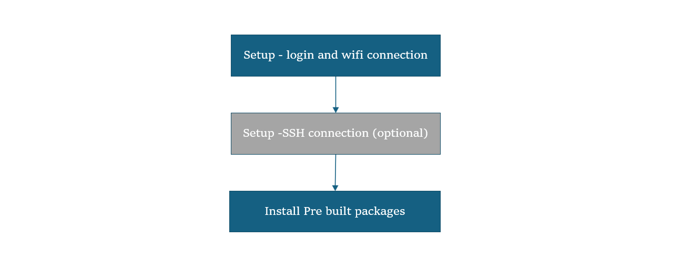

import Tabs from '@theme/Tabs';
import TabItem from '@theme/TabItem';

# Upgrade Canoncial Ubuntu Build
 
	This guide walks you through a streamlined process to update your system using prebuilt packages, while maintaining your existing environment. Upgrading your Ubuntu build ensures your device stays current with the latest improvements in performance, security, and compatibility.   

	:::info 
		- **Before You Start** - Complete [**🔗setup**](https://hongyang-rp.github.io/rubikpi-ubuntu-user-manual-test-en.github.io/docs/Document%20Home/quick-start/set-up-your-device) instructions.  
	:::
	---
		### 🏁 Let’s Get Started!
		
		
    #### 1️⃣ Login & Wi-Fi Connection 
	1: Login and change password on the monitor UART console/SBC terminal.     
	2: Set up Wi-Fi connectivity. [🔗 Wi-Fi Setup Guide](https://hongyang-rp.github.io/rubikpi-ubuntu-user-manual-test-en.github.io/docs/Document%20Home/quick-start/set-up-your-device#connect-to-the-network)  

	#### 2️⃣ SSH Connection (Optional) 
	1: Get the IP address for RPi3.  
	2: On your host machine, use SSH to connect to the device.   
	```shell
	ssh ubuntu@<IP Address>
	```

	#### 3️⃣ Upgrade Pre-built Packages 
	This command will upgrade to the latest pre-built packages on the device.  
	```shell
	sudo apt upgrade -y
	```

----
	> 📌 **Note:** If you haven’t previously installed the PPA packages, please run the following steps to install them:
	```shell
	git clone -b ubuntu_setup --single-branch https://github.com/rubikpi-ai/rubikpi-script.git 
	cd rubikpi-script  
	./install_ppa_pkgs.sh 
	```
	If you encounter install package failures please run this command 'apt --fix-broken install' 

----
	#### 4️⃣ Verify the SW version 
	Run the following commands in the device shell to verify the version:
	```shell
	cat /etc/os-release 
	uname -a
	```
---
> **🧭 Next Steps**
> After the image is flashed, refer to the [**AI Application Development and Execution Guide**](https://hongyang-rp.github.io/rubikpi-ubuntu-user-manual-test-en.github.io/docs/Document%20Home/AI%20Application%20Development%20and%20Execution%20Guide/).
---