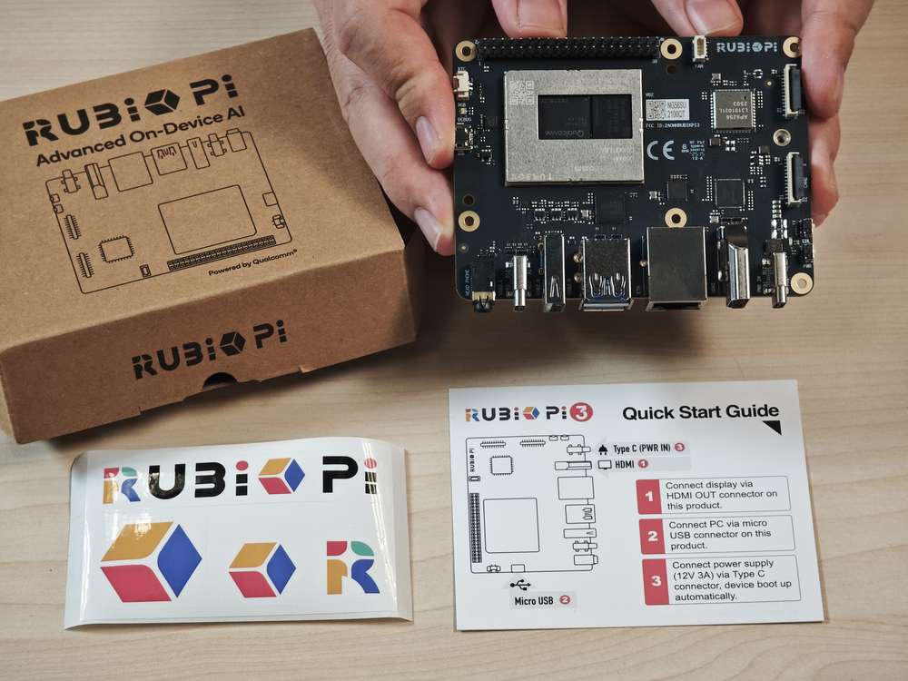
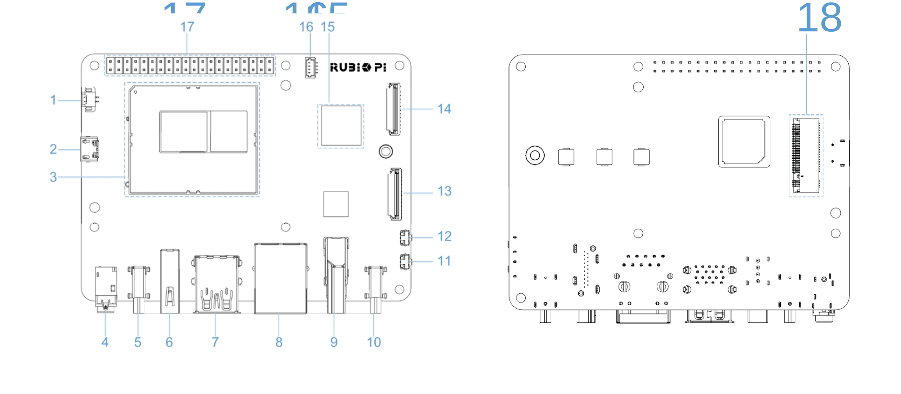

import Tabs from '@theme/Tabs';
import TabItem from '@theme/TabItem';

# Get started with RUBIK Pi 3

This quick start guide helps you set up your RUBIK Pi 3 to explore and use end-to-end multimedia and AI applications in an Ubuntu 24.04-based environment. Additionally, this guide provides instructions on how to establish communication with hosts running Linux, Windows(®), or macOS(®).

RUBIK Pi 3 is developed based on the Qualcomm QCS6490 processor, which features the Qualcomm® Kryo™ 670 CPU and the Qualcomm® Hexagon™ Processor with fused AI-accelerator architecture. The processor provides exceptional AI performance of 12 TOPS and offers the capability for various machine learning and AI application scenarios.

RUBIK Pi 3 is designed with a wide range of interfaces and functions, such as USB, camera, DisplayPort, HDMI, Ethernet, 3.5mm headphone jack, Wi-Fi, Bluetooth, M.2 connector, fan, RTC, and 40-pin LS connector. These features cater to diverse development needs while facilitating rapid development and efficient debugging.

RUBIK Pi 3 is compatible with various systems, such as Qualcomm Linux, Debian 13, Android 13, and Canonical Ubuntu for Qualcomm Platforms, providing developers with the flexibility to meet their specific application needs.

### Packaging

* RUBIK Pi 3

* RUBIK Pi sticker

* Quick Start Guide

### Introduction to the board

