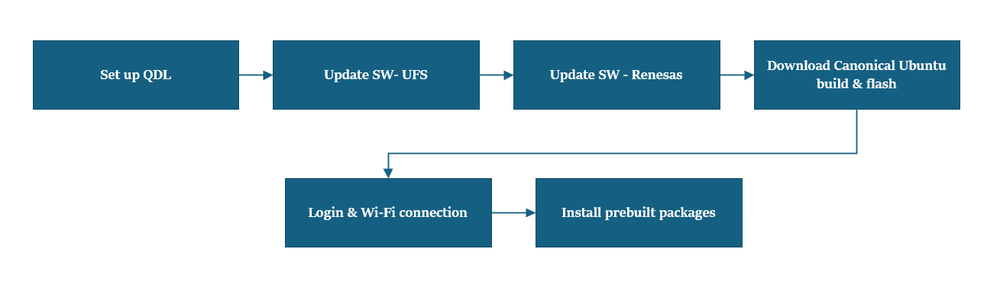
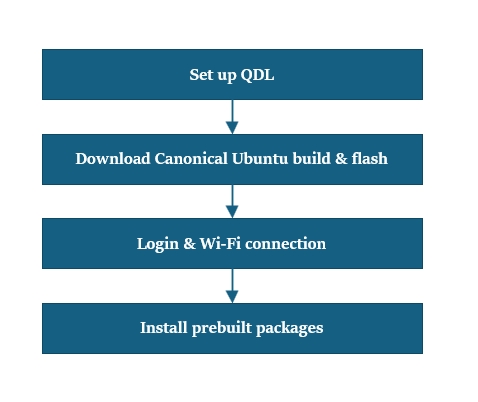

import Tabs from '@theme/Tabs';
import TabItem from '@theme/TabItem';

# 👋 Rpi Dogfooding Guide!  
Thanks for joining the Rpi internal testing crew! This guide walks you through our dogfooding phase, where your feedback helps us spot issues and make Rpi even better before launch.

***Inside this guide, you’ll find:***  
 How to get started with dogfooding  
 Steps for reporting bugs and sharing feedback  
 Where to find support and resources  

We encourage you to dive in, try things out, and let us know what’s working and what needs improvement. 
Your input is key to making Rpi the best it can be!

# Workflow Comparison Table

<details>

| **Aspect**               |  [🖥️ Workflow 1-Preloaded Certified Ubuntu Build](https://hongyang-rp.github.io/rubikpi-ubuntu-user-manual-test-en.github.io/docs/Document%20Home/Dogfooding-Guide/Rpi%20Dogfooding%20Guide#workflow-1--device-with-preloaded-certified-ubuntu-build-post-930) |  [🖥️Workflow 2 – Preloaded QLI Build (Pre 9/30)](https://hongyang-rp.github.io/rubikpi-ubuntu-user-manual-test-en.github.io/docs/Document%20Home/Dogfooding-Guide/Rpi%20Dogfooding%20Guide#workflow-2--user-gets-a-device-with-preloaded-qli-build--pre-930) | [🖥️Workflow 3 – QLI/Android to Certified Ubuntu (Post 9/30)](https://hongyang-rp.github.io/rubikpi-ubuntu-user-manual-test-en.github.io/docs/Document%20Home/Dogfooding-Guide/Rpi%20Dogfooding%20Guide#workflow-3-user-device-is-preloaded-to-qliandroid-build-and-update-to-certified-canonical-ubuntu-build-post-930) |  [🖥️Workflow 4 – Reset System Image or Update qcom Firmware](rubikpi-ubuntu-user-manual-test-en.github.io/docs/Document%20Home/Dogfooding-Guide/Rpi%20Dogfooding%20Guide#workflow-4-user-wants-to-reset-the-system-image-or-update-qcom-firmware) |
|--------------------------|---------------------------------------------------------------|--------------------------------------------------|---------------------------------------------------------------|--------------------------------------------------------------|
| **Device State**         | Device comes preloaded with certified Ubuntu and Renesas FW   | Device comes preloaded with QLI build            | Device comes with QLI/Android build, needs Ubuntu update      | Device needs system image reset or firmware update          |
| **Setup Complexity**     | Minimal setup: login, Wi-Fi, install packages                 | Full flashing: QDL, UFS, Renesas, Ubuntu image   | Full flashing: QDL, UFS, Renesas, Canonical Ubuntu            | Flashing Canonical Ubuntu and qcom firmware                 |
| **Tools Used**           | SSH (optional), Wi-Fi setup, install script                   | QDL, UFS provisioning, Renesas FW update, Canonical flashing | QDL, UFS provisioning, Renesas FW update, Canonical flashing | QDL, Canonical flashing                                     |
| **Steps Involved**       | 1. Login and Wi-Fi  2. Optional SSH  3. Install packages       | 1. QDL setup  2. UFS update  3. Renesas update  4. Ubuntu download and flash  5. Login and Wi-Fi  6. Install packages | 1. QDL setup  2. UFS update  3. Renesas update  4. Canonical download  5. Flash image  6. Login and Wi-Fi  7. Install packages | 1. QDL setup  2. Canonical download  3. Flash image  4. Login and Wi-Fi  5. Install packages |
| **User Effort**          | Lower – device is mostly ready to use                         | Higher – full reflash and configuration needed   | Higher – full reflash and configuration needed                | Moderate – focused on reset or firmware update              |
| **Use Case Timing**      | After September 30th                                          | Before September 30th                            | After September 30th                                          | Anytime reset or firmware update is needed                  |

</details>

<Tabs>
<TabItem value="Workflow1" label="Workflow1-Preloaded Certified Build(Post 9/30)">

		---
		## Workflow 1 – Device with Preloaded Certified Ubuntu Build (Post 9/30)
		---
		#### 📝 What You Need to Know First
		:::info
		- Make sure your device already has the certified Ubuntu build and Renesas firmware loaded.    
		- **Before You Start** - Complete [**🔗setup**](https://hongyang-rp.github.io/rubikpi-ubuntu-user-manual-test-en.github.io/docs/Document%20Home/Dogfooding-Guide/Setup#-steps) instructions.  

	
		:::

		---


	### 🏁 Let’s Get Set Up!
	 

	#### 1️⃣ Login & Wi-Fi Connection 
	1: Login and change password on the monitor terminal (SBC).    
	2: Set up Wi-Fi connectivity. [🔗 Wi-Fi Setup Guide](https://hongyang-rp.github.io/rubikpi-ubuntu-user-manual-test-en.github.io/docs/Document%20Home/quick-start/set-up-your-device#connect-to-the-network)  

	#### 2️⃣ SSH Connection (Optional) 
	1: Get the IP address for RPi3.  
	2: On your host machine, use SSH to connect to the device.  
	###### Commands:  
	```shell
	ssh ubuntu@<IP Address>
	```

	#### 3️⃣ Install Pre-built Packages 
	Install pre-built packages on the device.  
	###### Commands:  
	```shell
	git clone -b ubuntu_setup --single-branch https://github.com/rubikpi-ai/rubikpi-script.git; 
	cd rubikpi-script;  
	./install_ppa_pkgs.sh 
	```
	#### 4️⃣ Verify the SW version
	1: Log in to the UART console/SBC terminal/SSH terminal and follow the prompts to reset the password.  
		Account: ubuntu  
		Password: ubuntu  
	2: Run the following command in the device shell to verify the version:
	###### Commands:  
	```shell
		cat /etc/os-release 
	```
    ---
	> **🧭 Next Steps**
	> After the image is flashed, refer to the [**Run Pre-loaded Sample Apps**](https://hongyang-rp.github.io/rubikpi-ubuntu-user-manual-test-en.github.io/docs/Document%20Home/Dogfooding-Guide/PreBuilt-SampleApps#-persona) for the next steps.
	---
</TabItem>
<TabItem value="Workflow2" label="Workflow2-preloaded QLI build–(Pre 9/30)">

	---
	## Workflow 2 – User gets a device with preloaded QLI build – (Pre 9/30)
	---
	#### 📝 What You Need to Know First
	:::info 
		- If the QLI version is 1.3 or above , please ignore Update UFS provisioning step.  
		- If accessing links outside the Qualcomm network, create a qcom userid to download UFS provisioning (to set up correct partitions & sizes).  
		- **Before You Start** - Complete [**🔗setup**](https://hongyang-rp.github.io/rubikpi-ubuntu-user-manual-test-en.github.io/docs/Document%20Home/Dogfooding-Guide/Setup#-steps) instructions.  


	:::

	---

### 🏁 Let’s Get Set Up!
 

#### 1️⃣ Set up QDL   
1: Start by reviewing the official setup guide to understand the full process. [**🔗Flash using the QDL tool**](https://softwarecenter.qualcomm.com/catalog/item/Qualcomm_Device_Loader)   
2: Based on your host machine (**Windows/Linux/MAC**), download the correct version of the QDL tool from the link above. 

#### 2️⃣ Update S/W - UFS 
1: Go to the link [**🔗 UFS**](https://artifacts.codelinaro.org/ui/native/codelinaro-le/Qualcomm_Linux/QCS6490/)    
2: Unzip the folder from **Step 1** and copy the files to UFS provisioing folder.  
3: Put the device in EDL mode   
4: Run the command to perform UFS provisioning operation   
###### Commands:  
> 📌 **Note:** This command is for windows  
  ```shell
  <pathToQDL>\QDL.exe prog_firehose_ddr.elf provision_1_3.xml
``` 

#### 3️⃣ Update S/W - Renesas
1: Download the file  [**🔗Renesas FW Update**](https://thundercomm.s3.dualstack.ap-northeast-1.amazonaws.com/uploads/web/rubik-pi-3/firmware/Flat_usb_fw.zip)  
2: Unzip the folder from **Step 1** and copy the files to Renesas location.    
3: Put the device in EDL mode  
4: Flash the driver using QDL command 
###### Commands:
> 📌 **Note:** This command is for windows    
```shell
QDL.exe prog_firehose_ddr.elf rawprogram0.xml rawprogram1.xml rawprogram2.xml rawprogram3.xml rawprogram4.xml rawprogram5.xml patch1.xml patch2.xml patch3.xml patch4.xml patch5.xml  
```
#### 4️⃣ Download Canonical Ubuntu build 
1: Download the zip file tangshan ubuntu server build [**🔗Canonical link**](https://oem-share.canonical.com/partners/tangshan/share/ubuntu-server-24.04/20250912-127/tangshan-ubuntu-server-24.04-20250912-127.tar.xz) OR [\\lab9101\Dropbox\UBUNTU\Rubik-Pi\ ]  
2:  Unzip the folder 

#### 5️⃣ Canonical Ubuntu image flashing
1: Unzip the folder from **Step 1** and copy the files to Build location (canonical/tangshan folder).  
2: Put the device into EDL mode  
3: Flash the device using the command  
###### Commands:  
> 📌 **Note:** This command is for windows  
  ```shell
  QDL.exe prog_firehose_ddr.elf rawprogram0.xml rawprogram1.xml rawprogram2.xml rawprogram3.xml rawprogram4.xml rawprogram5.xml rawprogram6.xml patch1.xml patch2.xml patch3.xml patch4.xml patch5.xml patch6.xml
  ```  
4:  Device automatically boots up

#### 6️⃣ Login & Wi-Fi Connection 
1: Login and change password on the monitor terminal (SBC).  
2: Set up Wi-Fi connectivity.  [🔗 Wi-Fi Setup Guide](https://hongyang-rp.github.io/rubikpi-ubuntu-user-manual-test-en.github.io/docs/Document%20Home/quick-start)

#### 7️⃣ Install Pre-built Packages 
Install pre-built packages on the device.  
###### Commands:  
```shell
git clone -b ubuntu_setup --single-branch https://github.com/rubikpi-ai/rubikpi-script.git; 
cd rubikpi-script;  
./install_ppa_pkgs.sh 
```
#### 8️⃣ Verify the SW version
1: Log in to the UART console/SBC terminal/SSH terminal and follow the prompts to reset the password.  
    Account: ubuntu  
    Password: ubuntu  
2: Run the following command in the device shell to verify the version:
###### Commands:  
```shell
	cat /etc/os-release 
```
---
> **🧭 Next Steps**
> After the image is flashed, refer to the [**Run Pre-loaded Sample Apps**](https://hongyang-rp.github.io/rubikpi-ubuntu-user-manual-test-en.github.io/docs/Document%20Home/Dogfooding-Guide/PreBuilt-SampleApps#-persona) for the next steps.
---
</TabItem>
<TabItem value="Workflow3" label="Workflow3-preloaded QLI/Android build to certified Canonical ubuntu build (post 9/30)">
	---
	## Workflow 3– User device is preloaded to QLI/Android build and update to certified Canonical ubuntu build (post 9/30) 
	---
	#### 📝 What You Need to Know First
	:::info 
		- If the QLI version is 1.3 or above , please ignore Update UFS provisioning step.  
		- If accessing links outside the Qualcomm network, create a qcom userid to download UFS provisioning (to set up correct partitions & sizes).  
		- **Before You Start** - Complete [**🔗setup**](https://hongyang-rp.github.io/rubikpi-ubuntu-user-manual-test-en.github.io/docs/Document%20Home/Dogfooding-Guide/Setup#-steps) instructions.  


	:::

	---

### 🏁 Let’s Get Set Up!
 

#### 1️⃣ Set up QDL   
1: Start by reviewing the official setup guide to understand the full process. [**🔗Flash using the QDL tool**](https://softwarecenter.qualcomm.com/catalog/item/Qualcomm_Device_Loader)   
2: Based on your host machine (**Windows/Linux/MAC**), download the correct version of the QDL tool from the link above. 

#### 2️⃣ Update S/W - UFS 
1: Go to the link [**🔗 UFS**](https://artifacts.codelinaro.org/ui/native/codelinaro-le/Qualcomm_Linux/QCS6490/)    
2: Unzip the folder from **Step 1** and copy the files to UFS provisioing folder.  
3: Put the device in EDL mode   
4: Run the command to perform UFS provisioning operation   
###### Commands:  
> 📌 **Note:** This command is for windows  
  ```shell
  <pathToQDL>\QDL.exe prog_firehose_ddr.elf provision_1_3.xml
``` 

#### 3️⃣ Update S/W - Renesas
1: Download the file  [**🔗Renesas FW Update**](https://thundercomm.s3.dualstack.ap-northeast-1.amazonaws.com/uploads/web/rubik-pi-3/firmware/Flat_usb_fw.zip)  
2: Unzip the folder from **Step 1** and copy the files to Renesas location.    
3: Put the device in EDL mode  
4: Flash the driver using QDL command 
###### Commands:
> 📌 **Note:** This command is for windows    
```shell
QDL.exe prog_firehose_ddr.elf rawprogram0.xml rawprogram1.xml rawprogram2.xml rawprogram3.xml rawprogram4.xml rawprogram5.xml patch1.xml patch2.xml patch3.xml patch4.xml patch5.xml  
```

#### 4️⃣ Download Canonical Ubuntu build 
1: From Canonical ubuntu site download the system image for Rpi3. [**🔗Canonical link**](https://ubuntu.com/download/qualcomm-iot)  
2: Download the dtb.bin file (device tree)  
3: Download the rawprogram0.xml file  
4: Download the qcom firmware images  
5: Unzip the qcom firmware image zip file and copy the dtb.bin ,rawprogram0.xml and system images to the folder location. 

#### 5️⃣ Canonical Ubuntu image flashing
1: Unzip the folder from **Step 1** and copy the files to Build location (canonical/tangshan folder).  
2: Put the device into EDL mode  
3: Flash the device using the command  
###### Commands:  
> 📌 **Note:** This command is for windows  
  ```shell
  QDL.exe prog_firehose_ddr.elf rawprogram0.xml rawprogram1.xml rawprogram2.xml rawprogram3.xml rawprogram4.xml rawprogram5.xml rawprogram6.xml patch1.xml patch2.xml patch3.xml patch4.xml patch5.xml patch6.xml
  ```  
4:  Device automatically boots up

#### 6️⃣ Login & Wi-Fi Connection 
1: Login and change password on the monitor terminal (SBC).  
2: Set up Wi-Fi connectivity.  [🔗 Wi-Fi Setup Guide](https://hongyang-rp.github.io/rubikpi-ubuntu-user-manual-test-en.github.io/docs/Document%20Home/quick-start)

#### 7️⃣ Install Pre-built Packages 
Install pre-built packages on the device.  
###### Commands:  
```shell
git clone -b ubuntu_setup --single-branch https://github.com/rubikpi-ai/rubikpi-script.git; 
cd rubikpi-script;  
./install_ppa_pkgs.sh 
```
#### 8️⃣ Verify the SW version
1: Log in to the UART console/SBC terminal/SSH terminal and follow the prompts to reset the password.  
    Account: ubuntu  
    Password: ubuntu  
2: Run the following command in the device shell to verify the version:
###### Commands:  
```shell
	cat /etc/os-release 
```
---
> **🧭 Next Steps**
> After the image is flashed, refer to the [**Run Pre-loaded Sample Apps**](https://hongyang-rp.github.io/rubikpi-ubuntu-user-manual-test-en.github.io/docs/Document%20Home/Dogfooding-Guide/PreBuilt-SampleApps#-persona) for the next steps.
---

</TabItem>
<TabItem value="Workflow4" label="Workflow4-reset system image/update qcom firmware ">
	---
	## Workflow 4– User wants to reset the system image or update qcom firmware 
	---
	#### 📝 What You Need to Know First
	:::info 
		- **Before You Start** - Complete [**🔗setup**](https://hongyang-rp.github.io/rubikpi-ubuntu-user-manual-test-en.github.io/docs/Document%20Home/Dogfooding-Guide/Setup#-steps) instructions.  


	:::

	---

### 🏁 Let’s Get Set Up!
 

#### 1️⃣ Set up QDL   
1: Start by reviewing the official setup guide to understand the full process. [**🔗Flash using the QDL tool**](https://softwarecenter.qualcomm.com/catalog/item/Qualcomm_Device_Loader)   
2: Based on your host machine (**Windows/Linux/MAC**), download the correct version of the QDL tool from the link above. 

#### 2️⃣ Download Canonical Ubuntu build 
1: From Canonical ubuntu site download the system image for Rpi3. [**🔗Canonical link**](https://ubuntu.com/download/qualcomm-iot)  
2: Download the dtb.bin file (device tree)  
3: Download the rawprogram0.xml file  
4: Download the qcom firmware images  
5: Unzip the qcom firmware image zip file and copy the dtb.bin ,rawprogram0.xml and system images to the folder location. 

#### 3️⃣ Canonical Ubuntu image flashing
1: Unzip the folder from **Step 1** and copy the files to Build location (canonical/tangshan folder).  
2: Put the device into EDL mode  
3: Flash the device using the command  
###### Commands:  
> 📌 **Note:** This command is for windows  
  ```shell
  QDL.exe prog_firehose_ddr.elf rawprogram0.xml rawprogram1.xml rawprogram2.xml rawprogram3.xml rawprogram4.xml rawprogram5.xml rawprogram6.xml patch1.xml patch2.xml patch3.xml patch4.xml patch5.xml patch6.xml
  ```  
4:  Device automatically boots up

#### 4️⃣ Login & Wi-Fi Connection 
1: Login and change password on the monitor terminal (SBC).  
2: Set up Wi-Fi connectivity.  [🔗 Wi-Fi Setup Guide](https://hongyang-rp.github.io/rubikpi-ubuntu-user-manual-test-en.github.io/docs/Document%20Home/quick-start)

#### 5️⃣ Install Pre-built Packages 
Install pre-built packages on the device.  
###### Commands:  
```shell
git clone -b ubuntu_setup --single-branch https://github.com/rubikpi-ai/rubikpi-script.git; 
cd rubikpi-script;  
./install_ppa_pkgs.sh 
```
#### 6️⃣ Verify the SW version  
1: Log in to the UART console/SBC terminal/SSH terminal and follow the prompts to reset the password.  
    Account: ubuntu  
    Password: ubuntu  
2: Run the following command in the device shell to verify the version:
###### Commands:  
```shell
	cat /etc/os-release 
```
---
> **🧭 Next Steps**
> After the image is flashed, refer to the [**Run Pre-loaded Sample Apps**](https://hongyang-rp.github.io/rubikpi-ubuntu-user-manual-test-en.github.io/docs/Document%20Home/Dogfooding-Guide/PreBuilt-SampleApps#-persona) for the next steps.
---
</TabItem>
</Tabs>

