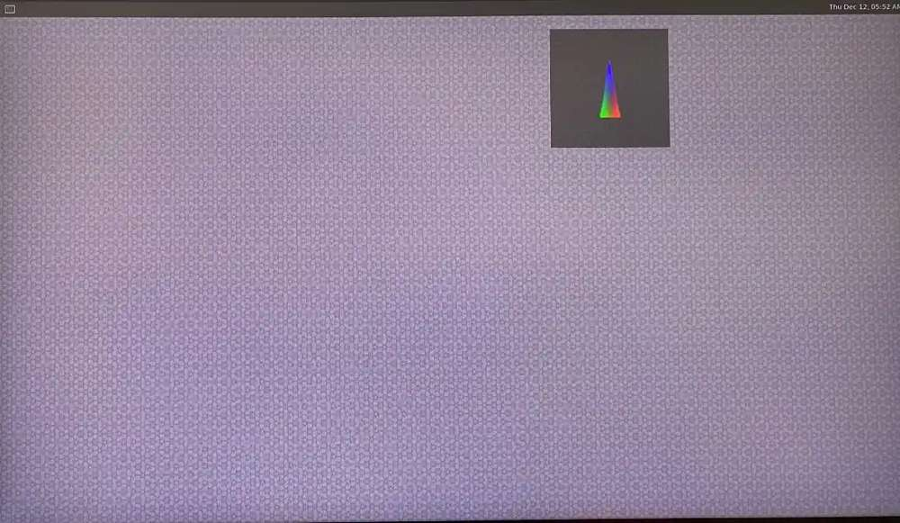

import Tabs from '@theme/Tabs';
import TabItem from '@theme/TabItem';

# Run Sample Applications

### ✅ Quick Start Checklist

- [x] Ubuntu 24.04 installed
- [x] Wi-Fi & SSH set up
- [x] HDMI display connected
- [x] Run PPA script for package installs 
- [x] Weston display enabled

---
<<<<<<< HEAD
> 💡 Pro tip: Use a fan! These apps work your Pi hard..


### What You Can Run

- **LiteRT Apps:** AI classification models 
- **Multimedia Apps:** Camera, display, video streaming  
- **AI Apps:** Object detection, parallel inferencing
- **Skill Level:** Anyone.  
- **Goal:** Get cool demos running, quick.
---
=======
> 💡 Pro tip: Use the fan to avoid overheating
>>>>>>> 246e82c75c2e35b71248f6692208c3c13697c17e

### Before You Start - Must do steps on target"
**Enable Weston Display**  
This unlocks the camera + AI features.
Run the following command int he RubikPi Terminal:
```shell
sudo -i
export XDG_RUNTIME_DIR=/run/user/$(id -u ubuntu)
```
  :::tip
  If the Weston desktop doesn’t appear, run this command in the RUBIK Pi terminal:  
`sudo dpkg-reconfigure weston-autostart`
:::

To verify that the graphics are working correctly, run:
   ```shell
   weston-simple-egl
   ```
<<<<<<< HEAD
### Sample Applications
=======
   

## Run Sample applications
>>>>>>> 246e82c75c2e35b71248f6692208c3c13697c17e
<Tabs>
 <TabItem value="LiteRT" label="LiteRT Sample Apps">
    LiteRT (formerly TensorFlow Lite) is Google’s high-performance runtime for on-device AI. Run quantized models on Dragonwing NPU with just one line using LiteRT delegates in AI Engine Direct.
### AI Classification Examples
    <Tabs>
        <TabItem value="Terminal" label="Terminal:Run Vision Transformer (Python)"> 
        ### Use Cases
            - 🔍 Image classification (what’s in the pic?)
            - 🏷️ Object detection (where’s the cat, where’s the car?)
            - 🤖 Edge AI: Run powerful vision models locally, no cloud needed.

            ---

            ### What does It Do?
            - Runs **Vision Transformer (ViT)** model inference on Qualcomm hardware.
            - ViT = next-gen neural net for image recognition (think: smarter, sharper, more context-aware than classic CNNs).
            - Demo app shows how fast and efficient ViT inference can be on-device.

            ---
            ### How It Works
            - Loads a pre-trained, quantized ViT model.
            - Feeds in images, gets predictions back instantly.
            - Optimized for Qualcomm NPUs (runs on CPU if layers aren’t supported).

            ---

            > ### 💡 **Pro Tips**
            > - **Quantize your model!** NPU only supports `uint8`/`int8` quantized models. Use quantization-aware training or post-training quantization.
            > - **Unsupported layers?** They’ll auto-run on CPU. For best speed, optimize your model for NPU compatibility.
            > - **Quantize your models with: [Quantization-aware training](https://www.tensorflow.org/model_optimization/guide/quantization/training_comprehensive_guide) ; [Post Training Quantization](https://ai.google.dev/edge/litert/models/post_training_quantization)
            > - **Grab ready-to-go models:** Check [Qualcomm AI Hub](https://aihub.qualcomm.com/) or [Edge Impulse](https://www.edgeimpulse.com/) for pre-quantized ViT models.
            > - **Benchmark smart:** Compare NPU vs CPU performance to see real gains.
            > - **Stay updated:** Qualcomm SDKs and sample apps get frequent upgrades—always check for the latest features and fixes.
            > - **Check compatibility:** Make sure your platform and SDK version match the model requirements.

            ---
            Setup Environment
            ```shell
                python3 -m venv .venv-litert-demo
                source .venv-litert-demo/bin/activate
                pip3 install ai-edge-litert==1.3.0 Pillow
            ```
            Inference Script
            ```shell
            import numpy as np
            from ai_edge_litert.interpreter import Interpreter, load_delegate
            from PIL import Image
            import os, time, sys, urllib.request

            MODEL_PATH = "vit-vit-w8a8.tflite"
            IMAGE_PATH = "boa-constrictor.jpg"
            LABELS_PATH = "vit-vit-labels.txt"

            # Download files if missing
            for url, path in [
                ('https://cdn.edgeimpulse.com/qc-ai-docs/models/vit-vit-w8a8.tflite', MODEL_PATH),
                ('https://cdn.edgeimpulse.com/qc-ai-docs/models/vit-vit-labels.txt', LABELS_PATH),
                ('https://cdn.edgeimpulse.com/qc-ai-docs/examples/boa-constrictor.jpg', IMAGE_PATH)
            ]:
                if not os.path.exists(path):
                    urllib.request.urlretrieve(url, path)

            with open(LABELS_PATH) as f:
                labels = [line for line in f.read().splitlines() if line.strip()]

            use_qnn = len(sys.argv) >= 2 and sys.argv[1] == '--use-qnn'
            delegates = [load_delegate("libQnnTFLiteDelegate.so", options={"backend_type":"htp"})] if use_qnn else []

            interpreter = Interpreter(model_path=MODEL_PATH, experimental_delegates=delegates)
            interpreter.allocate_tensors()
            input_details = interpreter.get_input_details()
            output_details = interpreter.get_output_details()

            def load_image(path, shape):
                _, h, w, c = shape
                img = Image.open(path).convert("RGB").resize((w, h))
                img_np = np.array(img, dtype=np.uint8)
                return np.expand_dims(img_np, axis=0)

            input_data = load_image(IMAGE_PATH, input_details[0]['shape'])
            interpreter.set_tensor(input_details[0]['index'], input_data)
            interpreter.invoke()

            # Run 10x for timing
            start = round(time.time() * 1000)
            for _ in range(10): interpreter.invoke()
            end = round(time.time() * 1000)

            q_output = interpreter.get_tensor(output_details[0]['index'])
            scale, zero_point = output_details[0]['quantization']
            scores = (q_output.astype(np.float32) - zero_point) * scale
            top_k = scores[0].argsort()[-5:][::-1]
            print("\nTop-5 predictions:")
            for i in top_k:
                print(f"{labels[i]}: score={scores[0][i]}")
            print(f"\nAvg inference: {(end-start)/10}ms/image")
            ```
            Run on CPU
            ```shell
            python3 inference_vit.py
            ```
            Run on NPU
            ```shell
            python3 inference_vit.py --use-qnn
            ```
            
### NPU Inference: 

        INFO: QNN Delegate → 1382/1633 nodes on NPU (27 partitions)
        INFO: XNNPACK Delegate → CPU fallback

        🎯 Top-5 Predictions:
        1. 🐍 boa constrictor: 7.59
        2. 🐍 rock python: 4.82
        3. 🐍 night snake: 3.63
        4. 🐭 mouse: 2.00
        5. 🎥 lens cap: 1.81

        ⚡️ Avg Inference: 132.7ms/image
    </TabItem>
    <TabItem value="GuiApp" label="Image Classification GUI(Python)">
                ### Use Cases  
               - School Projects:Need to sort images for a report or presentation? Just drag, drop, and get instant categories.
               - Personal Photo Library:Clean up your phone or laptop gallery.
               - Social Media Magic: Instantly tag and organize your pics before posting.
               - Content Creators: Auto-label images for blogs, vlogs, and YouTube thumbnails
               ---
               ###  What Does It Do?
                - A Python app that lets you: Pick any image
                - Run AI inference
                - Instantly see the top 4 predictions
                ---
                ### How to Use
                - Click Select Image
                - See your image + predictions!
                    - Top 4 guesses
                    - Confidence bars (so you know how sure the AI is)Results
                - Switch Inference Mode:
                    - CPU or Delegate (for speed boost!)
                - Reprocess Image:
                    - Try again, swap images, experiment!
                    ---

                > ### 💡 **Pro Tips**
                > - Use high-quality images for best results
                > - Try both CPU and Delegate modes to compare speed.
                --- 
                
                Get the AI Model + Labels
                - Model: [TFLite GoogLeNet-Quantized](https://aihub.qualcomm.com/models/googlenet?domain=Computer+Vision&useCase=Image+Classification)
                - Labels:[Imagenet labels](https://github.com/quic/ai-hub-models/blob/main/qai_hub_models/labels/imagenet_labels.txt)
                ```shell
                    scp googlenet_googlenet-float.tflite ubuntu@<rubikpi ip address>:/home/ubuntu/
                    scp imagenet_labels.txt ubuntu@<rubikpi ip address>:/home/ubuntu/
                ```
                Install the Essentials
                ```shell
                    pip install numpy opencv-python tflite-runtime PyGObject
                ```
                Copy-Paste the Code
                    Create pyGUI-classification.py and drop this in:
                ```shell
                    # Core Imports
                    import cv2, gi, numpy as np, os, time
                    import tflite_runtime.interpreter as tflite
                    gi.require_version("Gtk", "3.0")
                    from gi.repository import Gtk, GLib, GdkPixbuf

                    # Constants
                    TF_MODEL = "googlenet_googlenet-float.tflite"
                    LABELS = "imagenet_labels.txt"
                    DELEGATE_PATH = "libQnnTFLiteDelegate.so"
            # ... [Helper functions, Inference, GUI classes as in original code] ...
            # (Keep code modular, readable, and comment key sections for clarity)
            ````
            Tip: Want to see the full code? [Expand here](https://qgenie-chat.qualcomm.com/apps/chat#full-code) 👀

             Run the App
             ```shell
             python3 pyGUI-classification.py
             ```
</TabItem>
</Tabs>
</TabItem>
   <TabItem value="Multimedia" label="Multimedia Sample Apps">
       The multimedia sample applications show various use cases for the camera, display, and video streaming capabilities of RUBIK Pi.
    <Tabs>
        <TabItem value="dashcam" label="Multi-camera streaming(dashcam)">
            ### Use Cases  
               - 🚗 Dashcam: Record front + rear views
               - 🤖 Stereo vision: Depth perception for robotics
               - 🛡️ Security: Monitor multiple zones at once           
                ---
            ###  What Does It Do?
            - **Composes** both camera feeds into a single display (side-by-side preview)
            - **Encodes** and saves video streams to files (for later playback or analysis)
            - Super useful for multi-cam setups: dashcam, stereo cam, security cam, etc.
        ```shell
            Camera0 --\
                        |--> [Composer] --> [Display or Encoder] --> [File/Screen]
            Camera1 --/
            ```
            ---
            > ### 💡 **Pro Tips**
            > - Make sure both cameras are connected and recognized by the system 
            > - HDMI must be plugged in for display output
            > - Use export GST_DEBUG=2 for troubleshooting 
            ---
   Install Camera Software:
    ```shell
    sudo sed -i &#x27;a deb http://apt.rubikpi.ai ppa main&#x27; /etc/apt/sources.list
    sudo apt update
    sudo apt install -y qcom-ib2c qcom-camera-server qcom-camx rubikpi3-cameras
    sudo chmod -R 755 /opt
    sudo mkdir -p /var/cache/camera/
    sudo touch /var/cache/camera/camxoverridesettings.txt
    sudo sh -c &#x27;echo enableNCSService=FALSE &gt;&gt; /var/cache/camera/camxoverridesettings.txt&#x27;
    ```
  Set Display Environment:
    ```shell
    export XDG_RUNTIME_DIR=/run/user/</span></span>(id -u ubuntu)/ && export WAYLAND_DISPLAY=wayland-1
    ```

:::note
If Weston isn’t auto-enabling,here’s the hack:  
Open **two SSH sessions** — one to wake up Weston, the other to launch your app.

**1. Fire up Weston (First Shell):**
```bash
export GBM_BACKEND=msm && export XDG_RUNTIME_DIR=/run/user/$(id -u ubuntu)/ && mkdir -p <span class="latex-inline"><span class="katex-error" title="ParseError: KaTeX parse error: Expected &#x27;EOF&#x27;, got &#x27;&amp;&#x27; at position 17: …DG_RUNTIME_DIR &amp;̲&amp; weston --cont…" style="color:#cc0000">XDG_RUNTIME_DIR &amp;&amp; weston --continue-without-input --idle-time=0
```
**2. Set the Wayland Display environment(Shell #2)
```bash
export XDG_RUNTIME_DIR=/run/user/</span></span>(id -u ubuntu)/ && export WAYLAND_DISPLAY=wayland-1
```
:::
Run Camera Example:
```bash
gst-multi-camera-example -o 0   # View on HDMI
gst-multi-camera-example -o 1   # Save to /opt/cam1_vid.mp4 & /opt/cam2_vid.mp4
```
Copy Videos to Host:
```bash
scp ubuntu@<DEVICE_IP>:/opt/cam1_vid.mp4 <destination>
```
Get Help:
```bash
gst-multi-camera-example --help
```
  🛑 Stop Playback  
        Ctrl + C
</TabItem>

 <TabItem value="Video Wall" label="Multichannel decode & Compose(Video wall)">

            ### Use Cases    
            - 🧑‍💻 **Group video calls:** See everyone, all at once
            - 🛡️ **Security feeds:** Monitor multiple cameras together
            - 🖥️ **Digital signage:** Show dynamic info across screens
                
                ---
            ###  What Does It Do?
                    - Plays multiple MP4 (H.264) videos at once
                    - Tiles them together for a unified video wall display
                    - Works with 2, 4, 8, or 16 video streams
                    - Super simple commands—no deep setup needed
                    ```shell
                    Multiple videos → Composer → Display/Encoder → File or Screen.
                    All streams, one wall.

                            Video1 --\
                            Video2 ----\
                            Video3 ------> [Composer] --> [Display] --> [Screen]
                            Video4 --/
                                        \
                                          --> [Encoder] --> [File]
                              ```
            ---
            > ### 💡 **Pro Tips**
            > - Start playback:
            ```shell
            gst-concurrent-videoplay-composition -c 4 -i /opt/video1.mp4 -i /opt/video2.mp4 -i /opt/video3.mp4 -i /opt/video4.mp4
            ```
            ---
Prep Your Device
```shell
sudo sed -i '<span class="latex-inline"><span class="katex-error" title="ParseError: KaTeX parse error: Expected group after &#x27;_&#x27; at position 370: …esettings.txt&#x27;
_̲_CODE_BLOCK_1__…" style="color:#cc0000">a deb http://apt.rubikpi.ai ppa main&#x27; /etc/apt/sources.list
sudo apt update
sudo apt install -y qcom-ib2c qcom-camera-server qcom-camx
sudo apt install -y rubikpi3-cameras
sudo chmod -R 755 /opt
sudo mkdir -p /var/cache/camera/
sudo touch /var/cache/camera/camxoverridesettings.txt
sudo sh -c &#x27;echo enableNCSService=FALSE &gt;&gt; /var/cache/camera/camxoverridesettings.txt&#x27;
```

Add Your Videos (H.264 MP4)
```shell
scp &lt;file_name&gt; ubuntu@[DEVICE IP-ADDR]:/opt/
```
Set Up Display
```shell
export XDG_RUNTIME_DIR=/run/user/</span></span>(id -u ubuntu)/
export WAYLAND_DISPLAY=wayland-1
```
:::note
If Weston isn’t auto-enabling,here’s the hack:  
Open **two SSH sessions** — one to wake up Weston, the other to launch your app.

**1. Fire up Weston (First Shell):**
```bash
export GBM_BACKEND=msm && export XDG_RUNTIME_DIR=/run/user/$(id -u ubuntu)/ && mkdir -p <span class="latex-inline"><span class="katex-error" title="ParseError: KaTeX parse error: Expected &#x27;EOF&#x27;, got &#x27;&amp;&#x27; at position 17: …DG_RUNTIME_DIR &amp;̲&amp; weston --cont…" style="color:#cc0000">XDG_RUNTIME_DIR &amp;&amp; weston --continue-without-input --idle-time=0
```
**2. Set the Wayland Display environment(Shell #2)
```bash
export XDG_RUNTIME_DIR=/run/user/</span></span>(id -u ubuntu)/ && export WAYLAND_DISPLAY=wayland-1
```
:::
 Play Multiple Videos!
 ```shell
 gst-concurrent-videoplay-composition -c 4 \
  -i /opt/<file1>.mp4 \
  -i /opt/<file2>.mp4 \
  -i /opt/<file3>.mp4 \
  -i /opt/<file4>.mp4
  ```
  🛑 Stop Playback  
        Ctrl + C
    </TabItem>
    </Tabs>
 </TabItem>
  <TabItem value="AI" label="AI Sample Apps">
  </TabItem>
 </Tabs>