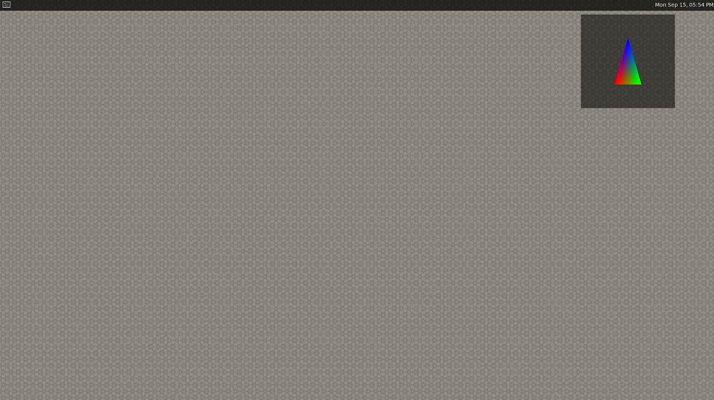
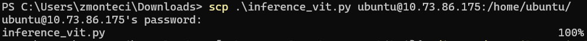
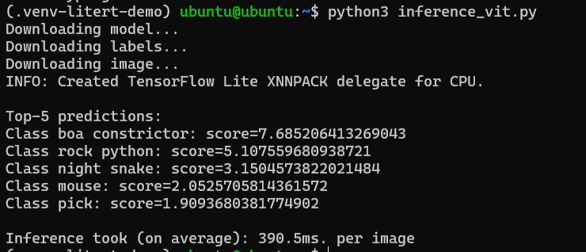
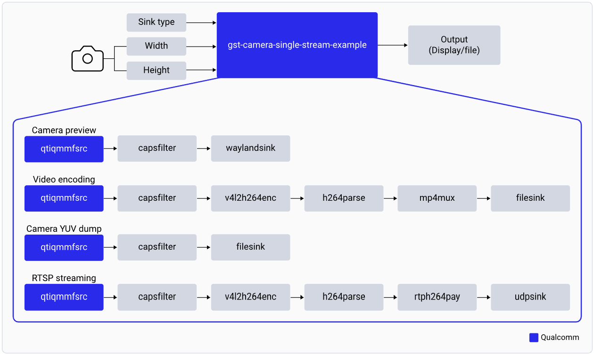

import Tabs from '@theme/Tabs';
import TabItem from '@theme/TabItem';

# Run Sample Applications

### ✅ Quick Start Checklist

- [x] Ubuntu 24.04 installed
- [x] Wi-Fi & SSH set up
- [x] HDMI display connected
- [x] Run PPA script for package installs 
- [x] Weston display enabled

### Before You Start

**Verify Weston Display**  
Check that graphics are working correctly by running this command on the terminal:
```shell
weston-simple-egl
```


:::warning[**Weston Display Not Working**]
  
If your display doesnt look like the previous image run the following commands in the RubikPi Terminal:  
`sudo dpkg-reconfigure weston-autostart`
:::

## Run Sample applications
This collection of sample applications demonstrates how to build efficient multimedia solutions using **LiteRT**, **OpenCV**, and **GStreamer**.

- **LiteRT**: A lightweight runtime framework for modular, high-performance applications.
- **OpenCV**: A widely-used computer vision library for real-time image and video processing.
- **GStreamer**: A powerful multimedia framework for building flexible and scalable media pipelines.

These examples highlight practical approaches to real-time media handling across different integration patterns.

:::tip[**Pro Tip**]
   Use the fan to avoid overheating
:::

<Tabs>
    <TabItem value="LiteRT" label="LiteRT-OpenCV">
        
        ### AI Classification Examples in Python
        <Tabs> 
            <TabItem value="Terminal" label= "Terminal: Vision Transformer">
                Here's how you can run a Vision Transformer model (downloaded from [AI Hub](https://aihub.qualcomm.com/models/vit)) on both the CPU and the NPU using the LiteRT delegates directly on the terminal.

                1. Create a new venv, and install the LiteRT runtime and Pillow:
                ```shell
                python3 -m venv .venv-litert-demo
                source .venv-litert-demo/bin/activate
                pip3 install ai-edge-litert==1.3.0 Pillow
                ```
                
                2. Create `inference_vit.py` and add:
                ```py
                import numpy as np
                from ai_edge_litert.interpreter import Interpreter, load_delegate
                from PIL import Image
                import os, time, sys
                import urllib.request

                def curr_ms():
                    return round(time.time() * 1000)

                use_qnn = True if len(sys.argv) >= 2 and sys.argv[1] == '--use-qnn' else False

                # Path to your quantized TFLite model and test image (will be download automatically)
                MODEL_PATH = "vit-vit-w8a8.tflite"
                IMAGE_PATH = "boa-constrictor.jpg"
                LABELS_PATH = "vit-vit-labels.txt"

                if not os.path.exists(MODEL_PATH):
                    print("Downloading model...")
                    model_url = 'https://cdn.edgeimpulse.com/qc-ai-docs/models/vit-vit-w8a8.tflite'
                    urllib.request.urlretrieve(model_url, MODEL_PATH)

                if not os.path.exists(LABELS_PATH):
                    print("Downloading labels...")
                    labels_url = 'https://cdn.edgeimpulse.com/qc-ai-docs/models/vit-vit-labels.txt'
                    urllib.request.urlretrieve(labels_url, LABELS_PATH)

                if not os.path.exists(IMAGE_PATH):
                    print("Downloading image...")
                    image_url = 'https://cdn.edgeimpulse.com/qc-ai-docs/examples/boa-constrictor.jpg'
                    urllib.request.urlretrieve(image_url, IMAGE_PATH)

                with open(LABELS_PATH, 'r') as f:
                    labels = [line for line in f.read().splitlines() if line.strip()]

                experimental_delegates = []
                if use_qnn:
                    experimental_delegates = [load_delegate("libQnnTFLiteDelegate.so", options={"backend_type":"htp"})]

                # Load TFLite model and allocate tensors
                interpreter = Interpreter(
                    model_path=MODEL_PATH,
                    experimental_delegates=experimental_delegates
                )
                interpreter.allocate_tensors()

                # Get input and output tensor details
                input_details = interpreter.get_input_details()
                output_details = interpreter.get_output_details()

                # Load and preprocess image
                def load_image(path, input_shape):
                    # Expected input shape: [1, height, width, channels]
                    _, height, width, channels = input_shape

                    img = Image.open(path).convert("RGB").resize((width, height))
                    img_np = np.array(img, dtype=np.uint8)  # quantized models expect uint8
                    img_np = np.expand_dims(img_np, axis=0)
                    return img_np

                input_shape = input_details[0]['shape']
                input_data = load_image(IMAGE_PATH, input_shape)

                # Set tensor and run inference
                interpreter.set_tensor(input_details[0]['index'], input_data)

                # Run once to warmup
                interpreter.invoke()

                # Then run 10x
                start = curr_ms()
                for i in range(0, 10):
                    interpreter.invoke()
                end = curr_ms()

                # Get prediction
                q_output = interpreter.get_tensor(output_details[0]['index'])
                scale, zero_point = output_details[0]['quantization']
                f_output = (q_output.astype(np.float32) - zero_point) * scale

                # show top-5 predictions
                scores = f_output[0]
                top_k = scores.argsort()[-5:][::-1]
                print("\nTop-5 predictions:")
                for i in top_k:
                    print(f"Class {labels[i]}: score={scores[i]}")

                print('')
                print(f'Inference took (on average): {(end - start) / 10}ms. per image')
                ```

                3. Copy file to RubikPi over SSH
                ```shell
                scp .\inference_vit.py ubuntu@<your IP>:/home/ubuntu/
                ```
                
                :::info
                You can retrieve your IP address by executing `ip addr` in the terminal
                :::

                4. Run on CPU
                ```shell
                python3 inference_vit.py
                ```
                

                4. Run on NPU
                ```shell
                python3 inference_vit.py --use-qnn
                ```
                NPU Inference: 

                INFO: QNN Delegate → 1382/1633 nodes on NPU (27 partitions)
                INFO: XNNPACK Delegate → CPU fallback

                🎯 Top-5 Predictions:
                1. 🐍 boa constrictor: 7.59
                2. 🐍 rock python: 4.82
                3. 🐍 night snake: 3.63
                4. 🐭 mouse: 2.00
                5. 🎥 lens cap: 1.81

                ⚡️ Avg Inference: 132.7ms/image

                - [ ] TODO: Fix logging configuration on the output of Running on the NPU
                - [ ] TODO: Add output Picture to replace bottom
               
            </TabItem>

            <TabItem value="GuiApp" label="GUI: Image Classification">
                Pick an image, run it through a model, and get instant predictions. The app lets you switch between CPU and NPU, reprocess images, and experiment—all with a simple GUI using LiteRT.
            
                1. Install the essentials
                ```shell
                    pip install numpy opencv-python tflite-runtime PyGObject
                ```

                2. Get the AI Model + Labels
                - Model: [TFLite GoogLeNet-Quantized](https://aihub.qualcomm.com/models/googlenet?domain=Computer+Vision&useCase=Image+Classification)
                - Labels:[Imagenet labels](https://github.com/quic/ai-hub-models/blob/main/qai_hub_models/labels/imagenet_labels.txt)
                
                3. Copy files to RubikPi using SSH
                ```shell
                    scp googlenet_googlenet-float.tflite ubuntu@<rubikpi ip address>:/home/ubuntu/
                    scp imagenet_labels.txt ubuntu@<rubikpi ip address>:/home/ubuntu/
                ```
                
                4. Clone aplication directly on RubikPi
                Copy-Paste the Code
                    Create pyGUI-classification.py and drop this in:
                ```shell
                git clone repo 
                ````
             
                5. Run the App
                ```shell
                python3 pyGUI-classification.py
                ```

                - [ ] TODO: fix repo and clean up app before adding cloning repo location
                - [ ] TODO: Add instructions to get AIHUB model
                - [ ] TODO: Add images to expected output copying ssh
                - [ ] TODO: add images of expected output for cloning
                - [ ] TODO: Add images to expected output running the app
            </TabItem>
        </Tabs>
    </TabItem>
   
       
    <TabItem value="AI" label="LiteRT-GStreamer">
        ### AI Sample Applications
        <Tabs>    
            <TabItem value="classification" label= "Classification">
                Here's how you can run a Vision Transformer model (downloaded from [AI Hub](https://aihub.qualcomm.com/models/vit)) on both the CPU and the NPU using the LiteRT delegates directly on the terminal.

                1. Create a new venv, and install the LiteRT runtime and Pillow:
                ```shell
                python3 -m venv .venv-litert-demo
                source .venv-litert-demo/bin/activate
                pip3 install ai-edge-litert==1.3.0 Pillow
                ```
                
                2. Create `inference_vit.py` and add:
             
                3. Copy file to RubikPi over SSH
                ```shell
                scp .\inference_vit.py ubuntu@<your IP>:/home/ubuntu/
                ```
                
                :::info
                You can retrieve your IP address by executing `ip addr` in the terminal
                :::

                4. Run on CPU
                ```shell
                python3 inference_vit.py
                ```
                
               

                - [ ] TODO: Fix logging configuration on the output of Running on the NPU
                - [ ] TODO: Add output Picture to replace bottom
               
            </TabItem>

            <TabItem value="detection" label="Object Detection">
                Pick an image, run it through a model, and get instant predictions. The app lets you switch between CPU and NPU, reprocess images, and experiment—all with a simple GUI using LiteRT.
            
                1. Install the essentials
                ```shell
                    pip install numpy opencv-python tflite-runtime PyGObject
                ```

                2. Get the AI Model + Labels
                - Model: [TFLite GoogLeNet-Quantized](https://aihub.qualcomm.com/models/googlenet?domain=Computer+Vision&useCase=Image+Classification)
                - Labels:[Imagenet labels](https://github.com/quic/ai-hub-models/blob/main/qai_hub_models/labels/imagenet_labels.txt)
                
                3. Copy files to RubikPi using SSH
                ```shell
                    scp googlenet_googlenet-float.tflite ubuntu@<rubikpi ip address>:/home/ubuntu/
                    scp imagenet_labels.txt ubuntu@<rubikpi ip address>:/home/ubuntu/
                ```
                
                - [ ] TODO: fix repo and clean up app before adding cloning repo location
                - [ ] TODO: Add instructions to get AIHUB model
                - [ ] TODO: Add images to expected output copying ssh
                - [ ] TODO: add images of expected output for cloning
                - [ ] TODO: Add images to expected output running the app
            </TabItem>

            <TabItem value="Posedetection" label="Pose Detection">
                Pick an image, run it through a model, and get instant predictions. The app lets you switch between CPU and NPU, reprocess images, and experiment—all with a simple GUI using LiteRT.
            
                1. Install the essentials
                ```shell
                    pip install numpy opencv-python tflite-runtime PyGObject
                ```

                2. Get the AI Model + Labels
                - Model: [TFLite GoogLeNet-Quantized](https://aihub.qualcomm.com/models/googlenet?domain=Computer+Vision&useCase=Image+Classification)
                - Labels:[Imagenet labels](https://github.com/quic/ai-hub-models/blob/main/qai_hub_models/labels/imagenet_labels.txt)
                
                3. Copy files to RubikPi using SSH
                ```shell
                    scp googlenet_googlenet-float.tflite ubuntu@<rubikpi ip address>:/home/ubuntu/
                    scp imagenet_labels.txt ubuntu@<rubikpi ip address>:/home/ubuntu/
                ```
                
                - [ ] TODO: fix repo and clean up app before adding cloning repo location
                - [ ] TODO: Add instructions to get AIHUB model
                - [ ] TODO: Add images to expected output copying ssh
                - [ ] TODO: add images of expected output for cloning
                - [ ] TODO: Add images to expected output running the app
            </TabItem>
        </Tabs>
    </TabItem>

    <TabItem value="Multimedia" label="Multimedia-GStreamer">
       
        ### Multimedia Sample Applications
        <Tabs>
            <TabItem value="dashcam" label="Single camera streaming">
                Quick summary of application
                
                
                https://docs.qualcomm.com/bundle/publicresource/topics/80-70020-50/gst-camera-single-stream-example.html  
                
                Run Camera Example:
                ```bash
                gst-multi-camera-example -o 0   # View on HDMI
                gst-multi-camera-example -o 1   # Save to /opt/cam1_vid.mp4 & /opt/cam2_vid.mp4
                ```
                Copy Videos to Host:
                ```bash
                scp ubuntu@<DEVICE_IP>:/opt/cam1_vid.mp4 <destination>
                ```
                Get Help:
                ```bash
                gst-multi-camera-example --help
                ```
                🛑 Stop Playback  
                        Ctrl + C
            </TabItem>

            <TabItem value="Video Wall" label="Video wall">

                > - Start playback:
                ```shell
                gst-concurrent-videoplay-composition -c 4 -i /opt/video1.mp4 -i /opt/video2.mp4 -i /opt/video3.mp4 -i /opt/video4.mp4
                ```
                ---
                Prep Your Device
                ```shell
                sudo sed -i '<span class="latex-inline"><span class="katex-error" title="ParseError: KaTeX parse error: Expected group after &#x27;_&#x27; at position 370: …esettings.txt&#x27;
                _̲_CODE_BLOCK_1__…" style="color:#cc0000">a deb http://apt.rubikpi.ai ppa main&#x27; /etc/apt/sources.list
                sudo apt update
                sudo apt install -y qcom-ib2c qcom-camera-server qcom-camx
                sudo apt install -y rubikpi3-cameras
                sudo chmod -R 755 /opt
                sudo mkdir -p /var/cache/camera/
                sudo touch /var/cache/camera/camxoverridesettings.txt
                sudo sh -c &#x27;echo enableNCSService=FALSE &gt;&gt; /var/cache/camera/camxoverridesettings.txt&#x27;
                ```

                Add Your Videos (H.264 MP4)
                ```shell
                scp &lt;file_name&gt; ubuntu@[DEVICE IP-ADDR]:/opt/
                ```
                Set Up Display
                ```shell
                export XDG_RUNTIME_DIR=/run/user/</span></span>(id -u ubuntu)/
                export WAYLAND_DISPLAY=wayland-1
                ```
                :::note
                If Weston isn’t auto-enabling,here’s the hack:  
                Open **two SSH sessions** — one to wake up Weston, the other to launch your app.

                **1. Fire up Weston (First Shell):**
                ```bash
                export GBM_BACKEND=msm && export XDG_RUNTIME_DIR=/run/user/$(id -u ubuntu)/ && mkdir -p <span class="latex-inline"><span class="katex-error" title="ParseError: KaTeX parse error: Expected &#x27;EOF&#x27;, got &#x27;&amp;&#x27; at position 17: …DG_RUNTIME_DIR &amp;̲&amp; weston --cont…" style="color:#cc0000">XDG_RUNTIME_DIR &amp;&amp; weston --continue-without-input --idle-time=0
                ```
                **2. Set the Wayland Display environment(Shell #2)
                ```bash
                export XDG_RUNTIME_DIR=/run/user/</span></span>(id -u ubuntu)/ && export WAYLAND_DISPLAY=wayland-1
                ```
                :::
                Play Multiple Videos!
                ```shell
                gst-concurrent-videoplay-composition -c 4 \
                -i /opt/<file1>.mp4 \
                -i /opt/<file2>.mp4 \
                -i /opt/<file3>.mp4 \
                -i /opt/<file4>.mp4
                ```
                🛑 Stop Playback  
                        Ctrl + C
            </TabItem>
        </Tabs>
    </TabItem>

</Tabs>