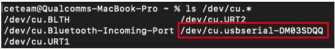

import Tabs from '@theme/Tabs';
import TabItem from '@theme/TabItem';

# LiteRT OpenCV applications

# LiteRT / TFLite

LiteRT, formerly known as TensorFlow Lite, is Google's high-performance runtime for on-device AI. You can run existing quantized LiteRT models (in Python or C++) on the NPU on Dragonwing devices with a single line of code using the LiteRT delegates that are part of AI Engine Direct.

## Use Acceleration Delegate

The NPU only supports uint8/int8 quantized models. Unsupported models, or unsupported layers will be automatically moved back to the CPU. You can use [quantization-aware training](https://www.tensorflow.org/model_optimization/guide/quantization/training_comprehensive_guide) or [post-training quantization](https://ai.google.dev/edge/litert/models/post_training_quantization) to quantize your LiteRT models. Make sure you follow the steps for "Full integer quantization".

**Don't want to quantize yourself?** You can download a range of pre-quantized models from [Qualcomm AI Hub](https://aihub.qualcomm.com), or use [Edge Impulse](edge-impulse) to quantize new or existing models.
## AI Classification Examples
<Tabs>
<TabItem value="Terminal" label="Terminal">

## Vision Transformers (Python)

Here's how you can run a Vision Transformer model (downloaded from [AI Hub](https://aihub.qualcomm.com/models/vit)) on both the CPU and the NPU using the LiteRT delegates.

Open the terminal on your development board, or an ssh session to your development board, and:

1.  Create a new venv, and install the LiteRT runtime and Pillow:

    ```bash
    python3 -m venv .venv-litert-demo
    source .venv-litert-demo/bin/activate
    pip3 install ai-edge-litert==1.3.0 Pillow
    ```
2.  Create `inference_vit.py` and add:

    ```py
    import numpy as np
    from ai_edge_litert.interpreter import Interpreter, load_delegate
    from PIL import Image
    import os, time, sys
    import urllib.request

    def curr_ms():
        return round(time.time() * 1000)

    use_qnn = True if len(sys.argv) >= 2 and sys.argv[1] == '--use-qnn' else False

    # Path to your quantized TFLite model and test image (will be download automatically)
    MODEL_PATH = "vit-vit-w8a8.tflite"
    IMAGE_PATH = "boa-constrictor.jpg"
    LABELS_PATH = "vit-vit-labels.txt"

    if not os.path.exists(MODEL_PATH):
        print("Downloading model...")
        model_url = 'https://cdn.edgeimpulse.com/qc-ai-docs/models/vit-vit-w8a8.tflite'
        urllib.request.urlretrieve(model_url, MODEL_PATH)

    if not os.path.exists(LABELS_PATH):
        print("Downloading labels...")
        labels_url = 'https://cdn.edgeimpulse.com/qc-ai-docs/models/vit-vit-labels.txt'
        urllib.request.urlretrieve(labels_url, LABELS_PATH)

    if not os.path.exists(IMAGE_PATH):
        print("Downloading image...")
        image_url = 'https://cdn.edgeimpulse.com/qc-ai-docs/examples/boa-constrictor.jpg'
        urllib.request.urlretrieve(image_url, IMAGE_PATH)

    with open(LABELS_PATH, 'r') as f:
        labels = [line for line in f.read().splitlines() if line.strip()]

    experimental_delegates = []
    if use_qnn:
        experimental_delegates = [load_delegate("libQnnTFLiteDelegate.so", options={"backend_type":"htp"})]

    # Load TFLite model and allocate tensors
    interpreter = Interpreter(
        model_path=MODEL_PATH,
        experimental_delegates=experimental_delegates
    )
    interpreter.allocate_tensors()

    # Get input and output tensor details
    input_details = interpreter.get_input_details()
    output_details = interpreter.get_output_details()

    # Load and preprocess image
    def load_image(path, input_shape):
        # Expected input shape: [1, height, width, channels]
        _, height, width, channels = input_shape

        img = Image.open(path).convert("RGB").resize((width, height))
        img_np = np.array(img, dtype=np.uint8)  # quantized models expect uint8
        img_np = np.expand_dims(img_np, axis=0)
        return img_np

    input_shape = input_details[0]['shape']
    input_data = load_image(IMAGE_PATH, input_shape)

    # Set tensor and run inference
    interpreter.set_tensor(input_details[0]['index'], input_data)

    # Run once to warmup
    interpreter.invoke()

    # Then run 10x
    start = curr_ms()
    for i in range(0, 10):
        interpreter.invoke()
    end = curr_ms()

    # Get prediction
    q_output = interpreter.get_tensor(output_details[0]['index'])
    scale, zero_point = output_details[0]['quantization']
    f_output = (q_output.astype(np.float32) - zero_point) * scale

    # show top-5 predictions
    scores = f_output[0]
    top_k = scores.argsort()[-5:][::-1]
    print("\nTop-5 predictions:")
    for i in top_k:
        print(f"Class {labels[i]}: score={scores[i]}")

    print('')
    print(f'Inference took (on average): {(end - start) / 10}ms. per image')
    ```
3.  Run the model on the CPU:

    ```bash
    python3 inference_vit.py

    # INFO: Created TensorFlow Lite XNNPACK delegate for CPU.
    #
    # Top-5 predictions:
    # Class boa constrictor: score=7.685206413269043
    # Class rock python: score=5.107559680938721
    # Class night snake: score=3.1504573822021484
    # Class mouse: score=2.0525705814361572
    # Class pick: score=1.9093680381774902
    #
    # Inference took (on average): 391.1ms. per image
    ```
4.  Run the model on the NPU:

    ```bash
    python3 inference_vit.py --use-qnn

    # INFO: TfLiteQnnDelegate delegate: 1382 nodes delegated out of 1633 nodes with 27 partitions.
    #
    # INFO: Created TensorFlow Lite XNNPACK delegate for CPU.
    #
    # Top-5 predictions:
    # Class boa constrictor: score=7.589737892150879
    # Class rock python: score=4.8211541175842285
    # Class night snake: score=3.6277992725372314
    # Class mouse: score=2.0048365592956543
    # Class lens cap: score=1.8138996362686157
    #
    # Inference took (on average): 132.7ms. per image
    ```

As you can see this model runs significantly faster on NPU - but there's a slight change in the output of the model. You can also see that for this model not all layers can run on NPU ("1382 nodes delegated out of 1633 nodes with 27 partitions").
</TabItem>
<TabItem value="GuiApp" label="GUI">

## 🧠 Image Classification (Python)

This sample application allows users to select an image, run inference, and view the top 4 predictions with confidence bars in a graphical interface.

1. Download the model and labels on your host machine and push to RubikPi:
    + TFLite GoogLeNet-Quantized model from [AIHub](https://aihub.qualcomm.com/models/googlenet?domain=Computer+Vision&useCase=Image+Classification)
    + Imagenet dataset [labels](https://github.com/quic/ai-hub-models/blob/main/qai_hub_models/labels/imagenet_labels.txt)
   ```bash
   scp googlenet_googlenet-float.tflite ubuntu@<rubikpi ip address>:/home/ubuntu/
   scp imagenet_labels.txt ubuntu@<rubikpi ip address>:/home/ubuntu/
   ```
2. Install Prerequisites on RubikPi Terminal:
   ```bash
    numpy
    opencv-python
    tflite-runtime
    PyGObject
   ```
3. Create `pyGUI-classification.py` and add:
    ```py
    import cv2
    import gi
    import numpy as np
    import os
    import time
    import tflite_runtime.interpreter as tflite
    gi.require_version("Gtk", "3.0")
    from gi.repository import Gtk, GLib, GdkPixbuf

    # ========= Constants =========
    TF_MODEL = "googlenet_googlenet-float.tflite"
    LABELS = "imagenet_labels.txt"
    DELEGATE_PATH = "libQnnTFLiteDelegate.so" 

    # ========= Helper Functions =========
    def stable_softmax(logits):
        # Convert logits to float64 for higher precision
        logits = logits.astype(np.float32)
        
        # Subtract the maximum logit to prevent overflow
        shifted_logits = logits - np.max(logits)
        
        # Clip the shifted logits to a safe range to prevent overflow in exp
        shifted_logits = np.clip(shifted_logits, -500, 500)
        
        # Calculate the exponentials and normalize
        exp_scores = np.exp(shifted_logits)
        probabilities = exp_scores / np.sum(exp_scores)
        
        return probabilities

    # Load labels from file
    def load_labels(label_path):
        with open(label_path, 'r') as f:
            return [line.strip() for line in f.readlines()]

    def resizeImage(pixbuf):
        original_width = pixbuf.get_width()
        original_height = pixbuf.get_height()

        # Target display size
        max_width = 800
        max_height = 600

        # Calculate new size preserving aspect ratio
        scale = min(max_width / original_width, max_height / original_height)
        new_width = int(original_width * scale)
        new_height = int(original_height * scale)

        return new_width, new_height

    # Load and preprocess input image
    def preprocess_image(image_path, input_shape, input_dtype):
        # Read the image using OpenCV
        img = cv2.imread(image_path)
        if img is None:
            raise ValueError(f"Failed to load image at {image_path}")
        # Convert BGR to RGB
        img = cv2.cvtColor(img, cv2.COLOR_BGR2RGB)
        # Resize the image to the desired input shape
        img = cv2.resize(img, (input_shape[2], input_shape[1]))
        # Convert to the desired data type
        img = img.astype(input_dtype)
        # Add batch dimension
        img = np.expand_dims(img, axis=0)
        
        return img

    # ====== Inference Function ======
    def runInference(image, use_delegate):
        results = []    

        if use_delegate:
            try:
                # Load the QNN delegate library
                delegate_options = { 'backend_type': 'htp' }
                delegate = tflite.load_delegate(DELEGATE_PATH, delegate_options)
                
                # Load the TFLite model
                model = tflite.Interpreter(model_path=TF_MODEL, experimental_delegates=[delegate])
                print("INFO: Loaded QNN delegate with HTP backend")
            except Exception as e:
                print(f"WARNING: Failed to load QNN delegate: {e}")
                print("INFO: Continuing without QNN delegate")
                model = tflite.Interpreter(model_path=TF_MODEL)   
        else:
            model = tflite.Interpreter(model_path=TF_MODEL)  
    
        model.allocate_tensors()

        # Get and Prepare input 
        input_details = model.get_input_details()
        input_shape = input_details[0]['shape']
        input_dtype = input_details[0]['dtype']
        input_data = preprocess_image(image, input_shape, input_dtype)
        
        # Load input data to input tensor
        model.set_tensor(input_details[0]['index'], input_data)
        model.get_signature_list()
        
        # Run inference
        try:
            start_time = time.time()
            model.invoke()
            end_time = time.time()
            print("Interpreter invoked successfully.")
        except Exception as e:
            print(f"Error during model invocation: {e}")
            return []

        # Calculate and print duration
        inference_time = end_time - start_time

        # Prepare output tensor details
        output_details = model.get_output_details()

        # Load output data to output tensor
        output_data = model.get_tensor(output_details[0]['index'])

        # Load labels and get prediction
        labels = load_labels(LABELS)
        predicted_index = np.argmax(output_data)
        predicted_label = labels[predicted_index]
        print("Predicted index:", predicted_index)
        print("Predicted label:", predicted_label)
        
        # Add Softmax function
        logits = output_data[0]
        probabilities = stable_softmax(logits)

        # Get top 4 predictions
        top_k = 4
        top_indices = np.argsort(probabilities)[::-1][:top_k]
        for i in top_indices:
            result = (labels[i], probabilities[i] * 100)
            results.append(result)

        return results, inference_time

    # ====== GTK GUI Classes ======
    class FileBrowser(Gtk.FileChooserDialog):
        def __init__(self):
            super().__init__(title="Choose an image", action=Gtk.FileChooserAction.OPEN)
            self.add_buttons(Gtk.STOCK_CANCEL, Gtk.ResponseType.CANCEL, Gtk.STOCK_OPEN, Gtk.ResponseType.OK)

        def run_and_get_file(self):
            response = super().run()
            if response == Gtk.ResponseType.OK:
                print("Selected file:", self.get_filename())
                self.selected_file = self.get_filename()            
            self.destroy()
            return self.selected_file

    class MainWindow(Gtk.Window):
        def __init__(self):
            super().__init__(title="RB3 Gen 2 Image Classification")
            self.set_default_size(800, 600)
            self.imageFilepath = ""
            # Main layout
            self.mainBox = Gtk.Box(orientation=Gtk.Orientation.HORIZONTAL, spacing=10)
            self.mainBox.set_margin_top(10)
            self.mainBox.set_margin_bottom(10)
            self.mainBox.set_margin_start(10)
            self.mainBox.set_margin_end(10)
            self.add(self.mainBox)
            
            # Main Window Image setup with fallback
            self.image = Gtk.Image()
            try:
                MAIN_IMAGE = "MainWindowPic.jpg"
                self.image.set_from_file(MAIN_IMAGE)         
            except Exception as e:
                print("Error loading main image:", e)
                self.image.set_from_icon_name("image-missing", Gtk.IconSize.DIALOG)

            self.mainBox.pack_start(self.image, True, True, 0)

            # Set up a new box to add results and and file button
            self.infoBox = Gtk.Box(orientation=Gtk.Orientation.VERTICAL, spacing=10)
            
            # Radio button to select Delegate
            delegate_label = Gtk.Label(label="Select Inference Mode:")
            self.infoBox.pack_start(delegate_label, False, False, 10)

            self.cpu_radio = Gtk.RadioButton.new_with_label_from_widget(None, "CPU")
            self.delegate_radio = Gtk.RadioButton.new_with_label_from_widget(self.cpu_radio, "Delegate")

            self.infoBox.pack_start(self.cpu_radio, False, False, 0)
            self.infoBox.pack_start(self.delegate_radio, False, False, 0)
            
            # Radio button signal
            self.cpu_radio.connect("toggled", self.on_radio_toggled)
            self.delegate_radio.connect("toggled", self.on_radio_toggled)

            # Open file button
            open_button = Gtk.Button(label="Select Image")
            open_button.connect("clicked", self.on_open_file_clicked)
            self.infoBox.pack_start(open_button, False, True, 10)

            # Reprocess Image
            reprocess_button = Gtk.Button(label="Reprocess Image")
            reprocess_button.connect("clicked", self.on_reprocess_image_clicked)
            self.infoBox.pack_start(reprocess_button, False, True, 10)

            # Classification results
            self.results = Gtk.Box(orientation=Gtk.Orientation.VERTICAL, spacing=10)
            self.infoBox.pack_start(self.results, True, True, 0)
            self.mainBox.pack_start(self.infoBox, True, True, 0)

        def use_delegate(self):
            return self.delegate_radio.get_active()

        def on_radio_toggled(self, button):
            if button.get_active():
                print(f"Selected option: {button.get_label()}")

        def process_file(self, filepath): 
            try:
                # Resize Image
                pixbuf = GdkPixbuf.Pixbuf.new_from_file(filepath)
                new_width, new_height = resizeImage(pixbuf)
                scaled_pixbuf = pixbuf.scale_simple(new_width, new_height, GdkPixbuf.InterpType.BILINEAR)
                
                # Replace the image with new image
                self.image.set_from_pixbuf(scaled_pixbuf)
            
                # Run Inference
                use_delegate = self.use_delegate()
                print("delegate: " , use_delegate)
                options, inference_time = runInference(filepath, use_delegate)

                # Clear result box
                for child in self.results.get_children():
                    self.results.remove(child)
                
                # Set up predictions
                for label, percent in options:
                    textBox = Gtk.Box(orientation=Gtk.Orientation.HORIZONTAL, spacing=10)
                    barBox = Gtk.Box(orientation=Gtk.Orientation.HORIZONTAL, spacing=10)
                    text = Gtk.Label(label=label, xalign=0)
                    text.set_size_request(100, -1) 
                    
                    bar = Gtk.ProgressBar()
                    bar.set_fraction(percent / 100.0)
                    bar.set_text(f"{percent:.2f}%")
                    bar.set_show_text(True)
                    
                    textBox.pack_start(text, False, False, 0)
                    barBox.pack_start(bar, True, True, 0)
                
                    self.results.pack_start(textBox, False, False, 0)
                    self.results.pack_start(barBox, False, False, 0)
                    self.results.show_all()
                
                # Add inference time label
                time_label = Gtk.Label(label=f"Inference Time : {inference_time:.4f} s")
                self.results.pack_start(time_label, False, False, 50)
                self.results.show_all()
            except Exception as e:
                print("Error reading file:", e)

        def on_open_file_clicked(self, widget):
            dialog = FileBrowser()
            selected_file = dialog.run_and_get_file()
            self.imageFilepath = selected_file
            if selected_file:
                self.process_file(selected_file)
    
        def on_reprocess_image_clicked(self, widget):
            self.process_file(self.imageFilepath)

        def on_destroy(self, widget):
            Gtk.main_quit()

    # === Main Entry Point ===
    def main():
        app = MainWindow()
        app.connect("destroy", Gtk.main_quit)
        app.show_all()
        Gtk.main()

    if __name__ == "__main__":
        success, _ = Gtk.init_check()
        if not success:
            print("GTK could not be initialized. Check environmental variables")
            exit(1)
        main() 
    ```
4.  Run the App:

    ```bash
    python3 pyGUI-classification.py
    ```

Output
 
---

## 💻 Use GUI and expected output

  - Click **"Select Image"** to choose an image file.
    
  - The image will be displayed and classified with the top 4 predictions.
    

</TabItem>
<TabItem value="machost" label="macOS host">

1. Run the following command to check the serial device connected to the macOS host.

   ```shell
   ls /dev/cu.*
   ```

2. Find your device in the list of serial devices.

    

3. Run the following command to open the serial device.

    ```shell
    screen <serial_device_node> <baud_rate>
    ```

    :::note

    * Replace `<serial_device_node>` with the device node name.

    * Replace `<baud_rate>` with an appropriate baud rate.
    :::

Sample command: `ceteam@Qualcomms-MacBook-Pro ~ % screen /dev/cu.usbserial-DM03SDQQ 115200`

4. Open the serial device and press **Enter** to bring up the authentication prompt.

5. Log in to the UART console and follow the prompts to reset the password.

    * Account: `ubuntu`

    * Password: `ubuntu`

:::tip
 If you are unable to log in properly, check that your RUBIK Pi 3 has been upgraded to the Ubuntu 24.04. For detailed upgrade steps, refer to [Update software](1.update-software.md).
:::

:::tip

 If you do not see the authentication console as expected, please check the USB connection. If necessary, disconnect and reconnect the Micro USB cable.
::: 
</TabItem>
</Tabs>

