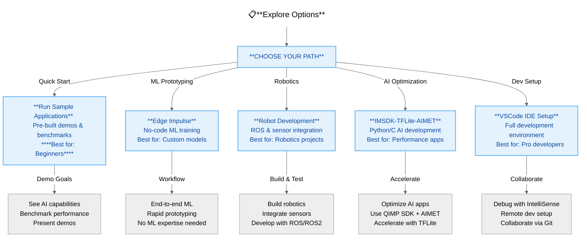

# AI Developer Workflow

## RUBIK Pi: Pick Your Vibe

Explore. Build. Innovate.  
Select your path below to access tutorials,demos and unleash everything RUBIK Pi can do.

>> 💡 **New to RUBIK Pi?**  
>> Start with [**Run Sample Applications**](../Run-sample-applications)  for instant demos—no setup needed.
---

## Path Descriptions

## 🚀 **Run Sample Applications**

Curious about RUBIK Pi’s capabilities?
Explore instant demos—computer vision, audio, and sensors—optimized for Qualcomm hardware. No setup required; get started right away.

**Includes:**  
- GStreamer-based AI demos  
- Object detection & classification  
- Performance benchmarking

> **📖 Key Documentation:**  
> - [Sample Applications section](https://docs.qualcomm.com/bundle/publicresource/topics/80-70018-50/overview.html)

**Best for:** First-timers, demo days, speed tests

---

## 🧠 **Edge Impulse**

Build your own ML models—no coding required. Collect data, train, deploy, and run on RUBIK Pi. Drag, drop, done.

**Includes:**
- End-to-end ML pipeline  
- Live data collection  
- Model training & deployment to edge devices

> **📚 Recommended Tutorials & Example Projects:**  
> - [Edge Impulse Studio](https://studio.edgeimpulse.com) *(general workflow)*  
> - [Crash Detection Project Example](https://docs.edgeimpulse.com/docs/tutorials/audio-classification) *(audio classification workflow, adaptable for RUBIK Pi)*  

**How-To**  
1. Set up RUBIK Pi with Ubuntu Linux  
2. Install Edge Impulse SDK  
3. Collect data & train model in Edge Impulse Studio  
4. Export Linux deployment package  
5. Deploy & run model on RUBIK Pi  
6. *(Optional)* Optimize for Qualcomm hardware using IM SDK or AIMET

**Best for:** *Creators, rapid prototyping, no-code fans*

---

## 🤖 **Robot Development**

For the makers and robot fans. Set up ROS, plug in sensors, and use Qualcomm’s AI for next-level robotics.

**Includes:**  
- ROS/ROS2 setup  
- Sensor drivers  
- Robotics AI samples  
- Multi-camera synchronization

> **📖 Key Documentation:**  
> - [Qualcomm Robotics Development Kit Documentation](https://docs.qualcomm.com/bundle/publicresource/topics/80-90441-2/introduction_1.html?product=1601111740057201&facet=Intelligent_Robotics_Function.SDK.2.0)  
> - [Sample Apps Guide](https://docs.qualcomm.com/bundle/publicresource/topics/80-90441-2/qir-sdk-sample-applications_3.html?product=1601111740057201&facet=Intelligent_Robotics_Function.SDK.2.0)

**Best for:** *Robotics, sensor hacks, ROS devs*

---

## ⚡ **IMSDK-TFLite-AIMET**

Want to go deep? Build AI apps in Python or C, deploy TFLite models, and optimize with Qualcomm’s SDKs for max speed.

**Includes:**  
- Python/C API support  
- TFLite model deployment  
- GStreamer pipelines  
- Model optimization with AIMET

> **📖 Key Documentation:**  
> - [Qualcomm IM SDK documentation](https://docs.qualcomm.com/bundle/publicresource/topics/80-70018-50/overview.html)  
> - [AIMET documentation](https://github.com/quic/aimet)
> - [Sample Apps Guide](https://docs.qualcomm.com/bundle/publicresource/topics/80-70018-50/example-applications.html)

**Best for:** *Custom AI applications, performance-critical projects, rapid development*

---

## 💻 **VSCode IDE Setup**

Full IDE, remote dev, debugging, and team collab. Set up VSCode for embedded Linux, cross-compile, and integrate with Qualcomm SDKs.

**Includes:**  
- IDE configuration  
- Remote SSH  
- Cross-compilation  
- Integration with Qualcomm SDKs & sample projects

> **📖 Key Documentation:**  
> - [Qualcomm Visual Studio Code Extension Guide](https://docs.qualcomm.com/bundle/publicresource/topics/80-79972-1/getting_started.html)  
> - [Projects/User Guide](https://docs.qualcomm.com/bundle/publicresource/topics/80-79972-1/user_guide.html)

**Best for:** *Professional development, debugging, team collaboration*

---

> ### 💡 **Pro Tips**
> - For hardware speed boosts (NPU/DSP), check [Qualcomm IM SDK documentation](https://docs.qualcomm.com/bundle/publicresource/topics/80-70018-50/overview.html).
> - Stuck? Try [Edge Impulse Troubleshooting Guide](https://docs.edgeimpulse.com/docs/troubleshooting) or hit up the dev community. (Need TC community link).

---

## 📌 **References**

- [Sample Applications section](https://docs.qualcomm.com/bundle/publicresource/topics/80-70018-50/ai-ml-sample-applications.html)
- [Edge Impulse Studio](https://studio.edgeimpulse.com)
- [Edge Impulse Linux SDK Documentation](https://docs.edgeimpulse.com/docs/edge-impulse-linux)
- [Crash Detection Project Example](https://docs.edgeimpulse.com/docs/tutorials/audio-classification)
- [Qualcomm Robotics Development Kit Documentation](https://docs.qualcomm.com/bundle/publicresource/topics/80-90441-2/introduction_1.html?product=1601111740057201&facet=Intelligent_Robotics_Function.SDK.2.0)
- [Sample Apps Guide](https://docs.qualcomm.com/bundle/publicresource/topics/80-90441-2/qir-sdk-sample-applications_3.html?product=1601111740057201&facet=Intelligent_Robotics_Function.SDK.2.0)
- [Qualcomm IM SDK documentation](https://docs.qualcomm.com/bundle/publicresource/topics/80-70018-50/overview.html)
- [AIMET documentation](https://github.com/quic/aimet)
- [Qualcomm Visual Studio Code Extension Guide](https://docs.qualcomm.com/bundle/publicresource/topics/80-79972-1/getting_started.html)
- [Projects/User Guide](https://docs.qualcomm.com/bundle/publicresource/topics/80-79972-1/user_guide.html)
- [Edge Impulse Troubleshooting Guide](https://docs.edgeimpulse.com/docs/troubleshooting)

---