# AI Developer Workflow

## RUBIK Pi: Pick Your Vibe

Explore. Build. Innovate.  
Select your path below to access tutorials,demos and unleash everything RUBIK Pi can do.

:::note[New to RUBIK Pi?]  
Start with [**Run Sample Applications**](./Run-sample-applications)  for instant demos—no setup needed.
:::

```mermaid
---
config:
  look: classic
  theme: neutral
---
graph TD
    Title[📋**Explore Options**]:::titleStyle
    Title --> B["**CHOOSE YOUR PATH**"]:::rectStyle
    B -->|Quick Start| C["🔗**Run Sample Applications**
    Pre-built demos & benchmarks
    ****Best for: Beginners****
    *(click to open)*"]:::rectStyle

    B -->|ML Prototyping| D["🔗**Edge Impulse**
    No-code ML training
    ****Best for: Custom models****
    *(click to open)*"]:::rectStyle

    B -->|AI Optimization| E["🔗**IMSDK-TFLite-AIMET**
    Python/C AI development
    ****Best for: Performance apps****
    *(click to open)*"]:::rectStyle

    B -->|Robotics| F["🔗**Robot Development**
    ROS & sensor integration
    ****Best for: Robotics projects****
    *(click to open)*"]:::rectStyle

    B -->|Dev Setup| G["🔗**VSCode IDE Setup**
    Full development environment
    ****Best for: Pro developers****
    *(click to open)*"]:::rectStyle

    C -->|Demo Goals| C1["See AI capabilities
    Benchmark performance
    Present demos"]

    D -->|Workflow| D1["End-to-end ML
    Rapid prototyping
    No ML expertise needed"]

    F -->|Accelerate| E1["Optimize AI apps
    Use QIMP SDK + AIMET
    Accelerate with TFLite"]

    E -->|Build & Test| F1["Build robotics
    Integrate sensors
    Develop with ROS/ROS2"]

    G -->|Collaborate| G1["Debug with IntelliSense
    Remote dev setup
    Collaborate via Git"]
    
    classDef titleStyle fill:transparent,stroke:transparent,font-size:20px
    classDef rectStyle fill:#e3f2fd,stroke:#64b5f6,stroke-width:2px,color:#0d47a1
    class Title titleStyle
    class C,D,E,F,G pathNodes
    class C1,D1,E1,F1,G1 detailNodes

    click C "./Run-sample-applications" "_self";
    click D "./Edge-Impulse" "_self";
    click E "./modify-IMSDK-sample-applications" "_self";
    click F "./Robot-development" "_self";
 
    click G "https://docs.qualcomm.com/bundle/publicresource/topics/80-79972-1/getting_started.html" "_self";
```

## Path Descriptions

## 🚀 **Run Sample Applications**

Ready to see RUBIK Pi in action?
Jump straight into hands-on AI demos—no setup, no stress. Whether you're into computer vision, audio tricks, or sensor magic, these preloaded experiences are built to impress and optimized for Qualcomm hardware.

**Includes:**  
- GStreamer-based AI demos  
- Object detection & classification  
- Performance benchmarking

:::note[**Key Docs to Dive Deeper**]   
- [Run Sample Applications](./Run-sample-applications) 
- [Qualcomm Sample Applications](https://docs.qualcomm.com/bundle/publicresource/topics/80-70018-50/overview.html)
:::

**Perfect for:** First-timers, demo day heroes, and anyone who loves fast results with zero fuss.
👉 Let’s get started!

---

## 🧠 **Edge Impulse**

Build your own ML models—no coding required. Collect data, train, deploy, and run on RUBIK Pi. Drag, drop, done.

**Includes:**
- End-to-end ML pipeline  
- Live data collection  
- Model training & deployment to edge devices

> **📚 Recommended Tutorials & Example Projects:**  
> - [Edge Impulse Studio](https://studio.edgeimpulse.com) *(general workflow)*  
> - [Crash Detection Project Example](https://docs.edgeimpulse.com/docs/tutorials/audio-classification) *(audio classification workflow, adaptable for RUBIK Pi)*  

**How-To**  
1. Set up RUBIK Pi with Ubuntu Linux  
2. Install Edge Impulse SDK  
3. Collect data & train model in Edge Impulse Studio  
4. Export Linux deployment package  
5. Deploy & run model on RUBIK Pi  
6. *(Optional)* Optimize for Qualcomm hardware using IM SDK or AIMET

**Best for:** *Creators, rapid prototyping, no-code fans*

---

## 🤖 **Robot Development**

For the makers and robot fans. Set up ROS, plug in sensors, and use Qualcomm’s AI for next-level robotics.

**Includes:**  
- ROS/ROS2 setup  
- Sensor drivers  
- Robotics AI samples  
- Multi-camera synchronization

> **📖 Key Documentation:**  
> - [Qualcomm Robotics Development Kit Documentation](https://docs.qualcomm.com/bundle/publicresource/topics/80-90441-2/introduction_1.html?product=1601111740057201&facet=Intelligent_Robotics_Function.SDK.2.0)  
> - [Sample Apps Guide](https://docs.qualcomm.com/bundle/publicresource/topics/80-90441-2/qir-sdk-sample-applications_3.html?product=1601111740057201&facet=Intelligent_Robotics_Function.SDK.2.0)

**Best for:** *Robotics, sensor hacks, ROS devs*

---

## ⚡ **IMSDK-TFLite-AIMET**

Want to go deep? Build AI apps in Python or C, deploy TFLite models, and optimize with Qualcomm’s SDKs for max speed.

**Includes:**  
- Python/C API support  
- TFLite model deployment  
- GStreamer pipelines  
- Model optimization with AIMET

> **📖 Key Documentation:**  
> - [Qualcomm IM SDK documentation](https://docs.qualcomm.com/bundle/publicresource/topics/80-70018-50/overview.html)  
> - [AIMET documentation](https://github.com/quic/aimet)
> - [Sample Apps Guide](https://docs.qualcomm.com/bundle/publicresource/topics/80-70018-50/example-applications.html)

**Best for:** *Custom AI applications, performance-critical projects, rapid development*

---

## 💻 **VSCode IDE Setup**

Full IDE, remote dev, debugging, and team collab. Set up VSCode for embedded Linux, cross-compile, and integrate with Qualcomm SDKs.

**Includes:**  
- IDE configuration  
- Remote SSH  
- Cross-compilation  
- Integration with Qualcomm SDKs & sample projects

> **📖 Key Documentation:**  
> - [Qualcomm Visual Studio Code Extension Guide](https://docs.qualcomm.com/bundle/publicresource/topics/80-79972-1/getting_started.html)  
> - [Projects/User Guide](https://docs.qualcomm.com/bundle/publicresource/topics/80-79972-1/user_guide.html)

**Best for:** *Professional development, debugging, team collaboration*

---

> ### 💡 **Pro Tips**
> - For hardware speed boosts (NPU/DSP), check [Qualcomm IM SDK documentation](https://docs.qualcomm.com/bundle/publicresource/topics/80-70018-50/overview.html).
> - Stuck? Try [Edge Impulse Troubleshooting Guide](https://docs.edgeimpulse.com/docs/troubleshooting) or hit up the dev community. (Need TC community link).

---