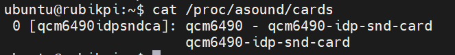
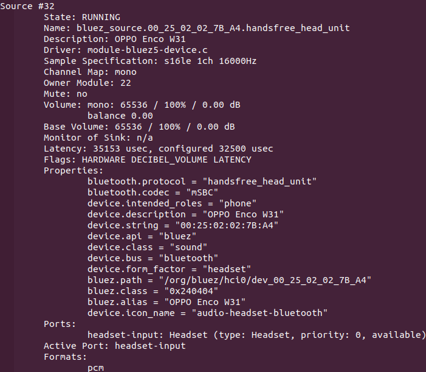
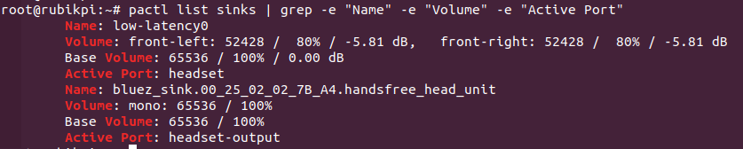
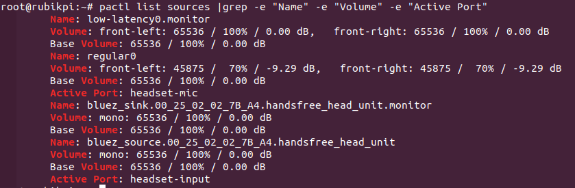

import Tabs from '@theme/Tabs';
import TabItem from '@theme/TabItem';

## Audio

RUBIK Pi 3 currently supports the following audio interfaces:

* 3.5mm headphone (No. 4 in the following figure)

* HDMI OUT (No. 9 in the following figure)

* Bluetooth


### Enable the audio function
    1. Add the Qualcomm and RUBIK Pi public personal package archive (PPA) to your RUBIK Pi 3 Ubuntu software sources.
    ```shell
    sudo add-apt-repository ppa:ubuntu-qcom-iot/qcom-noble-ppa
    sudo sed -i '$a deb http://apt.rubikpi.ai ppa main' /etc/apt/sources.list
    sudo apt update
    ```
    2. To install the audio-related software packages, run the following commands:
    ```shell
    sudo apt install libsndfile1 libltdl7 libspeexdsp1 qcom-fastrpc1 \
    rubikpi3-tinyalsa rubikpi3-tinycompress rubikpi3-qcom-agm rubikpi3-qcom-args rubikpi3-qcom-pal \
    rubikpi3-qcom-audio-ftm rubikpi3-qcom-audioroute rubikpi3-qcom-acdbdata rubikpi3-qcom-audio-node \
    rubikpi3-qcom-kvh2xml rubikpi3-qcom-pa-bt-audio rubikpi3-qcom-sva-capi-uv-wrapper rubikpi3-qcom-sva-cnn \
    rubikpi3-qcom-sva-listen-sound-model rubikpi3-qcom-sva-eai rubikpi3-qcom-pa-pal-voiceui rubikpi3-qcom-pa-pal-acd \
    rubikpi3-qcom-audio-plugin-headers rubikpi3-qcom-dac-mer-testapp rubikpi3-qcom-dac-plugin rubikpi3-qcom-mercury-plugin \
    rubikpi3-pulseaudio rubikpi3-diag rubikpi3-dsp rubikpi3-libdmabufheap rubikpi3-qcom-vui-interface rubikpi3-qcom-vui-interface-header \
    rubikpi3-time-genoff rubikpi3-pa-pal-plugins

    sudo usermod -aG audio,pulse,plugdev,video,render ubuntu  # Replace ubuntu with the actual user name
    ```

* Run the following command on RUBIK Pi 3 to view the mounted sound cards:
```shell
cat /proc/asound/cards
```


### Set the audio output device

To change the audio output source for pulseaudio-related commands, run the following commands:

* Set the output device to the 3.5mm headset
```shell
pactl set-default-sink low-latency0
pactl set-sink-port low-latency0 headset
```
* Set the output device to HDMI OUT
```shell
pactl set-default-sink low-latency0
pactl set-sink-port low-latency0 hdmi-out
```

* To set the output device to Bluetooth, refer to [Bluetooth](#blue) and make sure the Bluetooth connection is established.
    * To confirm the audio information supported by the current Bluetooth device, run the following command. There are differences in the audio support between different Bluetooth devices.
    ```shell
    pactl list cards
    ```
    Sample output
    

    * Run the following command to switch the Bluetooth audio output profile.
    ```shell
    pactl set-card-profile <Card-Name> <Profile>
    ```
    Example

    ```shell
    # Switch to the call mode (HFP/HSP).
    pactl set-card-profile bluez_card.00_25_02_02_7B_A4 handsfree_head_unit
    ```
    * Run the following command to view the Bluetooth-related source information.
    ```shell
    pactl list sources
    ```
    Sample output

    

    * Run the following command to switch the Bluetooth audio input interface.
    ```shell
    pactl set-default-source <Source-Name>
    ```
    Example

    ```shell
    pactl set-default-source bluez_source.00_25_02_02_7B_A4.handsfree_head_unit
    ```

### Playback

1. Run the following command to create the */opt* directory and ensure that the */opt* path is readable and writable.
2. Before running the commands, make sure to push the MP3 test file (*FileName.mp3*) to the */opt* directory.
:::

```shell
mkdir /opt
sudo chmod 777 -R /opt
```
* Run the following to test the .mp3 playback.
```shell
paplay /opt/<FileName>.mp3
```

### Recording
* Run the following command to test the .mp3 recording.
```shell
parecord /opt/<FileName>.mp3
```

### Adjust the volume
* Adjust the playback volume
    * Run the following command to check the volume of the output device:
    ```shell
    pactl list sinks | grep -e "Name" -e "Volume" -e "Active Port"
    ```
    Sample output

    

    * Run the following command to modify the volume of the current output device:
    ```shell
    pactl set-sink-volume <Sink-Name> <Volume>
    ```
    Example
    ```shell
    pactl set-sink-volume low-latency0 70%
    ```

* Adjust the recording volume
    * Run the following command to check the volume of the output device:
    ```shell
    pactl list sources | grep -e "Name" -e "Volume" -e "Active Port"
    ```
    Sample output

    

    * Run the following command to modify the volume of the current output device:
    ```shell
    pactl set-source-volume <Source-Name> <Volume>
    ```
    Example

    ```shell
    pactl set-source-volume regular0 70%
    ```

### Capture logs

* User space logs
  
  Perform the following operation to capture user space logs:

  ```shell

  cat /var/log/user.log
  ```

* Kernel audio driver logs

  To capture the kernel logs, please do the following:

  * Kernel logs

    ```shell
    dmesg
    ```

  * Disable kernel logs in a specific file:

    ```shell
    echo –n “file <filename> -p” > /sys/kernel/debug/dynamic_debug/control

    ```

  * Dynamic kernel logs

    By default, dynamic logging is disabled. To enable it, add the `CONFIG_DYNAMIC_DEBUG` kernel configuration, then recompile and reflash the device.
    To enable audio dynamic kernel logs, perform the following steps:

    ```shell
    ssh root@ip-addr
    mount -o rw,remount /
    mount -t debugfs none /sys/kernel/debug
    echo –n “file <filename> +p” > /sys/kernel/debug/dynamic_debug/control
    ```

### Analyze the captured logs

View user space logs and kernel audio driver logs to learn about playback and recording use cases.

* Playback

  The following log snippet describes the information collected for the playback use case.

  ```shell
  //Open Low latency Playback stream. Details of each stream type can be found at sources/audio/opensource/arpal-lx/inc/PalDefs.h
  2022-04-28T18:02:08.748280+00:00 pulseaudio: pal_stream_open: 224: Enter, stream type:1

  //Verify the backend device, sample rate, bitwidth, channels etc
  2022-04-28T18:02:08.748627+00:00 pulseaudio: setDeviceMediaConfig: 1056: CODEC_DMA-LPAIF_WSA-RX-0 rate ch fmt data_fmt 48000 2 2 1

  //Start playback stream
  2022-04-28T18:02:08.751947+00:00 pulseaudio: pal_stream_start: 338: Enter. Stream handle 0xffff94001040K

  //Map the metadata with kvh2xml.h file for playback usecase details.
  2022-04-28T18:02:08.853157+00:00 pulseaudio: metadata_print: 82 key:0xa1000000, value:0xa100000e//PCM_LL_PLAYBACK
  2022-04-28T18:02:08.853395+00:00 pulseaudio: metadata_print: 82 key:0xab000000, value:0x1
  2022-04-28T18:02:08.853660+00:00 pulseaudio: metadata_print: 82 key:0xa2000000, value:0xa2000001//Speaker
  2022-04-28T18:02:08.853881+00:00 pulseaudio: metadata_print: 82 key:0xac000000, value:0xac000002//DEVICEPP_RX_AUDIO_MBDRC

  //Verify the graph opened for playback usecase
  2022-04-28T18:02:08.856934+00:00 pulseaudio: print_graph_alias: 2334 GKV Alias 142 | StreamRX_PCM_LL_Playback_DeviceRX_Speaker_Instance_Instance_1_DevicePP_Rx_Audio_MBDRC
  //graph_open called
  2022-04-28T18:02:08.859509+00:00 pulseaudio: graph_open: 709 graph_handle 0x47534c

  //Configure hardware endpoint module
  2022-04-28T18:02:08.864386+00:00 pulseaudio: configure_hw_ep_media_config: 636 entry mod tag c0000004 miid 43b1 mid 7001023
  2022-04-28T18:02:08.864495+00:00 pulseaudio: configure_hw_ep_media_config: 664 rate 48000 bw 16 ch 2, data_fmt 1
  2022-04-28T18:02:08.864603+00:00 pulseaudio: configure_hw_ep_media_config: 676 exit, ret 0

  //graph_start entry
  2022-04-28T18:02:08.867234+00:00 pulseaudio: graph_start: 899 entry graph_handle 0x47534c
  //Stream started
  2022-04-28T18:02:08.867864+00:00 pulseaudio: pal_stream_start: 387: Exit. status 0

  //graph_stop entry
  2022-04-28T18:02:25.037338+00:00 pulseaudio: graph_stop: 928 entry graph_handle 0x47534c
  //Stop the PAL stream once playback completes
  2022-04-28T18:02:25.039923+00:00 pulseaudio: pal_stream_stop: 441: Exit. status 0

  //graph_close entry
  2022-04-28T18:02:25.050944+00:00 pulseaudio: graph_close: 762 entry handle 0x47534c
  //Close the PAL stream
  2022-04-28T18:02:25.054510+00:00 pulseaudio: pal_stream_close: 322: Exit. status 0

  ```

* Recording

  The following log snippet describes the information collected for the recording use case.

  ```shell
  //Open Recording stream for PAL_STREAM_RAW. Details of stream type can be found at sources/audio/opensource/arpal-lx/inc/PalDefs.h
  Apr 29 09:23:11 pulseaudio[862]: pal_stream_open: 224: Enter, stream type:9

  //Verify the backend device, sample rate, bitwidth, channels etc
  Apr 29 09:23:11 pulseaudio[862]: setDeviceMediaConfig: 1056: CODEC_DMA-LPAIF_VA-TX-0 rate ch fmt data_fmt 48000 1 2 1

  //Start recording stream
  Apr 29 09:23:11 pulseaudio[862]: pal_stream_start: 338: Enter. Stream handle 0xffff6c001040K

  //graph_open entry
  Apr 29 09:23:11 pulseaudio[862]: graph_open: 709 graph_handle 0x47534c

  //Metadata details to identify the usecase
  Apr 29 09:23:11 pulseaudio[862]: metadata_print: 82 key:0xb1000000, value:0xb1000009//RAW_RECORD
  Apr 29 09:23:11 pulseaudio[862]: metadata_print: 82 key:0xa3000000, value:0xa3000004//HANDSETMIC

  //Verify the graph opened for recording usecase
  Apr 29 09:23:11 pulseaudio[862]: print_graph_alias: 2334 GKV Alias 29 | DeviceTX_Handset_Mic_StreamTX_RAW_Record

  //Configure hardware endpoint module
  Apr 29 09:23:11 pulseaudio[862]: configure_hw_ep_media_config: 636 entry mod tag c0000005 miid 43af mid 7001024
  Apr 29 09:23:11 pulseaudio[862]: configure_hw_ep_media_config: 664 rate 48000 bw 16 ch 1, data_fmt 1
  Apr 29 09:23:11 pulseaudio[862]: configure_hw_ep_media_config: 676 exit, ret 0

  //graph_start entry
  Apr 29 09:23:11 pulseaudio[862]: graph_start: 899 entry graph_handle 0x47534c
  //Stream recording started
  Apr 29 09:23:11 pulseaudio[862]: pal_stream_start: 387: Exit. status 0


  //graph_stop entry
  Apr 29 09:23:26 pulseaudio[862]: graph_stop: 928 entry graph_handle 0x47534c
  //Stop the PAL stream once user stops recording
  Apr 29 09:23:26 pulseaudio[862]: D: [regular2] pal-source.c: pal_stream_stop returned 0

  //Close the PAL stream
  Apr 29 09:23:26 pulseaudio[862]: pal_stream_close: 284: Enter. Stream handle :0xffff6c001040K
  //graph_close entry
  Apr 29 09:23:26 pulseaudio[862]: graph_close: 762 entry handle 0x47534c
  //Close the PAL stream
  Apr 29 09:23:26 pulseaudio[862]: pal_stream_close: 322: Exit. status 0

  ```


