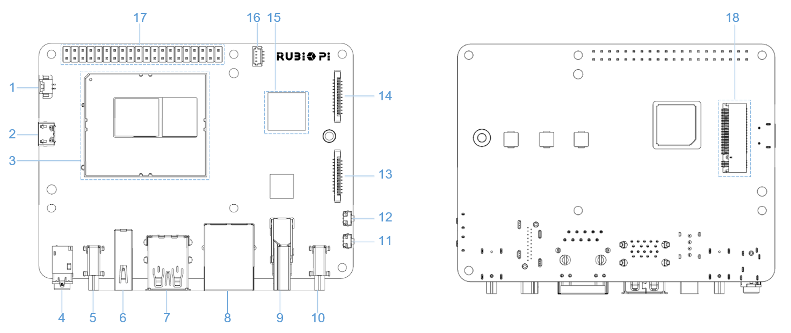

# Peripherals and Interfaces

This chapter provides an overview of the peripherals and interfaces available on RUBIK Pi 3

Through this section, you can learn the usage methods of various hardware interfaces on the RUBIK Pi, as well as general troubleshooting methods.

In this section, the command-line usage methods of peripherals and interfaces will be explained. For most functions, you can directly run them in the desktop system by operating the GUI-based apps.

## Hardware resource diagram

| No.  | Interface                      | No.  | Interface                    |
|------|--------------------------------|------|------------------------------|
| 1    | RTC battery connector          | 10   | Power Delivery over Type-C   |
| 2    | Micro USB (UART debug)         | 11   | PWR button                   |
| 3    | TurboX C6490P SOM              | 12   | EDL button                   |
| 4    | 3.5mm headphone jack           | 13   | Camera connector 2           |
| 5    | USB Type-C with DP (USB 3.1)   | 14   | Camera connector 1           |
| 6    | USB Type-A (USB 2.0)           | 15   | Wi-Fi/BT module              |
| 7    | 2 x USB Type-A (USB 3.0)       | 16   | Fan connector                |
| 8    | 1000M Ethernet                 | 17   | 40-pin LS connector          |
| 9    | HDMI OUT                       | 18   | M.2 Key M connector          |
