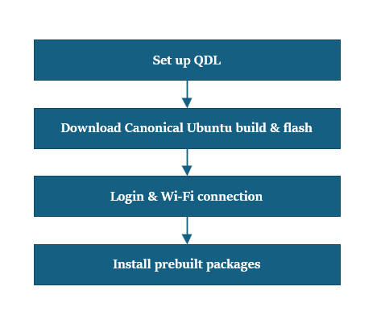
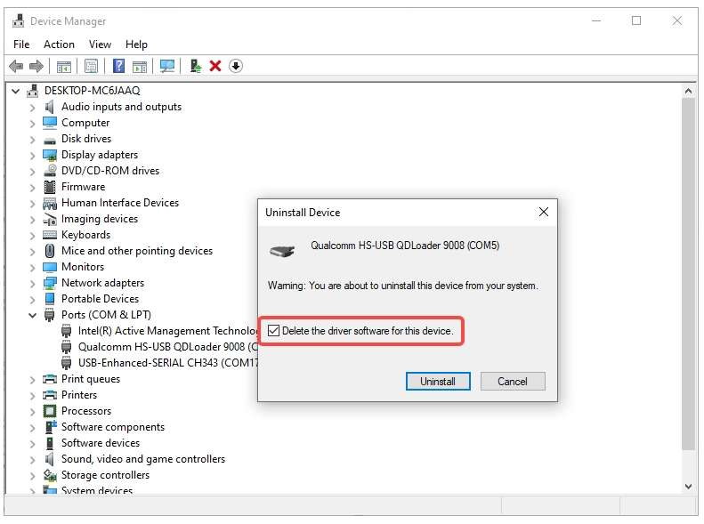

import Tabs from '@theme/Tabs';
import TabItem from '@theme/TabItem';

# Reset to Factory Ubuntu Image

This guide outlines a simplified recovery process for devices that are misconfigured, corrupted, or require a fresh start—restoring the original Canonical Ubuntu image to ensure a reliable starting point for development.   
 :::warning
    Updating the software with the prebuilt images erases all data on your device and installs a newer image. Ensure you back up important data before you start.
    ::: 
	:::info 

		- **Before You Start** - Complete [**🔗setup**](../2.set-up-your-device.md) instructions.  
	:::

### 🏁 Let’s Get Started!
 


### 1️⃣ Setup QDL tool   
**Qualcomm Device Loader (QDL)** is a cross-platform tool for flashing software images to Qualcomm® USB devices by uploading a flash loader, with support for **Windows**, **Linux**, and **macOS**.
1. Download the appropriate version of the QDL tool for your host machine (**Windows**, **Linux**, or **macOS**) from the provided link.  [**🔗QDL tool**(includes executable files)](https://softwarecenter.qualcomm.com/catalog/item/Qualcomm_Device_Loader)    
2. Review the official setup guide to understand the full flashing process. 
<a id="flashQDL"></a>
<Tabs>

<TabItem value="uhost" label="Ubuntu host">

1. Install libusb and libxml2 by executing the following command. (Skip this step if they are already installed.)

```shell
sudo apt-get install libxml2-dev libudev-dev libusb-1.0-0-dev
```

</TabItem>
<TabItem value="whost" label="Windows host">

1. Install winUSB Driver:  
   	To prepare your device for flashing, follow these steps to install the **winUSB driver**:   
	- 1a: Uninstall Existing Drivers    
	Ensure that **Qualcomm USB drivers (QUD)** or any other conflicting drivers are **not installed**.
	Open **Device Manager**, locate your device, and uninstall any existing drivers.  
	In the uninstall dialog, **check** the box labeled:  

          

         * Ensure that you check **Delete the driver software for this device**.

         

    - 1b: In the folder of QDL - Run **install_driver.bat** 

</TabItem>
<TabItem value="mhost" label="macOS host">

1. Install Homebrew using the following method. (Skip this step if it is already installed.)

```shell
/bin/bash -c "$(curl -fsSL https://raw.githubusercontent.com/Homebrew/install/HEAD/install.sh)"
```

2. Run the following commands to install libusb and libxml2.

```shell
brew install libusb
brew install libxml2
```
</TabItem>
</Tabs>


### 2️⃣  Download Canonical Ubuntu build and flash
1: Download the system image for RPi3 from the Canonical Ubuntu site. [**🔗Server 24.04 image**](https://people.canonical.com/~platform/images/qualcomm-iot/rubikpi3/ubuntu-server-24.04/x00/ubuntu-24.04-preinstalled-server-arm64+rubikpi3-20250912-127.img.xz)    
2: Download the dtb.bin file [**🔗Devicetree blob**](https://people.canonical.com/~platform/images/qualcomm-iot/rubikpi3/ubuntu-server-24.04/x00/dtb.bin)  
3: Download the rawprogram0.xml file [**🔗rawprogram0.xml**](https://people.canonical.com/~platform/images/qualcomm-iot/rubikpi3/ubuntu-server-24.04/x00/rawprogram0.xml)  
4: Download the boot firmware image. [**🔗Boot firmware**](https://thundercomm.s3.dualstack.ap-northeast-1.amazonaws.com/uploads/web/rubik-pi-3/nhlos-bins/QLI.1.4-ubuntu-rubikpi3-nhlos-bins-20250912-127.tar.gz)  
5: Unzip the boot firmware image zip file and copy the dtb.bin, rawprogram0.xml and system images to this folder location.   
6: Unzip and copy the QDL executable files from [**Step1**](#1️⃣-setup-qdl-tool) to Boot Firmware folder.  
	:::note
		- For Windows hosts, make sure to copy the DLL files along with the executable.
	:::
7: Enter into [**🔗 EDL mode**](../2.set-up-your-device.md#enterEDL)   
8: Flash the device using the command  
<Tabs>
<TabItem value="uhost" label="Ubuntu host">
Run the following command.
```shell
qdl --storage ufs prog_firehose_ddr.elf rawprogram*.xml patch*.xml
```
</TabItem>
<TabItem value="whost" label="Windows host">
Run the following command 
```shell
QDL.exe prog_firehose_ddr.elf rawprogram0.xml rawprogram1.xml rawprogram2.xml rawprogram3.xml rawprogram4.xml rawprogram5.xml rawprogram6.xml patch1.xml patch2.xml patch3.xml patch4.xml patch5.xml patch6.xml
```
</TabItem>
<TabItem value="mhost" label="macOS host">
Run the following command
```shell
qdl prog_firehose_ddr.elf rawprogram*.xml patch*.xml
```
</TabItem>
</Tabs>
:::note
 In case of failures, remove and plug in the power supply and USB cable to restart your RUBIK Pi 3 and perform the flashing operation again.
:::
9: Once flashing is complete, the device will automatically boot and display the startup screen on the connected HDMI monitor.  
 

### 3️⃣ Login & Wi-Fi Connection 
1: Login and change password on the monitor UART console/SBC terminal.    
2: Set up Wi-Fi connectivity.  [🔗 Wi-Fi Setup Guide](../2.set-up-your-device.md#conNET)

### 4️⃣ Install Pre-built Packages 
Run the following commands to install pre-built packages on the device.    
```shell
git clone -b ubuntu_setup --single-branch https://github.com/rubikpi-ai/rubikpi-script.git
cd rubikpi-script
./install_ppa_pkgs.sh 
```
> 📌 **Note:** If you encounter package installation failures, run the following command: 'apt --fix-broken install' 
After successful running the install_ppa_pkgs.sh, you can observe the following screen on Display Monitor.

 
 
### 5️⃣ Verify the SW version
  Run the following commands in the device shell to verify the version: 
    ```shell
    cat /etc/os-release 
    ```
  Output: 
    ```json
  NAME="Ubuntu"
  VERSION_ID="24.04"
  VERSION="24.04.2 LTS (Noble Numbat)"
  VERSION_CODENAME=noble
  ID=ubuntu
  ID_LIKE=debian
  HOME_URL="https://www.ubuntu.com/"
  SUPPORT_URL="https://help.ubuntu.com/"
  BUG_REPORT_URL="https://bugs.launchpad.net/ubuntu/"
  PRIVACY_POLICY_URL="https://www.ubuntu.com/legal/terms-and-policies/privacy-policy"
  UBUNTU_CODENAME=noble
  LOGO=ubuntu-logo
  ```
  Run the following command to check the Linux version:
    ```shell
    uname -a
    ```
  Output:
    ```json
    Linux ubuntu 6.8.0-1055-qcom #55-Ubuntu SMP PREEMPT_DYNAMIC Wed Sep 17 02:03:34 UTC 2025 aarch64 aarch64 aarch64 GNU/Linux  
    ```
---
> **🧭 Next Steps**
> After the image is flashed, refer to the [**Application Development and Execution Guide**](../7.Application%20Development%20and%20Execution%20Guide/1.Building%20AI%20Models/1.edge_impulse.md).
---
