---
# Display h2 to h5 headings
toc_min_heading_level: 2
toc_max_heading_level: 4
---

import Tabs from '@theme/Tabs';
import TabItem from '@theme/TabItem';

# Peripherals and Interfaces

This chapter provides an overview of the peripherals and interfaces available on RUBIK Pi 3

Through this section, you can learn the usage methods of various hardware interfaces on the RUBIK Pi, as well as general troubleshooting methods.

In this section, the command-line usage methods of peripherals and interfaces will be explained. For most functions, you can directly run them in the desktop system by operating the GUI-based apps.

## Hardware resource diagram


| No.  | Interface                      | No.  | Interface                    |
|------|--------------------------------|------|------------------------------|
| 1    | RTC battery connector          | 10   | Power Delivery over Type-C   |
| 2    | Micro USB (UART debug)         | 11   | PWR button                   |
| 3    | TurboX C6490P SOM              | 12   | EDL button                   |
| 4    | 3.5mm headphone jack           | 13   | Camera connector 2           |
| 5    | USB Type-C with DP (USB 3.1)   | 14   | Camera connector 1           |
| 6    | USB Type-A (USB 2.0)           | 15   | Wi-Fi/BT module              |
| 7    | 2 x USB Type-A (USB 3.0)       | 16   | Fan connector                |
| 8    | 1000M Ethernet                 | 17   | 40-pin LS connector          |
| 9    | HDMI OUT                       | 18   | M.2 Key M connector          |

## 40-pin LS connector

### GPIO

RUBIK Pi 3 is compatible with WiringRP (based on the high-performance GPIO programming library WiringPi). It is recommended to use WiringRP for controlling and programming GPIOs. For more details about WiringRP, visit https://github.com/rubikpi-ai/WiringRP.

#### Pinout

The figure below shows the default functions of the RUBIK Pi 3 40-pin LS connector, most of which are compatible with the default functions of the Raspberry Pi 40-pin connector.


The following table lists all functions of the 40-pin LS connector. Blue bold functions are default functions.


#### Use GPIOs

On RUBIK Pi 3, you can use shell commands or programming languages to control the General-Purpose Input/Output (GPIO).

<Tabs>
    <TabItem value="GPIO Shell" label="Shell command">
    Perform the following steps on your RUBIK Pi 3 to control GPIOs.
    
    :::note
    The following commands require the root privilege:

    * Use the `sudo -i` command to switch to the root user.

    * For regular users, run commands with the `sudo` prefix, such as `sudo gpio readall` and enter the user's login password as prompted.
    :::

    * Using WiringRP commands:

         Before using the WiringRP commands, install the WiringRP as follows:

   1. Add the RUBIK Pi public personal package archive (PPA) to your RUBIK Pi 3 Ubuntu software sources. 
       
        ```shell
        sudo sed -i '$a deb http://apt.rubikpi.ai ppa main' /etc/apt/sources.list
        sudo apt update
        ```
   2. Run the following command to install WiringRP.
        
        ```shell
        sudo apt install wiringrp
        ```

         Use the following commands to operate GPIOs after installation：

    * View the GPIO status

        ```shell
        gpio readall
        ```

         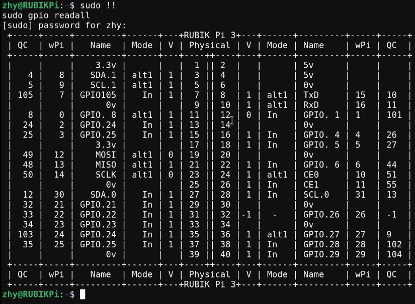

   *  Set the GPIO mode

        ```shell
        gpio mode 15 in             # Set pin 15 to input mode
        gpio pins                   # Check the mode
        gpio mode 15 out            # Set pin 15 to output mode
        gpio pins                   # Check the mode
        ```

    *  Set the pin level

        ```shell
        gpio write 15 1             # Set pin 15 to high level
        gpio read 15                # Check the pin level
        gpio write 15 0             # Set pin 15 to low level
        gpio read 15                # Check the pin level
        ```

    * Operate nodes under */sys/class/gpio*:
  
         The table below shows the GPIO subsystem numbering.

        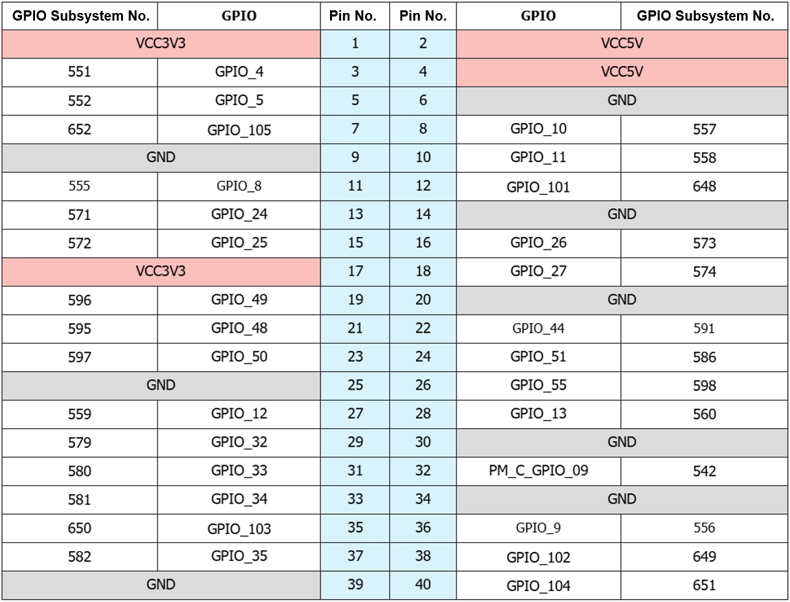

        1. Go to the */sys/class/gpio* directory:

             ```
             cd /sys/class/gpio
             ```

        2. Export the GPIO to be controlled. For example, pin 13 GPIO_24:
             ```
             echo 571 > export
             ```

        3. Go to the gpio571 directory to set GPIO attributes:

             ```
             cd gpio571
             ls
             ```
             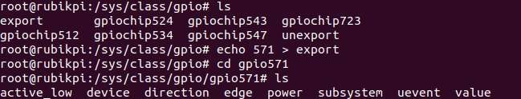

        - direction:
            - input: in
            - output: out
  
        - value:
            - Low level: 0
            - High level: 1
  
        - edge (interrupt edge):
            - Rising edge trigger: rising
            - Falling edge trigger: falling
            - Both-edge trigger: both
            - Disabling interrupts: none

        4. For example, set pin 13 to output a high level:

        ```
        echo out > direction
        echo 1 > value
        ```
        5. Cancel the export of pin 13 to user space:

        ```
        echo 571 > unexport
        ```

    </TabItem>
    <TabItem value="GPIO WiringRP-c" label="WiringRP">
       The WiringRP library provides a set of API functions that enable control with minimal logic.

        To install the WiringRP library on the RUBIK Pi 3, follow these steps:

        1. Add the RUBIK Pi public personal package archive (PPA) to your RUBIK Pi 3 Ubuntu software sources.
        ```shell
        sudo sed -i '$a deb http://apt.rubikpi.ai ppa main' /etc/apt/sources.list
        sudo apt update
        ```
        2. Run the following command to install WiringRP.
        ```shell
        sudo apt install wiringrp
        ```

        The following code snippet sets pin 13 as output, pin 15 as input, and loops to check the level status of pin 15.

        ```c
        #include <stdio.h>
        #include <wiringPi.h>

        int main (void)
        {
          wiringPiSetup () ;
          pinMode (13, OUTPUT) ;
          pinMode (15, INPUT) ;

          for (;;)
          {
            digitalWrite (13, HIGH) ;        // On
            printf("%d\n", digitalRead (15));        // On
            delay (1000) ;                // mS
            digitalWrite (13, LOW) ;        // Off
            printf("%d\n", digitalRead (15));        // On
            delay (1900) ;
          }

          return 0 ;
        }

        ```
        - Compile on RUBIK Pi 3

          ```shell
          gcc gpio.c -o gpio -lwiringPi
          ```

          :::note
          If the `gcc` command is not available, run `apt install gcc` to install the gcc compiler.
          :::
        Short pin 13 and pin 15 with a Dupont wire, as shown in the following figure, to test the GPIO level control and read the level.
        :::warning
        Pay attention to the pin order. Do not short the power and ground pins, as this may cause damage to the board.
        :::

        

          Run the following command:

        ```shell
        ./gpio
        ```

        The program execution result is as follows:

        


    </TabItem>
    <TabItem value="GPIO WiringRP-python" label="WiringRP-Python">
        The WiringRP-Python library provides a set of API functions that enable control with minimal logic.

        To install the WiringRP-Python on the RUBIK Pi 3, follow these steps:

        1. Add the RUBIK Pi public personal package archive (PPA) to your RUBIK Pi 3 Ubuntu software sources.
        ```shell
        sudo sed -i '$a deb http://apt.rubikpi.ai ppa main' /etc/apt/sources.list
        sudo apt update
        ```
        2. Run the following command to install WiringRP-Python.
        ```shell
        sudo apt install wiringrp-python
        ```

        The following code snippet is an example of controlling GPIOs using the WiringRP library: set pin 13 as output, pin 15 as input, and loops to check the level status of pin 15.

        ```python
        import wiringpi
        import time

        wiringpi.wiringPiSetup()
        wiringpi.pinMode(13, 1)
        wiringpi.pinMode(15, 0)
        wiringpi.digitalRead(15)

        while True:
            wiringpi.digitalWrite(13,1)
            pin_level = wiringpi.digitalRead(15)
            print(f"in_gpio level: {pin_level}")

            time.sleep(1)

            wiringpi.digitalWrite(13,0)
            pin_level = wiringpi.digitalRead(15)
            print(f"in_gpio level: {pin_level}")

            time.sleep(1)
        ```

        Short pin 13 and pin 15 with a Dupont wire, as shown in the following figure, to test the GPIO level control and read the level.

        :::warning
        Pay attention to the pin order. Do not short the power and ground pins, as this may cause damage to the board.
        :::

        

        Run the following command on your RUBIK Pi 3:

        ```shell
        python3 gpio.py
        ```

        The program execution result is as follows:

        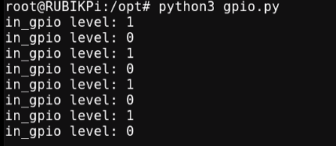


    </TabItem>
    <TabItem value="GPIO C" label="C">
        The following code snippet is an example of setting pin 13 as output, pin 15 as input, and loops to check the level status of pin 15.
        ```c
        #include <stdio.h>
        #include <stdlib.h>
        #include <unistd.h>

        int out_gpio = 571;
        int in_gpio = 572;

        int main() {
            char export_path[50] = {};
            char export_command[100] = {};
            snprintf(export_path, sizeof(export_path), "/sys/class/gpio/export");
            snprintf(export_command, sizeof(export_command), "echo %d > %s ", out_gpio, export_path);
            system(export_command);
            snprintf(export_command, sizeof(export_command), "echo %d > %s ", in_gpio, export_path);
            system(export_command);

            char direction_path[50] = {};
            snprintf(direction_path, sizeof(direction_path), "/sys/class/gpio/gpio%d/direction", out_gpio);
            FILE *direction_file = fopen(direction_path, "w");
            if (direction_file == NULL) {
                perror("Failed to open GPIO direction file");
                return -1;
            }
            fprintf(direction_file, "out");
            fclose(direction_file);

            snprintf(direction_path, sizeof(direction_path), "/sys/class/gpio/gpio%d/direction", in_gpio);
            direction_file = fopen(direction_path, "w");
            if (direction_file == NULL) {
                perror("Failed to open GPIO direction file");
                return -1;
            }
            fprintf(direction_file, "in");
            fclose(direction_file);

            char value_in_path[50] = {};
            char value_out_path[50] = {};
            char cat_command[100] = {};
            snprintf(value_out_path, sizeof(value_out_path), "/sys/class/gpio/gpio%d/value", out_gpio);
            snprintf(value_in_path, sizeof(value_in_path), "/sys/class/gpio/gpio%d/value", in_gpio);
            snprintf(cat_command, sizeof(cat_command), "cat %s", value_in_path);

            FILE *value_out_file = fopen(value_out_path, "w");
            if (value_out_file == NULL) {
                perror("Failed to open GPIO value file");
                return -1;
            }

            for (int i = 0; i < 5; i++) {
                fprintf(value_out_file, "1");
                fflush(value_out_file);

                system(cat_command);
                sleep(1);

                fprintf(value_out_file, "0");
                fflush(value_out_file);

                system(cat_command);
                sleep(1);
            }

            fclose(value_out_file);

            char unexport_path[50] = {};
            char unexport_command[100] = {};
            snprintf(unexport_path, sizeof(unexport_path), "/sys/class/gpio/unexport");
            snprintf(unexport_command, sizeof(unexport_command), "echo %d > %s ", out_gpio, unexport_path);
            system(unexport_command);
            snprintf(unexport_command, sizeof(unexport_command), "echo %d > %s ", in_gpio, unexport_path);
            system(unexport_command);

            return 0;
        }

        ```
        Compile on RUBIK Pi 3


        ```shell
        gcc gpio.c -o gpio
        ```
        :::note
        If the `gcc` command is not available, run `apt install gcc` to install the gcc compiler.
        :::

        Short pin 13 and pin 15 with a Dupont wire, as shown in the following figure, to test the GPIO level control and read the level.

        :::warning
        Pay attention to the pin order. Do not short the power and ground pins, as this may cause damage to the board.
        :::

        

        Run the following command:

        ```shell
        ./gpio
        ```

        The program execution result is as follows:

        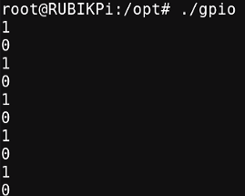

    </TabItem>
    <TabItem value="GPIO python" label="Python">
        GPIOs can be controlled by using python-periphery. Run the following command to install python-periphery on RUBIK Pi 3:

        The following code snippet uses python-periphery to operate GPIOs: set pin 13 as output, pin 15 as input, and loop to check the level status of pin 15.
        ```python
        from periphery import GPIO
        import time

        out_gpio = GPIO(571, "out")
        in_gpio = GPIO(572, "in")

        try:
            while True:
                try:
                    out_gpio.write(True)
                    pin_level = in_gpio.read()
                    print(f"in_gpio level: {pin_level}")

                    out_gpio.write(False)
                    pin_level = in_gpio.read()
                    print(f"in_gpio level: {pin_level}")

                    time.sleep(1)

                except KeyboardInterrupt:
                    out_gpio.write(False)
                    break

        except IOError:
            print("Error")

        finally:
            out_gpio.close()
            in_gpio.close()
        ```
        Short pin 13 and pin 15 with a Dupont wire, as shown in the following figure, to test the GPIO level control and read the level.

        :::warning
        
        Pay attention to the pin order. Do not short the power and ground pins, as this may cause damage to the board.
        :::

        

        Run the following command:

        ```shell
        python3 gpio.py
         ```
        
        The program execution result is as follows:

        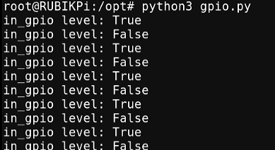
    </TabItem>
</Tabs>


### I2C

Inter-Integrated circuit (I2C) is a bidirectional 2-wire bus for an efficient inter‑IC control bus developed by Philips in the 1980s. Every device on the bus has its own unique address (registered with the I2C general body headed by Philips). The I2C core supports a multicontroller mode and 10‑bit target address and 10‑bit extendable address. For more information on I2C, see https://www.i2c-bus.org/fileadmin/ftp/i2c_bus_specification_1995.pdf.


RUBIK Pi 3 is compatible with WiringRP (based on the high-performance GPIO programming library WiringPi). It is recommended to use WiringRP for controlling and programming I2C. For more details about WiringRP, visit https://github.com/rubikpi-ai/WiringRP.

#### Pinout

The figure below shows the default functions of the RUBIK Pi 3 40-pin LS connector, most of which are compatible with the default functions of the Raspberry Pi 40-pin connector.


:::note
Pin 3 and pin 5 are set to I2C1 by default.
:::

The following table lists all functions of the 40-pin LS connector. Blue bold functions are default functions.


#### Use I2C

On RUBIK Pi 3, you can use shell commands or programming languages to control the I2C bus.

<Tabs>
    <TabItem value="I2C Shell" label="Shell command">
        Perform the following steps on RUBIK Pi 3 to control the I2C bus.
        To install the WiringRP library on your RUBIK Pi 3, follow these steps:

        1. Add the RUBIK Pi public personal package archive (PPA) to your RUBIK Pi 3 Ubuntu software sources.
        ```shell
        sudo sed -i '$a deb http://apt.rubikpi.ai ppa main' /etc/apt/sources.list
        sudo apt update
        ```
        2. To install the WiringRP library on the RUBIK Pi 3, follow these steps:
        ```shell
        sudo apt install wiringrp

        * Use the WiringRP related command:

            ```shell
            ./gpio -x ads1115:100:10 aread 100     #Read the analog signal value of the ADS1115 device via the I2C bus.
            ```
        * Use the i2cdetect tool

            *  View devices connected to the I2C1 interface:

              ```shell
              i2cdetect -a -y -r 1
              ```

            * Read all registers of the device whose address is 0x38:

              ```shell
              i2cdump -f -y 1 0x38
              ```

            * Write 0xaa to register 0x01 of the device whose address is 0x38:

              ```shell
              i2cset -f -y 1 0x38 0x01 0xaa
              ```

            * Read the value at register 0x01 of the device whose address is 0x38:

              ```shell
              i2cget -f -y 1 0x38 0x01
              ```

        :::note
        If commands like `i2cdetect` are not available, run `apt install i2c-tools` to install the i2c-tools package.
        :::
    </TabItem>

     <TabItem value="I2C WiringRP-c" label="WiringRP">
        The WiringRP library provides a set of API functions that enable control with minimal logic.

        To install the WiringRP library on your RUBIK Pi 3, follow these steps:

        1. Add the RUBIK Pi public personal package archive (PPA) to your RUBIK Pi 3 Ubuntu software sources.
        ```shell
        sudo sed -i '$a deb http://apt.rubikpi.ai ppa main' /etc/apt/sources.list
        sudo apt update
        ```
        2. Run the following command to install WiringRP.
        ```shell
        sudo apt install wiringrp
        ```

        The following code snippet uses the I2C1 bus to communicate with a device whose address is 0x38: write 0xaa to the 0x01 address of the device.

        ```c
        #include <wiringPi.h>
        #include <wiringPiI2C.h>
        #include <stdio.h>
        #include <stdlib.h>
        #include <unistd.h>

        #define I2C_ADDRESS 0x38

        int main(void)
        {
            int fd;

            if (wiringPiSetup() == -1) {
                exit(1);
            }

            fd = wiringPiI2CSetup(1, I2C_ADDRESS);
            if (fd == -1) {
                exit(1);
            }

            unsigned char data[2];
            if (read(fd, data, 2) != 2) {
                exit(1);
            }

            wiringPiI2CWriteReg8(fd, 0x01, 0xaa) ;

            close(fd);
            return 0;
        }
        ```
        Compile on RUBIK Pi 3:

        ```shell
        gcc i2c.c -o i2c -lwiringPi
        ```

        :::note
        If the `gcc` command is not available, run `apt install gcc` to install the gcc compiler.
        :::

        Connect pin 3 and pin 5 to the I2C sensor and test the I2C communication as shown in the following figure.

        :::warning
        Pay attention to the pin order. Do not short the power and ground pins, as this may cause damage to the board.
        :::

        

        Run the following command:

        ```shell
        ./i2c
        ```
    </TabItem>

    <TabItem value="I2C WiringRP-python" label="WiringRP-Python">
        The WiringRP library provides a set of API functions that enable control with minimal logic.

        To install WiringRP-Python on your RUBIK Pi 3, follow these steps:

        1. Add the RUBIK Pi public personal package archive (PPA) to your RUBIK Pi 3 Ubuntu software sources.
        ```shell
        sudo sed -i '$a deb http://apt.rubikpi.ai ppa main' /etc/apt/sources.list
        sudo apt update
        ```
        2. Run thw following command to install WiringRP-Python.
        ```shell
        sudo apt install wiringrp-python
        ```

        The following code snippet uses the I2C1 bus to communicate with a device whose address is 0x38: write 0xaa to the 0x01 address of the device.
        ```python
        import wiringpi as wpi

        wpi.wiringPiSetup()
        fd=wpi.wiringPiI2CSetup(0x38, 1)
        wpi.wiringPiI2CWriteReg8 (fd, 0x01, 0xaa)
        ```

        Connect pin 3 and pin 5 to the I2C sensor and test the I2C communication as shown in the following figure.

        :::warning
        Pay attention to the pin order. Do not short the power and ground pins, as this may cause damage to the board.
        :::

        

        Run the following command:
        
        ```shell
        python3 i2c.py
        ```
    </TabItem>

    <TabItem value="I2C C" label="C">
        The following code snippet uses the I2C1 bus to communicate with a device whose address is 0x38: write 0xaa to the 0x01 address of the device.
        ```c
        #include <stdio.h>
        #include <stdlib.h>
        #include <stdint.h>
        #include <fcntl.h>
        #include <unistd.h>
        #include <linux/i2c-dev.h>
        #include <sys/ioctl.h>

        #define I2C_DEVICE_PATH "/dev/i2c-1"

        int main() {
            uint8_t data[2] = {0x01,0xaa};

            const char *i2c_device = I2C_DEVICE_PATH;
            int i2c_file;

            if ((i2c_file = open(i2c_device, O_RDWR)) < 0) {
                perror("Failed to open I2C device");
                return -1;
            }

            ioctl(i2c_file, I2C_TENBIT, 0);
            ioctl(i2c_file, I2C_RETRIES, 5);
            printf("i2cdetect addr : ");
            for (int x = 0; x < 0x7f; x++)
            {
                if (ioctl(i2c_file, I2C_SLAVE, x) < 0) {
                    perror("Failed to set I2C slave address");
                    close(i2c_file);
                    return -1;
                }

                if (write(i2c_file, data, 2) == 2)
                {
                    printf("0x%x,", x);
                }
            }

            close(i2c_file);
            printf("\r\n");

            return 0;
        }
        ```

        Compile on RUBIK Pi 3:

        ```shell
        gcc i2c.c -o i2c
        ```

        :::note
        If the `gcc` command is not available, run `apt install gcc` to install the gcc compiler.
        :::


        Connect pin 3 and pin 5 to the I2C sensor to test the I2C bus communication, as shown in the following figure.

        :::warning
        Pay attention to the pin order. Do not short the power and ground pins, as this may cause damage to the board.
        :::

        

        Run the following command:

        ```shell
        ./i2c
        ```

          The program execution result is as follows:

        
    </TabItem>

    <TabItem value="I2C python" label="Python">
        I2C can be controlled by using the Python smbus library. Run the following command on RUBIK Pi 3 to install the library.

        ```shell
        apt install python3-smbus
        ```
        The following code snippet uses the I2C1 bus to communicate with a device whose address is 0x38: write 0xaa to the 0x01 address of the device.

        ```python
        import smbus

        def main():
            data = [0x01, 0xaa]

            try:
                i2c_bus = smbus.SMBus(1)

                print("i2cdetect addr : ", end="")
                for address in range(0x7F):
                    try:
                        i2c_bus.write_i2c_block_data(address, 0, data)
                        print("0x{:02X},".format(address), end="")
                    except OSError:
                        pass

                print()

            except Exception as e:
                print(f"An error occurred: {e}")

            finally:
                if i2c_bus:
                    i2c_bus.close()

        if __name__ == "__main__":
            main()

        ```

        Connect pin 3 and pin 5 to the I2C sensor and test the I2C communication as shown in the following figure.
        :::warning
        Pay attention to the pin order. Do not short the power and ground pins, as this may cause damage to the board.
        :::

        

        Run the following command:

        ```shell
        python3 i2c.py
        ```

        The execution result is as follows:

         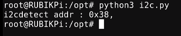

    </TabItem>
</Tabs>

### SPI

Serial Peripheral Interface (SPI) is a synchronous serial data link that operates in full-duplex mode. SPI is also known as a 4-wire serial bus.

RUBIK Pi 3 is compatible with WiringRP (based on the high-performance GPIO programming library WiringPi). It is recommended to use WiringRP for controlling and programming SPI. For more details about WiringRP, visit https://github.com/rubikpi-ai/WiringRP.

#### Pinout

The figure below shows the default functions of the RUBIK Pi 3 40-pin LS connector, most of which are compatible with the default functions of the Raspberry Pi 40-pin connector.


:::note
 Pins 19, 21, 23, and 24 are set to SPI by default.
:::

The following table lists all functions of the 40-pin LS connector. Blue bold functions are default functions.


#### Use SPI

<Tabs>
    <TabItem value="SPI WiringRP-c" label="WiringRP">
        The WiringRP library provides a set of API functions that enable control with minimal logic.

        To install WiringRP on your RUBIK Pi 3, follow these steps:

        1. Add the RUBIK Pi public personal package archive (PPA) to your RUBIK Pi 3 Ubuntu software sources.
        ```shell
        sudo sed -i '$a deb http://apt.rubikpi.ai ppa main' /etc/apt/sources.list
        sudo apt update
        ```
        2. Run the following command to install WiringRP.
        ```shell
        sudo apt install wiringrp
        ```
        The following code snippet uses the SPI bus to send and receive data.
        ```c
        #include <wiringPi.h>
        #include <wiringPiSPI.h>
        #include <stdio.h>
        #include <stdlib.h>

        int main(void)
        {
            int fd;
            unsigned char send_data[64] =  "hello world!";
            unsigned char read_data[64];

            if(wiringPiSetup() == -1)
                exit(1);

            fd = wiringPiSPISetup(0, 1000000);
            if(fd < 0)
                exit(2);

                printf("\rtx_buffer: \n %s\n ", send_data);
            // Send and receive data
            if(wiringPiSPIDataRW(0, send_data, sizeof(send_data)) < 0)
                exit(3);
                printf("\rtx_buffer: \n %s\n ", send_data);


            return 0;
        }
        ```

        Compile programs

        Compile on RUBIK Pi 3

        ```shell
        gcc spi.c -o spi -lwiringPi
        ```

        :::note
        If the `gcc` command is not available, run `apt install gcc` to install the gcc compiler.
        :::

        Short pin 19 and pin 21 with a Dupont wire to test the SPI bus communication, as shown in the following figure:

        :::warning

         Pay attention to the pin order. Do not short the power and ground pins, as this may cause damage to the board.
        :::

        

        Run the following command:

        ```shell
        ./spi
        ```

        The execution result is as follows:

        
    </TabItem>

    <TabItem value="SPI WiringRP-python" label="WiringRP-Python">
        The WiringRP library provides a set of API functions that enable control with minimal logic.

        To install WiringRP-Python on your RUBIK Pi 3, follow these steps:

        1. Add the RUBIK Pi public personal package archive (PPA) to your RUBIK Pi 3 Ubuntu software sources.
        ```shell
        sudo sed -i '$a deb http://apt.rubikpi.ai ppa main' /etc/apt/sources.list
        sudo apt update
        ```
        2. Run the following command to install WiringRP-Python.
        ```shell
        sudo apt install wiringrp-python
        ```
        The following code snippet uses the SPI bus to send and receive data:

        ```python
        import wiringpi as wpi

        wpi.wiringPiSetup()

        wpi.wiringPiSPISetup(0, 8000000)

        tx_buffer = bytes([72, 101, 108, 108, 111])
        print("tx_buffer:\n\r ", tx_buffer)
        retlen, rx_buffer = wpi.wiringPiSPIDataRW(0, tx_buffer)
        print("rx_buffer:\n\r ", rx_buffer)
        ```

        Short pin 19 and pin 21 with a Dupont wire to test the SPI bus communication, as shown in the following figure:

        :::warning
        Pay attention to the pin order. Do not short the power and ground pins, as this may cause damage to the board.
        :::

        

        Run the following command:

        ```shell
         python3 spi.py
        ```

          The execution result is as follows:

        
    </TabItem>

    <TabItem value="SPI C" label="C">
    The following code snippet uses the SPI bus to send and receive data.
    ```c
    #include <stdio.h>
    #include <stdlib.h>
    #include <stdint.h>
    #include <fcntl.h>
    #include <unistd.h>
    #include <linux/spi/spidev.h>
    #include <sys/ioctl.h>

    #define SPI_DEVICE_PATH "/dev/spidev12.0"

    int main() {
        int spi_file;
        uint8_t tx_buffer[50] = "hello world!";
        uint8_t rx_buffer[50];

        // Open the SPI device
        if ((spi_file = open(SPI_DEVICE_PATH, O_RDWR)) < 0) {
            perror("Failed to open SPI device");
            return -1;
        }

        // Configure SPI mode and bits per word
        uint8_t mode = SPI_MODE_0;
        uint8_t bits = 8;

        if (ioctl(spi_file, SPI_IOC_WR_MODE, &mode) < 0) {
            perror("Failed to set SPI mode");
            close(spi_file);
            return -1;
        }
        if (ioctl(spi_file, SPI_IOC_WR_BITS_PER_WORD, &bits) < 0) {
            perror("Failed to set SPI bits per word");
            close(spi_file);
            return -1;
        }

        // Perform SPI transfer
        struct spi_ioc_transfer transfer = {
            .tx_buf = (unsigned long)tx_buffer,
            .rx_buf = (unsigned long)rx_buffer,
            .len = sizeof(tx_buffer),
            .delay_usecs = 0,
            .speed_hz = 1000000,  // SPI speed in Hz
            .bits_per_word = 8,
        };

        if (ioctl(spi_file, SPI_IOC_MESSAGE(1), &transfer) < 0) {
            perror("Failed to perform SPI transfer");
            close(spi_file);
            return -1;
        }

         /* Print tx_buffer and rx_buffer*/
        printf("\rtx_buffer: \n %s\n ", tx_buffer);
        printf("\rrx_buffer: \n %s\n ", rx_buffer);

        // Close the SPI device
        close(spi_file);

        return 0;
    }
  ```

    Compile on RUBIK Pi 3

    ```c
    gcc spi.c -o spi
    ```

    :::note
    If the `gcc` command is not available, run `apt install gcc` to install the gcc compiler.
    :::

    Short pin 19 and pin 21 with a Dupont wire to test the SPI bus communication, as shown in the following figure.

    :::warning
    Pay attention to the pin order. Do not short the power and ground pins, as this may cause damage to the board.
    :::

    

    Run the following command:

    ```shell
    ./spi
    ```

     The program execution result is as follows:

   
    </TabItem>

    <TabItem value="SPI python" label="Python">
        SPI communication can be implemented by using the spidev library for Python. Run the following command to install spidev on RUBIK Pi 3.
        ```shell
        apt install python3-spidev
        ```
        The following code snippet uses the SPI bus to send and receive data.

        ```python
        import spidev

        def main():
            tx_buffer = [ord(char) for char in "hello world!"]
            rx_buffer = [0] * len(tx_buffer)

            try:
                spi = spidev.SpiDev()
                spi.open(12, 0)
                spi.max_speed_hz = 1000000

                rx_buffer = spi.xfer2(tx_buffer[:])
                print("tx_buffer:\n\r", ''.join(map(chr, tx_buffer)))
                print("rx_buffer:\n\r", ''.join(map(chr, rx_buffer)))

            except Exception as e:
                print(f"An error occurred: {e}")

            finally:
                if spi:
                    spi.close()

        if __name__ == "__main__":
            main()
        ```


        Short pin 19 and pin 21 with a Dupont wire to test the SPI bus communication, as shown in the following figure.

        :::warning
        Pay attention to the pin order. Do not short the power and ground pins, as this may cause damage to the board.
        :::

        

        Run the following command on your RUBIK Pi 3:

        ```shell
         python3 spi.py
        ```

          The program execution result is as follows:

        
    </TabItem>
</Tabs>


### UART
<a id="UART"></a>

RUBIK Pi 3 is compatible with WiringRP (based on the high-performance GPIO programming library WiringPi). It is recommended to use WiringRP for controlling and programming UART. For more details about WiringRP, visit https://github.com/rubikpi-ai/WiringRP.

#### Pinout

The figure below shows the default functions of the RUBIK Pi 3 40-pin LS connector, most of which are compatible with the default functions of the Raspberry Pi 40-pin connector.


:::note

Pins 8 and 10 have been set to UART by default. The device node is */dev/ttyHS2*.
:::

The following table lists all functions of the 40-pin LS connector. Blue bold functions are default functions.

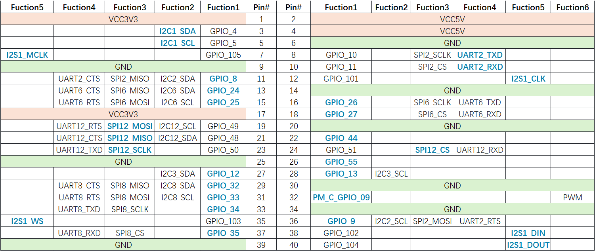


#### Use UART

<Tabs>
    <TabItem value="UART Shell" label="Shell command">
       Run the following commands on RUBIK Pi 3 to control UART communication.

        Use the stty tool to configure UART. Run the following commands to set both the input rate and output rate of UART to 115200 and disable the echo.

        ```shell
        stty -F /dev/ttyHS2 ispeed 115200 ospeed 115200
        stty -F /dev/ttyHS2 -echo
        ```

        Enable the two terminals on RUBIK Pi 3, short pin 8 and pin 10 with a Dupont wire, and run the following commands. The content sent by the transmitter will be displayed on the receiver.

        :::warning
        Pay attention to the pin order. Do not short the power and ground pins, as this may cause damage to the board.
        :::

        ```shell
        echo "hello world!" > /dev/ttyHS2  # Transmitter
        cat /dev/ttyHS2 # Receiver
        ```

        

    </TabItem>

    <TabItem value="UART WiringRP-c" label="WiringRP">
        The WiringRP library provides a set of API functions that enable control with minimal logic.

        To install WiringRP on your RUBIK Pi 3, follow these steps：

        1. Add the RUBIK Pi public personal package archive (PPA) to your RUBIK Pi 3 Ubuntu software sources.
        ```shell
        sudo sed -i '$a deb http://apt.rubikpi.ai ppa main' /etc/apt/sources.list
        sudo apt update
        ```
        2. Run the following command to install WiringRP.
        ```shell
        sudo apt install wiringrp

        The following code snippet uses UART to send and receive data:
        ```c
        #include <stdio.h>
        #include <string.h>
        #include <errno.h>

        #include <wiringPi.h>
        #include <wiringSerial.h>

        int main ()
        {
          int fd ;
          int count ;
          unsigned int nextTime ;

          if ((fd = serialOpen ("/dev/ttyHS2", 115200)) < 0)
          {
            fprintf (stderr, "Unable to open serial device: %s\n", strerror (errno)) ;
            return 1 ;
          }

          if (wiringPiSetup () == -1)
          {
            fprintf (stdout, "Unable to start wiringPi: %s\n", strerror (errno)) ;
            return 1 ;
          }


          char tx_buffer[] = "hello world!\n";
          for (count = 0 ; count < sizeof(tx_buffer) ; count++)
          {
            serialPutchar (fd, tx_buffer[count]) ;
            delay (3) ;
            printf ("%c", serialGetchar (fd)) ;
          }
          printf ("\n") ;

          return 0 ;
        }
        ```

    Compile on RUBIK Pi 3

    ```shell
    gcc uart.c -o uart -lwiringPi
    ```

     :::note
     If the `gcc` command is not available, run `apt install gcc` to install the gcc compiler.
     :::

    Short pin 8 and pin 10 with a Dupont wire and test the communication, as shown in the following figure:

    :::warning
    Pay attention to the pin order. Do not short the power and ground pins, as this may cause damage to the board.
    :::

    

    Run the following command:

    ```shell
    ./uart
    ```

    The execution result is as follows:

     

    </TabItem>

    <TabItem value="UART WiringRP-python" label="WiringRP-Python">
        The WiringRP-Python library provides a set of API functions that enable control with minimal logic.

        To install WiringRP-Python on your RUBIK Pi 3, follow these steps：

        1. Add the RUBIK Pi public personal package archive (PPA) to your RUBIK Pi 3 Ubuntu software sources.
        ```shell
        sudo sed -i '$a deb http://apt.rubikpi.ai ppa main' /etc/apt/sources.list
        sudo apt update
        ```
        2. Run the following command to install WiringRP-Python.
        ```shell
        sudo apt install wiringrp-python
        ```
        The following code snippet uses UART to send and receive data.
        ```python
        import wiringpi

        serial = wiringpi.serialOpen('/dev/ttyHS2', 115200)

        wiringpi.serialPuts(serial, "hello world")

        received_data = []
        c = wiringpi.serialGetchar(serial);
        received_data.append(chr(c))

        cnt = wiringpi.serialDataAvail(serial);
        for i in range(cnt):
            c = wiringpi.serialGetchar(serial);
            received_data.append(chr(c))

        print("Received:", received_data)

        wiringpi.serialClose(serial)
        ```

        Short pin 8 and pin 10 with a Dupont wire to test UART communication, as shown in the following figure:

        :::warning
        Pay attention to the pin order. Do not short the power and ground pins, as this may cause damage to the board.
        :::

        

        Run the following command:

        ```shell
        python3 uart.py
        ```

        The execution result is as follows:

        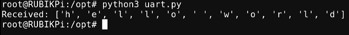
    </TabItem>

    <TabItem value="UART C" label="C">
        - The following code snippet uses UART to send and receive data.

          ```c
          #include <stdio.h>
          #include <stdlib.h>
          #include <string.h>
          #include <fcntl.h>
          #include <termios.h>
          #include <unistd.h>

          int main() {
              int serial_port_num = 2;
              char serial_port[15];

              sprintf(serial_port,"/dev/ttyHS%d",serial_port_num);
              int serial_fd;

              serial_fd = open(serial_port, O_RDWR | O_NOCTTY);
              if (serial_fd == -1) {
                  perror("Failed to open serial port");
                  return 1;
              }

              struct termios tty;
              memset(&tty, 0, sizeof(tty));

              if (tcgetattr(serial_fd, &tty) != 0) {
                  perror("Error from tcgetattr");
                  return 1;
              }

              cfsetospeed(&tty, B9600);
              cfsetispeed(&tty, B9600);

              tty.c_cflag &= ~PARENB;
              tty.c_cflag &= ~CSTOPB;
              tty.c_cflag &= ~CSIZE;
              tty.c_cflag |= CS8;

              if (tcsetattr(serial_fd, TCSANOW, &tty) != 0) {
                  perror("Error from tcsetattr");
                  return 1;
              }

              char tx_buffer[] = "hello world!\n";
              ssize_t bytes_written = write(serial_fd, tx_buffer, sizeof(tx_buffer));

              if (bytes_written < 0) {
                  perror("Error writing to serial port");
                  close(serial_fd);
                  return 1;
              }
              printf("\rtx_buffer: \n %s ", tx_buffer);

              char rx_buffer[256];
              int bytes_read = read(serial_fd, rx_buffer, sizeof(rx_buffer));
              if (bytes_read > 0) {
                  rx_buffer[bytes_read] = '\0';
                  printf("\rrx_buffer: \n %s ", rx_buffer);
              } else {
                  printf("No data received.\n");
              }

              close(serial_fd);

              return 0;
            }

            ```

            Compile on RUBIK Pi 3

            ```shell
            gcc uart.c -o uart
            ```

            :::note
            If the `gcc` command is not available, run `apt install gcc` to install the gcc compiler.
            :::

            Short pin 8 and pin 10 with a Dupont wire to test UART communication, as shown in the following figure:

            :::warning
            Pay attention to the pin order. Do not short the power and ground pins, as this may cause damage to the board.
            :::

            

            Run the following command:

            ```shell
            ./uart
            ```

            The execution result is as follows:

            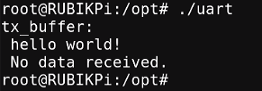
    </TabItem>

    <TabItem value="UART python" label="Python">
        UART communication can be implemented by using the serial library for Python. Run the following command to install the serial library on RUBIK Pi 3.

        ```shell
        apt install python3-serial
        ```

        The following code snippet uses UART to send and receive data.

        ```python
        import serial
        import time

        with serial.Serial(
            "/dev/ttyHS2",
            baudrate=115200,
            bytesize=serial.EIGHTBITS,
            stopbits=serial.STOPBITS_ONE,
            parity=serial.PARITY_NONE,
            timeout=1,

        ) as uart3:
            uart3.write(b"Hello World!\n")
            buf = uart3.read(128)
            print("Raw data:\n", buf)
            data_strings = buf.decode("utf-8")
            print("Read {:d} bytes, printed as string:\n {:s}".format(len(buf), data_strings))
        ```

        Transfer *uart.py* to RUBIK Pi 3. For example, use the ADB method. The command is as follows:

        ```shell
        adb push uart.py /opt
        ```

        Short pin 8 and pin 10 with a Dupont wire to test UART communication, as shown in the following figure:

        :::warning
        Pay attention to the pin order. Do not short the power and ground pins, as this may cause damage to the board.
        :::

        

        Run the following command:

        ```shell
        python3 uart.py
        ```

          The execution result is as follows:

        
    </TabItem>
</Tabs>


## USB

The Universal Serial Bus (USB) is an industry standard that allows data exchange and power supply between various types of electronic devices. The standard supports multiple operating speeds, such as 1.5 Mbps low speed, 12 Mbps full speed, 480 Mbps high speed, as well as 5 Gbps SuperSpeed and 10 Gbps SuperSpeed Plus.

RUBIK Pi 3 provides four USB ports:

* 2 x USB 3.0 Type-A, host mode only (No.7 in the following figure)

* 1 x USB 2.0 Type-A, host or device mode (No. 6 in the following figure)

* 1 x USB 3.1 Gen 1 Type-C, host or device mode (ADB), Type-C with DisplayPort v1.4 (No. 5 in the following figure)


### Verify USB functions

    <Tabs>
    <TabItem value="USB CAM" label="USB camera">

    RUBIK Pi 3 device provides driver support for USB webcams that are compliant with the USB Video Class (UVC) standard. The uvcvideo driver in the Linux kernel supports these cameras. For more information on the uvcvideo driver, refer to https://www.kernel.org/doc/html/v4.19/media/v4l-drivers/uvcvideo.html.

    The uvcvideo driver exposes these cameras as V4L2 video devices, which can be accessed through character device nodes (such as */dev/videoX*).

    In user space, applications can use the v4l2src GStreamer plugin to manage the USB cameras. The plugin is associated with the Qualcomm Intelligent Multimedia SDK (QIM SDK). Additionally, programs like Yavta (another V4L2 test application) can directly interact with the V4L2 (Video4Linux2) interface to test and control the camera devices.

    Install Yavta

    ```shell
    sudo apt install yavta
    ```
    **Prerequisite: Obtain the image format and size**

    To configure the USB camera using Yavta or GStreamer, perform the following steps.
    1. To understand the enumeration details, connect the USB camera and run the following command.
    ```shell
    lsusb
    ```

    The output is as follows:

    ```
    Bus 001 Device 001: ID 1d6b:0002 Linux Foundation 2.0 root hub
    Bus 001 Device 003: ID 1bcf:0215 Sunplus Innovation Technology Inc. 4K AutoFocus Webcam
    Bus 002 Device 001: ID 1d6b:0003 Linux Foundation 3.0 root hub
    Bus 002 Device 002: ID 0b95:1790 ASIX Electronics Corp. AX88179 Gigabit Ethernet
    Bus 003 Device 001: ID 1d6b:0002 Linux Foundation 2.0 root hub
    ```

    2. Before and after connecting the USB camera, run the following command in the RUBIK Pi 3 terminal. The difference between the two results can be used to identify the video node of the USB camera.
    ```shell
    ls /dev/video*
    ```
    Sample output:
    ```
    root@rubikpi:/sys/bus/pci# ls /dev/video*
    /dev/video0  /dev/video1  /dev/video32  /dev/video33
    root@rubikpi:/sys/bus/pci# ls /dev/video*
    /dev/video0  /dev/video1  /dev/video2  /dev/video3  /dev/video32  /dev/video33
    ```
    As shown above, the video nodes for the USB camera are *video2* and *video3*.

    3. To use Yavta to view the supported output formats and sizes, run the following command:
    ```shell
    yavta /dev/video2 --enum-formats
    ```
    The output is as follows:

    ```
    Device /dev/video3 opened.
    Device `4K AutoFocus Webcam: 4K AutoFoc' on `usb-0000:01:00.0-1' (driver 'uvcvideo') supports meta-d.
    - Available formats:
            Format 0: UVCH (48435655)
            Type: Meta-data capture (13)
            Name: UVC Payload Header Metadata

    Meta-data format: UVCH (48435655) buffer size 10240
    ubuntu@rubikpi:~$ yavta /dev/video2 --enum-formats
    Device /dev/video2 opened.
    Device `4K AutoFocus Webcam: 4K AutoFoc' on `usb-0000:01:00.0-1' (driver 'uvcvideo') supports video,.
    - Available formats:
            Format 0: MJPEG (47504a4d)
            Type: Video capture (1)
            Name: Motion-JPEG
            Frame size: 1920x1080 (1/30, 1/30)
            Frame size: 1280x720 (1/30)
            Frame size: 1600x900 (1/30)
            Frame size: 2304x1296 (1/30)
            Frame size: 2560x1440 (1/30)
            Frame size: 2688x1512 (1/30)
            Frame size: 3840x2160 (1/25)
            Frame size: 640x360 (1/30)
            Frame size: 800x450 (1/30)
            Frame size: 848x480 (1/30)
            Frame size: 960x540 (1/30)
            Frame size: 1024x576 (1/30)
            Frame size: 640x480 (1/30)
            Frame size: 800x600 (1/30)
            Frame size: 960x720 (1/30)
            Frame size: 1024x768 (1/30)
            Frame size: 1280x960 (1/30)
            Frame size: 1600x1200 (1/30)
            Frame size: 2048x1536 (1/30)
            Frame size: 2592x1944 (1/30)
            Frame size: 1920x1080 (1/30, 1/30)

            Format 1: YUYV (56595559)
            Type: Video capture (1)
            Name: YUYV 4:2:2
            Frame size: 1920x1080 (1/5, 1/5)
            Frame size: 1280x720 (1/10)
            Frame size: 1600x900 (1/5)
            Frame size: 640x360 (1/30)
            Frame size: 800x450 (1/20)
            Frame size: 848x480 (1/20)
            Frame size: 960x540 (1/20)
            Frame size: 1024x576 (1/15)
            Frame size: 640x480 (1/30)
            Frame size: 800x600 (1/20)
            Frame size: 960x720 (1/15)
            Frame size: 1024x768 (1/10)
            Frame size: 1280x960 (2/15)
            Frame size: 1600x1200 (1/5)
            Frame size: 1920x1080 (1/5, 1/5)

    Video format: MJPEG (47504a4d) 1920x1080 (stride 0) field none buffer size 4147200
    ```
    4. From the display results of step 3, select the desired image format and size.

    **Configure the USB camera using Yavta**

    Prerequisite: The USB camera's output format and size have been determined.

    Run the following command to select the 1920x1080 output size and 30 fps MJPEG format, and capture 10 frames to */tmp/* with file names in the format testmjpeg-00000*.bin:

    ```shell
    yavta -f MJPEG -s 1920x1080 -t 1/30 -c10 -F/tmp/testmjpeg /dev/video2
    ```
    The output is as follows:
    ```
    Device /dev/video2 opened.
    Device `4K AutoFocus Webcam: 4K AutoFoc' on `usb-0000:01:00.0-1' (driver 'uvcvideo') supports video, capture, without mplanes.
    Video format set: MJPEG (47504a4d) 1920x1080 (stride 0) field none buffer size 4147200
    Video format: MJPEG (47504a4d) 1920x1080 (stride 0) field none buffer size 4147200
    Current frame rate: 1/30
    Setting frame rate to: 1/30
    Frame rate set: 1/30
    8 buffers requested.
    length: 4147200 offset: 0 timestamp type/source: mono/SoE
    Buffer 0/0 mapped at address 0xffffa5e5b000.
    length: 4147200 offset: 32768 timestamp type/source: mono/SoE
    Buffer 1/0 mapped at address 0xffffa5a66000.
    length: 4147200 offset: 65536 timestamp type/source: mono/SoE
    Buffer 2/0 mapped at address 0xffffa5671000.
    length: 4147200 offset: 98304 timestamp type/source: mono/SoE
    Buffer 3/0 mapped at address 0xffffa527c000.
    length: 4147200 offset: 131072 timestamp type/source: mono/SoE
    Buffer 4/0 mapped at address 0xffffa4e87000.
    length: 4147200 offset: 163840 timestamp type/source: mono/SoE
    Buffer 5/0 mapped at address 0xffffa4a92000.
    length: 4147200 offset: 196608 timestamp type/source: mono/SoE
    Buffer 6/0 mapped at address 0xffffa469d000.
    length: 4147200 offset: 229376 timestamp type/source: mono/SoE
    Buffer 7/0 mapped at address 0xffffa42a8000.
    0 (0) [-] none 0 115283 B 53.095060 53.647782 244.260 fps ts mono/SoE
    1 (1) [-] none 1 115277 B 53.647091 53.679768 1.811 fps ts mono/SoE
    2 (2) [-] none 2 115376 B 53.683085 53.715810 27.782 fps ts mono/SoE
    3 (3) [-] none 3 115545 B 53.715105 53.747738 31.230 fps ts mono/SoE
    4 (4) [-] none 4 117998 B 53.747096 53.783769 31.259 fps ts mono/SoE
    5 (5) [-] none 5 117962 B 53.783089 53.815715 27.783 fps ts mono/SoE
    6 (6) [-] none 6 118127 B 53.815088 53.847740 31.251 fps ts mono/SoE
    7 (7) [-] none 7 118027 B 53.847099 53.883764 31.239 fps ts mono/SoE
    8 (0) [-] none 8 119080 B 53.883084 53.915721 27.789 fps ts mono/SoE
    9 (1) [-] none 9 119399 B 53.915093 53.947736 31.241 fps ts mono/SoE
    Captured 10 frames in 0.856770 seconds (11.671741 fps, 1368014.420968 B/s).
    8 buffers released.

    ```
    Run the following command to select the 1280x960 output size, 15 fps YUV format, and capture 10 frames to */tmp/* with file names in the format testyuv-00000*.bin

    ```shell
    yavta -f YUYV -s 1280x720 -t 1/15 -c10 -F/tmp/testyuv /dev/video2
    ```
    The output is as follows:
    ```
    Device /dev/video2 opened.
    Device `4K AutoFocus Webcam: 4K AutoFoc' on `usb-0000:01:00.0-1' (driver 'uvcvideo') supports video,.
    Video format set: YUYV (56595559) 1280x720 (stride 2560) field none buffer size 1843200
    Video format: YUYV (56595559) 1280x720 (stride 2560) field none buffer size 1843200
    Current frame rate: 1/10
    Setting frame rate to: 1/15
    Frame rate set: 1/10
    8 buffers requested.
    length: 1843200 offset: 0 timestamp type/source: mono/SoE
    Buffer 0/0 mapped at address 0xffff966ce000.
    length: 1843200 offset: 32768 timestamp type/source: mono/SoE
    Buffer 1/0 mapped at address 0xffff9650c000.
    length: 1843200 offset: 65536 timestamp type/source: mono/SoE
    Buffer 2/0 mapped at address 0xffff9634a000.
    length: 1843200 offset: 98304 timestamp type/source: mono/SoE
    Buffer 3/0 mapped at address 0xffff96188000.
    length: 1843200 offset: 131072 timestamp type/source: mono/SoE
    Buffer 4/0 mapped at address 0xffff95fc6000.
    length: 1843200 offset: 163840 timestamp type/source: mono/SoE
    Buffer 5/0 mapped at address 0xffff95e04000.
    length: 1843200 offset: 196608 timestamp type/source: mono/SoE
    Buffer 6/0 mapped at address 0xffff95c42000.
    length: 1843200 offset: 229376 timestamp type/source: mono/SoE
    Buffer 7/0 mapped at address 0xffff95a80000.
    0 (0) [-] none 0 1843200 B 364.737849 364.966754 2.174 fps ts mono/SoE
    1 (1) [-] none 1 1843200 B 364.966042 365.066785 4.382 fps ts mono/SoE
    2 (2) [-] none 2 1843200 B 365.066087 365.166812 9.996 fps ts mono/SoE
    3 (3) [-] none 3 1843200 B 365.166149 365.266862 9.994 fps ts mono/SoE
    4 (4) [-] none 4 1843200 B 365.266205 365.366929 9.994 fps ts mono/SoE
    5 (5) [-] none 5 1843200 B 365.366266 365.466985 9.994 fps ts mono/SoE
    6 (6) [-] none 6 1843200 B 365.466326 365.567108 9.994 fps ts mono/SoE
    7 (7) [-] none 7 1843200 B 365.566381 365.667099 9.995 fps ts mono/SoE
    8 (0) [-] none 8 1843200 B 365.666440 365.767150 9.994 fps ts mono/SoE
    9 (1) [-] none 9 1843200 B 365.766496 365.867212 9.994 fps ts mono/SoE
    Captured 10 frames in 1.589346 seconds (6.291895 fps, 11597220.863435 B/s).
    8 buffers released.
    ```

    **Configure the USB camera using the GStreamer in the Qualcomm IM SDK**

    The Qualcomm IM SDK uses the open-source multimedia framework [GStreamer](https://gstreamer.freedesktop.org/), which provides a concise API and easy-to-use plugins for multimedia and machine learning. For information on installing the Qualcomm IM SDK, refer to the [Quick Start](1.Quick%20Start.md#runmediaapp) section.

The Qualcomm IM SDK includes the v4l2src plugin, which allows input from the USB camera in the selected format. The waylandsink plugin is responsible for rendering the video output on the Wayland display interface.

    Prerequisite: The USB camera's output format and size have been determined.

    1. To set the environment variable for the Wayland display interface, run the following command in the RUBIK Pi 3 terminal:
    ```shell
    export XDG_RUNTIME_DIR=/dev/socket/weston && export WAYLAND_DISPLAY=wayland-1
    ```
    2. Use the GStreamer command to stream the video captured by the camera to the UI. Ensure that the appropriate device ID (*/dev/videoX*) is set, and select the correct format based on the detected USB camera.
    :::note
    In GStreamer, the YUYV color format is referred to as YUY2. Therefore, you must specify the YUYV format when setting up the pipeline and use **YUY2** in the caps filter.
    :::
        * For 720p, run the following command:
        ```shell
        gst-launch-1.0 -e v4l2src io-mode=dmabuf-import device="/dev/video0" ! video/x-raw,format=YUY2,width=1280,height=720,framerate=10/1 ! waylandsink fullscreen=true
        ```
        The output is as follows:
        ```
        Y2,width=1280,height=720,framerate=10/1 ! waylandsink fullscreen=true
        Setting pipeline to PAUSED ...
        I/Adreno-UNKNOWN (1985,1985): <ReadGpuID:357>: Reading chip ID through GSL
        GBM_INFO::msmgbm_mapper(262)::gbm mapper instantiated
        gbm_create_device(224): Info: backend name is: msm_drm
        Pipeline is live and does not need PREROLL ...
        Pipeline is PREROLLED ...
        Setting pipeline to PLAYING ...
        New clock: GstSystemClock
        gbm_create_device(224): Info: backend name is: msm_drm
        GBM_ERR::msmgbm_bo_create(870)::DRM_IOCTL_PRIME_FD_TO_HANDLE failed for data fd errono: 22 (Invalid argument) drm fd: 24 data fd: 26
         GBM_ERR::msmgbm_bo_create(923)::DRM_IOCTL_PRIME_FD_TO_HANDLE failed for metadata fd errono: 22 (Invalid argument) drm fd: 24 metadata fd: 27
        GBM_ERR::msmgbm_bo_create(870)::DRM_IOCTL_PRIME_FD_TO_HANDLE failed for data fd errono: 22 (Invalid argument) drm fd: 24 data fd: 29
        GBM_ERR::msmgbm_bo_create(923)::DRM_IOCTL_PRIME_FD_TO_HANDLE failed for metadata fd errono: 22 (Invalid argument) drm fd: 24 metadata fd: 30
        GBM_ERR::msmgbm_bo_create(870)::DRM_IOCTL_PRIME_FD_TO_HANDLE failed for data fd errono: 22 (Invalid argument) drm fd: 24 data fd: 32
        GBM_ERR::msmgbm_bo_create(923)::DRM_IOCTL_PRIME_FD_TO_HANDLE failed for metadata fd errono: 22 (Invalid argument) drm fd: 24 metadata fd: 33
        GBM_ERR::msmgbm_bo_create(870)::DRM_IOCTL_PRIME_FD_TO_HANDLE failed for data fd errono: 22 (Invalid argument) drm fd: 24 data fd: 35
        GBM_ERR::msmgbm_bo_create(923)::DRM_IOCTL_PRIME_FD_TO_HANDLE failed for metadata fd errono: 22 (Invalid argument) drm fd: 24 metadata fd: 36
        Redistribute latency...
        0:00:47.7 / 99:99:99.
        ```
        * For 1080p, run the following command:
        ```shell
        gst-launch-1.0 -e v4l2src io-mode=dmabuf-import device="/dev/video0" ! video/x-raw,format=YUY2,width=1920,height=1080,framerate=5/1 ! waylandsink fullscreen=true
        ```
    </TabItem>

    <TabItem value="USB Custom" label="Custom USB device">
    On RUBIK Pi 3, only the USB 2.0 Type-A port and USB 3.1 Type-C port support the custom USB device (device mode). The following example uses the USB 3.1 Type-C port as an example.

    **Example shell script for a USB composite device with diag and ADB interfaces**
    ```shell
    cd /sys/kernel/config/usb_gadget/adb
    echo on > /sys/bus/platform/devices/a600000.usb/power/control
    echo "" > UDC
    mkdir functions/ffs.diag
    echo "QCOM" > strings/0x409/manufacturer
    echo 0x05c6 > idVendor
    echo 0x901d > idProduct
    echo "Diag_ADB" > configs/c.1/strings/0x409/configuration

    if [ ! -d /dev/ffs-diag ]; then
    mkdir -p /dev/ffs-diag
    fi
    if [ ! -e /dev/ffs-diag/ep0 ]; then
    mount -o uid=2000,gid=2000 -t functionfs diag /dev/ffs-diag
    fi

    /usr/bin/diag-router &

    cd configs/c.1
    rm -r ffs.usb0
    ln -s ../../functions/ffs.diag f1
    ln -s ../../functions/ffs.usb0 f2
    cd ../../ udcname=`ls -1 /sys/class/udc | head -n 1`
    echo $udcname > UDC
    echo auto > /sys/bus/platform/devices/a600000.usb/power/control
    ```

    **Simulate as a USB flash drive**

    Run the following commands on RUBIK Pi 3 to simulate it as a 2 GB USB flash drive.
    ```shell
    sudo -i
    cd /sys/kernel/config/usb_gadget/  #Log in from the serial port or open the PC terminal and run the following commands
    mkdir g1
    cd g1
    mkdir functions/mass_storage.0
    dd if=/dev/zero of=/tmp/test.iso bs=1M count=2048  #Create a 2 GB USB drive space
    mkfs.ext4 /tmp/test.iso
    echo "/tmp/test.iso" > functions/mass_storage.0/lun.0/file
    mkdir configs/c.1
    ln -s functions/mass_storage.0/ configs/c.1/f3
    mount -t debugfs none /sys/kernel/debug/

    echo device > /sys/kernel/debug/usb/8c00000.usb/qcom_usb2_0_mode  #Switch USB to device mode
    echo 8c00000.usb > UDC #Connect the USB cable. The USB drive is identified and can be written to and read from

    echo host > /sys/kernel/debug/usb/8c00000.usb/qcom_usb2_0_mode  #Remove the USB cable and switch to host mode
    ```

    </TabItem>
</Tabs>

### USB debugging

This section provides the methods for obtaining debug logs. The debug methods include regdumps, debug ftraces, and configfs nodes. When debugging issues related to entering or exiting low-power modes, system memory management unit (SMMU), and unclocked accesses, you can check the event and controller status details through the logs obtained by using the above methods.

:::note
The following commands require the root privilege.

 Run the `sudo passwd root` command and modify the root user password as prompted. Run the `su root` command to switch to the root user.
:::

* USB 2.0 Type-A device path: *&#x20;/sys/devices/platform/soc@0/**8c00000**.usb/xhci-hcd.1.auto/usb3/*

* - USB 3.0 Type-A device path:

  * */sys/devices/platform/soc@0/**1c00000**.pci/pci0000:00/0000:00:00.0/0000:**01:00.0**/usb1*

  * */sys/devices/platform/soc@0/**1c00000**.pci/pci0000:00/0000:00:00.0/0000:**01:00.0**/usb2*

* USB 3.1 Type-C device path: */sys/devices/platform/soc@0/**a600000**.usb*&#x20;

#### USB tracing

Use `debugfs` to deeply trace each transaction over the USB line. To view the trace list, run the following command.

:::warning
Before running the command, ensure that `debugfs` has been mounted. If not mounted, run the following command to mount `debugfs`:

`mount -t debugfs none /sys/kernel/debug`
:::

```shell
ls /sys/kernel/debug/tracing/events/dwc3
```

The following traces can be used to verify data transmission in the xHCI, gadget stack, or USB Type-C Connector System Software Interface (UCSI).

```shell
dwc3_alloc_request  dwc3_event              dwc3_gadget_generic_cmd  enable
dwc3_complete_trb   dwc3_free_request       dwc3_gadget_giveback     filter
dwc3_ctrl_req       dwc3_gadget_ep_cmd      dwc3_prepare_trb
dwc3_ep_dequeue     dwc3_gadget_ep_disable  dwc3_readl
dwc3_ep_queue       dwc3_gadget_ep_enable   dwc3_writel
```

To list the traces in the xHCI/Host Controller Driver (HCD), run the following command:

```shell
ls /sys/kernel/debug/tracing/events/xhci-hcd
```

The following traces can be used to verify data transmission in the xHCI/HCD.

```shell
enable                            xhci_handle_cmd_config_ep
filter                            xhci_handle_cmd_disable_slot
  xhci_add_endpoint                 xhci_handle_cmd_reset_dev
  xhci_address_ctrl_ctx             xhci_handle_cmd_reset_ep
  xhci_address_ctx                  xhci_handle_cmd_set_deq
  xhci_alloc_dev                    xhci_handle_cmd_set_deq_ep
  xhci_alloc_virt_device            xhci_handle_cmd_stop_ep
  xhci_configure_endpoint           xhci_handle_command
  xhci_configure_endpoint_ctrl_ctx  xhci_handle_event
  xhci_dbc_alloc_request            xhci_handle_port_status
  xhci_dbc_free_request             xhci_handle_transfer
  xhci_dbc_gadget_ep_queue          xhci_hub_status_data
  xhci_dbc_giveback_request         xhci_inc_deq
  xhci_dbc_handle_event             xhci_inc_enq
  xhci_dbc_handle_transfer          xhci_queue_trb
  xhci_dbc_queue_request            xhci_ring_alloc
  xhci_dbg_address                  xhci_ring_ep_doorbell
  xhci_dbg_cancel_urb               xhci_ring_expansion
  xhci_dbg_context_change           xhci_ring_free
  xhci_dbg_init                     xhci_ring_host_doorbell
  xhci_dbg_quirks                   xhci_setup_addressable_virt_device
  xhci_dbg_reset_ep                 xhci_setup_device
  xhci_dbg_ring_expansion           xhci_setup_device_slot
  xhci_discover_or_reset_device     xhci_stop_device
  xhci_free_dev                     xhci_urb_dequeue
  xhci_free_virt_device             xhci_urb_enqueue
  xhci_get_port_status              xhci_urb_giveback
  xhci_handle_cmd_addr_dev
```

To list the available events for the USB Video Class (UVC) gadget driver, run the following command:

```shell
ls /sys/kernel/debug/tracing/events/gadget
```

The output is as follows.

```shell
enable                      usb_gadget_activate
  filter                      usb_gadget_clear_selfpowered
  usb_ep_alloc_request        usb_gadget_connect
  usb_ep_clear_halt           usb_gadget_deactivate
  usb_ep_dequeue              usb_gadget_disconnect
  usb_ep_disable              usb_gadget_frame_number
  usb_ep_enable               usb_gadget_giveback_request
  usb_ep_fifo_flush           usb_gadget_set_remote_wakeup
  usb_ep_fifo_status          usb_gadget_set_selfpowered
  usb_ep_free_request         usb_gadget_vbus_connect
  usb_ep_queue                usb_gadget_vbus_disconnect
  usb_ep_set_halt             usb_gadget_vbus_draw
  usb_ep_set_maxpacket_limit  usb_gadget_wakeup
  usb_ep_set_wedge
```

To list the available events in the UCSI driver, run the following command:

```shell
ls /sys/kernel/debug/tracing/events/ucsi
```

The output is as follows.

```shell
enable  ucsi_connector_change  ucsi_register_port  ucsi_run_command
filter  ucsi_register_altmode  ucsi_reset_ppm
```

#### USB regdump

The USB `debugfs` provides the following information (using the Type-C interface as an example).

* Operating mode

  ```shell
  cat /sys/kernel/debug/usb/a600000.usb/mode # Type-C interface
  ```

  :::note
  
  Operating mode of USB 2.0 Type-A `cat /sys/kernel/debug/usb/8c00000.usb/qcom_usb2_0_mode`
  :::

  Sample output:

  ```shell
  device
  ```

* State and transfer ring buffer (TRB) queues to all endpoints in device mode.

* Current link status.

  ```shell
  cat /sys/kernel/debug/usb/a600000.usb/link_state
  ```

  Sample output:

  ```shell
  Sleep
  ```

* Display processor (LSP) dump

  ```shell
  cat /sys/kernel/debug/usb/a600000.usb/lsp_dump
  ```

  Sample output:

  ```shell
  GDBGLSP[0] = 0x40000000
  GDBGLSP[1] = 0x00003a80
  GDBGLSP[2] = 0x38200000
  GDBGLSP[3] = 0x00802000
  GDBGLSP[4] = 0x126f1000
  GDBGLSP[5] = 0x3a800018
  GDBGLSP[6] = 0x00000a80
  GDBGLSP[7] = 0xfc03f14a
  GDBGLSP[8] = 0x0b803fff
  GDBGLSP[9] = 0x00000000
  GDBGLSP[10] = 0x000000f8
  GDBGLSP[11] = 0x000000f8
  GDBGLSP[12] = 0x000000f8
  GDBGLSP[13] = 0x000000f8
  GDBGLSP[14] = 0x000000f8
  GDBGLSP[15] = 0x000000f8
  ```

```shell
ls /sys/kernel/debug/usb/a600000.usb
```

Sample output:

```shell
ep0in    ep11out  ep14in   ep1out  ep4in   ep6out  ep9in       regdump
ep0out   ep12in   ep14out  ep2in   ep4out  ep7in   ep9out      testmode
ep10in   ep12out  ep15in   ep2out  ep5in   ep7out  link_state
ep10out  ep13in   ep15out  ep3in   ep5out  ep8in   lsp_dump
ep11in   ep13out  ep1in    ep3out  ep6in   ep8out  mode
```

Run the `regdump` command to obtain the current status of the register space for the following registers:

* Device mode registers, such as DCTL, DSTS, and DCFG

* Global registers, such as GCTL and GSTS

```shell
cd /sys/kernel/debug/usb/a600000.usb
cat regdump
```

Sample output:

```shell
GSBUSCFG0 = 0x2222000e
GSBUSCFG1 = 0x00001700
GTXTHRCFG = 0x00000000
GRXTHRCFG = 0x00000000
GCTL = 0x00102000
GEVTEN = 0x00000000
GSTS = 0x7e800000
GUCTL1 = 0x810c1802
GSNPSID = 0x5533330a
GGPIO = 0x00000000
GUID = 0x00060500
GUCTL = 0x0d00c010
GBUSERRADDR0 = 0x00000000
GBUSERRADDR1 = 0x00000000
GPRTBIMAP0 = 0x00000000
GPRTBIMAP1 = 0x00000000
GHWPARAMS0 = 0x4020400a
GDBGFIFOSPACE = 0x00420000
GDBGLTSSM = 0x41090658
GDBGBMU = 0x20300000
GPRTBIMAP_HS0 = 0x00000000
GPRTBIMAP_HS1 = 0x00000000
GPRTBIMAP_FS0 = 0x00000000
GPRTBIMAP_FS1 = 0x00000000
GUCTL2 = 0x0198440d
VER_NUMBER = 0x00000000
VER_TYPE = 0x00000000
GUSB2PHYCFG(0) = 0x00002400
GUSB2I2CCTL(0) = 0x00000000
GUSB2PHYACC(0) = 0x00000000
GUSB3PIPECTL(0) = 0x030e0002
GTXFIFOSIZ(0) = 0x00000042
GRXFIFOSIZ(0) = 0x00000305
GEVNTADRLO(0) = 0xfffff000
GEVNTADRHI(0) = 0x0000000f
GEVNTSIZ(0) = 0x00001000
GEVNTCOUNT(0) = 0x00000000
GHWPARAMS8 = 0x000007ea
GUCTL3 = 0x00010000
GFLADJ = 0x8c80c8a0
DCFG = 0x00cc08b4
DCTL = 0x8cf00a00
DEVTEN = 0x00000257
DSTS = 0x008a5200
DGCMDPAR = 0x00000000
DGCMD = 0x00000000
DALEPENA = 0x0000000f
DEPCMDPAR2(0) = 0x00000000
DEPCMDPAR1(0) = 0xffffe000
DEPCMDPAR0(0) = 0x0000000f
DEPCMD(0) = 0x00000006
OCFG = 0x00000000
OCTL = 0x00000000
OEVT = 0x00000000
OEVTEN = 0x00000000
OSTS = 0x00000000
```

#### Host mode sysfs lookup

To view the bus detailed information, run the following command:

```shell
lsusb
```

Sample output:

```shell
Bus 002 Device 001: ID 1d6b:0003 Linux Foundation 3.0 root hub
Bus 001 Device 002: ID 03f0:134a HP, Inc Optical Mouse
Bus 001 Device 001: ID 1d6b:0002 Linux Foundation 2.0 root hub
```

To view the contents of the current directory, run the following commands:

```shell
cd /sys/bus/usb/devices/
ls
```

Sample output:

```shell
1-0:1.0  1-1  1-1:1.0  2-0:1.0  usb1  usb2
```

To view detailed information about USB devices, run the following command:

```shell
cat /sys/kernel/debug/usb/devices
```

Sample output:

```shell
T:  Bus=01 Lev=00 Prnt=00 Port=00 Cnt=00 Dev#=  1 Spd=480  MxCh= 1
B:  Alloc=  0/800 us ( 0%), #Int=  0, #Iso=  0
D:  Ver= 2.00 Cls=09(hub  ) Sub=00 Prot=01 MxPS=64 #Cfgs=  1
P:  Vendor=1d6b ProdID=0002 Rev= 6.05
S:  Manufacturer=Linux 6.5.0-rc4 xhci-hcd
S:  Product=xHCI Host Controller
S:  SerialNumber=xhci-hcd.0.auto
C:* #Ifs= 1 Cfg#= 1 Atr=e0 MxPwr=  0mA
I:* If#= 0 Alt= 0 #EPs= 1 Cls=09(hub  ) Sub=00 Prot=00 Driver=hub
E:  Ad=81(I) Atr=03(Int.) MxPS=   4 Ivl=256ms

T:  Bus=01 Lev=01 Prnt=01 Port=00 Cnt=01 Dev#=  2 Spd=1.5  MxCh= 0
D:  Ver= 2.00 Cls=00(>ifc ) Sub=00 Prot=00 MxPS= 8 #Cfgs=  1
P:  Vendor=03f0 ProdID=134a Rev= 1.00
S:  Manufacturer=PixArt
S:  Product=HP USB Optical Mouse
C:* #Ifs= 1 Cfg#= 1 Atr=a0 MxPwr=100mA
I:* If#= 0 Alt= 0 #EPs= 1 Cls=03(HID  ) Sub=01 Prot=02 Driver=usbhid
E:  Ad=81(I) Atr=03(Int.) MxPS=   4 Ivl=10ms

T:  Bus=02 Lev=00 Prnt=00 Port=00 Cnt=00 Dev#=  1 Spd=5000 MxCh= 1
B:  Alloc=  0/800 us ( 0%), #Int=  0, #Iso=  0
D:  Ver= 3.00 Cls=09(hub  ) Sub=00 Prot=03 MxPS= 9 #Cfgs=  1
P:  Vendor=1d6b ProdID=0003 Rev= 6.05
S:  Manufacturer=Linux 6.5.0-rc4 xhci-hcd
S:  Product=xHCI Host Controller
S:  SerialNumber=xhci-hcd.0.auto
C:* #Ifs= 1 Cfg#= 1 Atr=e0 MxPwr=  0mA
I:* If#= 0 Alt= 0 #EPs= 1 Cls=09(hub  ) Sub=00 Prot=00 Driver=hub
E:  Ad=81(I) Atr=03(Int.) MxPS=   4 Ivl=256ms
```

## Camera Serial Interface (CSI)

Currently, RUBIK Pi 3 is compatible with two Raspberry Pi cameras. The following table lists the supported resolutions for each camera module.

| Resolution  | Aspect Ratio  | IMX477 | IMX219 |
| ----------- | ----          | ------ | ------ |
| 4056 x 3040 | 4:3           | Yes    | No     |
| 4608 x 2592 | 16:9          | No     | No     |
| 3280 x 2464 | 4:3           | No     | Yes    |
| 1920 x 1080 | 16:9          | Yes    | No     |
| 1632 x 1224 | 4:3           | No     | Yes    |

* Raspberry Pi High Quality Camera（IMX477/M12 Mount）[Purchase link](https://www.raspberrypi.com/products/raspberry-pi-high-quality-camera/)

  

* Raspberry Pi Camera Module 2 (IMX219) [Purchase link](https://www.raspberrypi.com/products/camera-module-v2/)

  :::note
  
  Currently, RUBIK Pi 3 only supports the standard Camera Module 2 and does not support the wide-angle or NoIR versions.
  :::

### Connect the camera cable
<a id="cameracable"></a>

RUBIK Pi 3 supports the 22-pin FPC with a 0.5mm pitch and a 0.3±0.05mm thickness. It is compatible with the [Raspberry Pi 5 FPC](https://www.raspberrypi.com/products/camera-cable/) of the same specification.

:::danger

Never plug or unplug the camera module while the board is powered on, as this can easily damage the camera module.
:::


1. Pull up the lock of the connector.

   

2. Insert the FPC. Ensure that the contacts are toward the center of RUBIK Pi 3.

   

3. Press the lock down to ensure that the FPC is properly connected.

   

### Use cameras

Connect cameras to connectors 13 and 14 in the following figure.


The following picture shows the physical connection:


* Preparations
    1. Add the Qualcomm and RUBIK Pi public personal package archive (PPA) to your RUBIK Pi 3 Ubuntu software sources.
        ```shell
        sudo add-apt-repository ppa:ubuntu-qcom-iot/qcom-noble-ppa
        sudo sed -i '$a deb http://apt.rubikpi.ai ppa main' /etc/apt/sources.list
        ```
    2. Install camera software.
        ```shell
        sudo apt update
        sudo apt install -y qcom-ib2c qcom-camera-server qcom-camx
        sudo apt install -y rubikpi3-cameras
        sudo apt install gstreamer1.0-qcom-sample-apps
        sudo chmod -R 777 /opt
        sudo mkdir -p /var/cache/camera/
        sudo touch /var/cache/camera/camxoverridesettings.txt
        echo  enableNCSService=FALSE >> /var/cache/camera/camxoverridesettings.txt
        ```
    3. Reboot.
        ```shell
        sudo reboot
        ```
* Test taking photos
    ```shell
    # CAM1, output file /opt/img0_123.jpg
    gst-launch-1.0 -e qtiqmmfsrc camera=0 ! video/x-raw,format=NV12,width=1280,height=720,framerate=30/1 ! queue ! jpegenc ! queue ! multifilesink location=/opt/img0_%d.jpg max-files=5

    # CAM2, output file /opt/img1_123.jpg
    gst-launch-1.0 -e qtiqmmfsrc camera=1 ! video/x-raw,format=NV12,width=1280,height=720,framerate=30/1 ! queue ! jpegenc ! queue ! multifilesink location=/opt/img1_%d.jpg max-files=5
    ```


### Troubleshoot camera issues

If the camera fails to display or capture images, check the following contents:

1. Check the camera module connection.

   For details, refer to [Connect the camera cable](#cameracable).

2. Run the following command to collect logs.

   ```shell
   journalctl -f > /opt/log.txt
   ```

   Search for "probe success" in the logs. "probe success" indicates that the camera module is powered on and responding to I2C control. If the sensor does not have the "probe success" log, the possible cause is the flex cable connection or camera module issue.
   

   The following log indicates that an IMX477 is detected:

   ```shell
   [   80.645992] CAM_INFO: CAM-SENSOR: cam_sensor_driver_cmd: 939: Probe success,slot:7,slave_addr:0x34,sensor_id:0x477, is always on: 0
   ```

3. Check the camera sensor driver command.

   Collect logs using the `journalctl -f > /opt/log.txt` command and search for "cam_sensor_driver_cmd" in the logs. "CAM_START_DEV Success" indicates that the camera sensor streaming started. "CAM_STOP_DEV Success" indicates that the camera sensor streaming has stopped. For example:

   ```shell

   start:
   [   81.172814] CAM_INFO: CAM-SENSOR: cam_sensor_driver_cmd: 1129: CAM_START_DEV Success, sensor_id:0x477,sensor_slave_addr:0x34
   stop:
   [   88.905241] CAM_INFO: CAM-SENSOR: cam_sensor_driver_cmd: 1157: CAM_STOP_DEV Success, sensor_id:0x477,sensor_slave_addr:0x34
   ```

4. Check the sensor streaming.

   Enable the CSID SOF/EOF IRQ logs, then execute the camera streaming command.

   ```shell
   mount -o rw,remount /usr
   mount -t debugfs none /sys/kernel/debug/
   echo 0x8 > /sys/module/camera/parameters/debug_mdl
   echo 3 >/sys/kernel/debug/camera_ife/ife_csid_debug
   echo 1 > /sys/kernel/tracing/tracing_on
   echo 1 > /sys/kernel/tracing/events/camera/cam_log_debug/enable
   echo 2 > /sys/module/camera/parameters/debug_type
   cat /sys/kernel/tracing/trace_pipe > trace.txt

   ```

   The captured logs provide detailed information about the Start of Frame (SOF) and End of Frame (EOF). In the trace.txt log, search for "irq_status_ipp".

   * BIT12 (0x1000) represents the SOF packet.

   * BIT9 (0x200) represents the EOF packet.

   The log will appear as follows:

   ```shell
   <idle>-0       [000] d.h1. 19287.546764: cam_log_debug:
   CAM_DBG: CAM-ISP: cam_ife_csid_irq: 4996: irq_status_ipp = 0x1110 cam-server-25604     [000] dNH.. 19287.561705: cam_log_debug:
   CAM_DBG: CAM-ISP: cam_ife_csid_irq: 4996: irq_status_ipp = 0xee8
   ```

## HDMI OUT

The HDMI connector is component No.9 in the following figure. 

RUBIK Pi 3 HDMI specifications are as follows:
- HDMI 1.4
- 3840 x 2160@30 fps
- DSI 0 to HDMI (LT9611)
- Supports CEC
- Supports resolution auto-adjustment
- Supports hot swapping


### CEC

HDMI Consumer Electronics Control (CEC) is a feature of HDMI designed to interconnect and control multiple connected devices via a single HDMI cable. CEC facilitates communication between connected devices through a dedicated CEC pin. For example, multiple devices can be controlled with a single remote control.

Run the following command to install cec-client.

```shell
sudo apt install cec-utils
```

After connecting the HDMI cable to a TV, run the following command to check whether the TV supports CEC.

```shell
echo 'scan' | cec-client -s -d 1
```

If the TV supports CEC, you will see the following output:

```plain&#x20;text
opening a connection to the CEC adapter...
requesting CEC bus information ...
CEC bus information
===================
device #0: TV
address:       0.0.0.0
active source: no
vendor:        Sony
osd string:    TV
CEC version:   1.4
power status:  standby
language:      eng


device #1: Recorder 1
address:       1.0.0.0
active source: no
vendor:        Pulse Eight
osd string:    CECTester
CEC version:   1.4
power status:  on
language:      eng


device #4: Playback 1
address:       3.0.0.0
active source: no
vendor:        Sony
osd string:    PlayStation 4
CEC version:   1.3a
power status:  standby
language:      ???
```

If the TV supports the CEC function, run the following commands on RUBIK Pi 3 to increase or decrease the TV volume.

```shell
echo 'volup' | cec-client -t p -s
echo 'voldown' | cec-client -t p -s
```

For more information about how to use cec-client, use the `-h` parameter.


### HDMI OUT touchscreen

RUBIK Pi 3 supports HDMI OUT touchscreen with 1024 x 600P resolution by default:


:::note
The screen used in the picture above is a [7" IPS HD touch screen](https://a.co/d/cTl7rkN).
:::

### HDMI OUT debugging

RUBIK Pi 3 uses the LT9611 DSI-to-HDMI bridge chip.

The following table lists the configurations required for integrating the bridge.

| Description | DTSI Node |
|------------|----------|
| Set the DSI-to-HDMI bridge panel as Primary | `&sde_dsi { qcom, dsi-default-panel = <&dsi_ext_bridge_1080p>; }` |
| Configure reference power supply entries for the bridge chip | `&sde_dsi { vddio-supply = <&vreg_18c_ip62>; vdda-9p9-supply = <&vreg_11oc_9p88>; vdda-9p9-supply = <&vreg_11oc_9p88>; }` |
| Configure panel reset GPIOs for the bridge chip | `lt9611: lt,lt9611 { reset-options = <&tlmm 21 0>; }` |
| Configure the DSI host driver in the external bridge mode to work with the third-party DSI-to-HDMI bridge chip | `qcom,mdss-dsi-ext-bridge-mode;` |

:::note
Run the `sudo -i` command to switch to the root user.
:::

#### Obtain lt9611 logs

Run the following command to obtain LT9611 logs:

```bash
dmesg | grep lt9611
```

Check the logs. The following message indicates that HDMI OUT is functioning properly.

This log records the initialization of the LT9611 chip and the HDMI connection process, from firmware version detection to CEC initialization, indicating that the chip has started normally.

1. The firmware version of the chip is 0xe2.17.02. This indicates that during initialization, the driver successfully reads the version information.

2. The Consumer Electronics Control (CEC) function adapter of the LT9611 has been successfully registered.

3. CEC initialization is complete, which means that the CEC module of LT9611 is functioning properly.

4. The chip successfully reads the Hot Plug Detection (HPD) status, and a value is returned, confirming the connection of the HDMI device.

5. The chip detects the video signal parameters: horizontal resolution 1920 pixels, vertical resolution 1080 pixels, and pixel clock frequency 148500 kHz (148.5 MHz). This is a typical 1080p resolution (Full HD) with a 60 Hz refresh rate configuration.

```bash
[    5.492765] lt9611 9-0039: LT9611 revision: 0xe2.17.02
[    5.570258] lt9611 9-0039: CEC adapter registered
[    5.582944] lt9611 9-0039: CEC init success

[    8.233028] lt9611 9-0039: success to read hpd status: 13
[    8.233044] lt9611_device_connect_status_notify: send msg[Hdmi Connection] ret[32]
[    8.345015] lt9611 9-0039: hdisplay=1920, vdisplay=1080, clock=148500 
[    8.836662] lt9611 9-0039: video check: hactive_a=1920, hactive_b=1920, vactive=1080, v_total=1125, h_total_sysclk=401, mipi_video_format=170
```

#### Obtain DSI logs

The output DSI information can also be used for debugging. DSI stands for Display Serial Interface, which is typically related to display drivers for mobile devices or embedded systems (such as MIPI DSI). 
The following command is used to view kernel logs related to DSI for debugging display drivers or hardware issues.

```bash
dmesg | grep dsi
```

Sample output:

```shell
[    6.831249] i2c 9-0039: Fixed dependency cycle(s) with /soc@0/display-subsystem@ae00000/dsi@ae9400
[   15.070444] lt9611 9-0039: failed to find dsi host
[   17.855362] lt9611 9-0039: failed to find dsi host
[   18.007167] platform ae01000.display-controller: Fixed dependency cycle(s) with /soc@0/display-su0
[   18.014168] platform ae01000.display-controller: Fixed dependency cycle(s) with /soc@0/display-su0
[   18.014317] lt9611 9-0039: Fixed dependency cycle(s) with /soc@0/display-subsystem@ae00000/dsi@ae0
[   18.014460] platform ae94000.dsi: Fixed dependency cycle(s) with /soc@0/geniqup@ac0000/i2c@a840009
[   18.014514] platform ae94000.dsi: Fixed dependency cycle(s) with /soc@0/display-subsystem@ae000000
[   18.372993] lt9611 9-0039: failed to find dsi host
[   18.803189] msm_dpu ae01000.display-controller: bound ae94000.dsi (ops dsi_ops [msm])
```

#### View regulator information

Run the following command to view the regulator status and voltage.

```shell
cat /sys/kernel/debug/regulator/regulator_summary
```

#### View interface information

To retrieve the debug dump output (display interface number, VSync count, underload count, and interface mode), run the following command:

```shell
cat /sys/kernel/debug/dri/0/encoder*/status
```

Sample output:

```shell
intf:1  wb:-1  vsync:    2580     underrun:       0    frame_done_cnt:0mode: INTF_MODE_VIDEO
intf:-1  wb:2  vsync:       0     underrun:       0    frame_done_cnt:0mode: INTF_MODE_WB_LINE
```

#### Common DPU debug information

The common Display Processing Unit (DPU) debug information is explained as follows:

Run the following command to check the DPU clock rate:

```shell
cat /sys/kernel/debug/clk/clk_summary | grep disp_cc
```

Set the DPU to performance mode.

```shell
cd /sys/kernel/debug/dri/0/debug/core_perf/
echo 1 > perf_mode
```

## DisplayPort

RUBIK Pi 3 provides a USB Type-C that supports DisplayPort (DP), labeled as No. 5 in the following figure.

The DP specifications are as follows:

* 3840 × 2160@60 fps

* Single stream transport

* Simultaneous operation of DP and USB 3.0


:::note

In the Ubuntu 24.04 V1.0.0 version, the DP function is not currently supported. The DP function will be supported in subsequent versions.
:::

### Wi-Fi

Wi-Fi is a wireless networking technology that uses the IEEE 802.11 protocol. It allows electronic devices like smartphones, wearables, laptops, desktops, and other consumer electronics to connect to the Internet without physical cables.

#### Operating bands

The AP6256 Wi-Fi chipset supports 2.4 GHz and 5 GHz operating bands.

#### Operating modes

The Wi-Fi software operates in the following modes.

| Mode          | Description |
|---------------|-------------|
| STA mode      | In STA mode, a device connects to an AP within a Wi-Fi network and communicates with other devices in the network. This mode is standard for wireless devices in a Wi-Fi connection. |
| Hotspot mode  | The hotspot mode enables a device to provide backhaul (Internet) connectivity to Wi-Fi clients using a cellular link (LTE). The device establishes this connection through its lightweight hotspot interface. In hotspot mode, the device can communicate with other Wi-Fi clients connected to the same hotspot, communicate with the hotspot device, and share the WAN connection of the device. |


<Tabs>
    <TabItem value="Wi-Fi STA" label="STA mode">
    In Station (STA) mode, the device can be connected to an existing Wi-Fi network to access network resources or the Internet. 

    1. Scan for nearby Wi-Fi networks using commands.

    ```shell
    nmcli dev wifi list 2>&1 | less
    ```
    

    :::note
    Type `q` to exit.
    :::
    2. Connect to a Wi-Fi network.
    ```shell
    sudo nmcli dev wifi connect <WiFi-SSID> password <WiFi-password>
    ```

    For example, run the following command.

    ```shell
    sudo nmcli dev wifi connect rubikpiwifi password 123456789
    ```

    `WiFi-SSID` is `rubikpiwifi` and `WiFi-password` is `123456789`

    Sample output:

    ```shell
    Device 'wlan0' successfully activated with 'e8b98f24-3f23-4742-8aa3-0d37c5ee6564'.
    ```

    :::note
    If you see a network error message when running the command, run one of the following commands to trigger a Wi-Fi scan and verify the target access point (AP).

    * `nmcli dev wifi list`

    * `iw dev wlan0 scan `       &#x20;
    :::
    3. Check the network status:

    ```shell
    nmcli general status
    ```

    Sample output:

    ```shell
    STATE  CONNECTIVITY  WIFI-HW  WIFI    WWAN-HW  WWAN
    connected  full     enabled  enabled  enabled  enabled
    ```
    4. To verify the network status, run the following command:
        1. Run the following command to check the device status.

        ```shell
        nmcli dev status
        ```

        Sample output:

        ```
        DEVICE  TYPE      STATE        CONNECTION
        wlan0   wifi      connected    RUbikpiWiFi
        eth0    ethernet  unavailable  --
        eth1    ethernet  unavailable  --
        can0    can       unmanaged    --
        lo      loopback  unmanaged    --
        ```
        2. Check the additional connection information.

        ```
        nmcli device show wlan0
        ```

        Sample output:

        ```
        GENERAL.DEVICE:                         wlan0
        GENERAL.TYPE:                           wifi
        GENERAL.HWADDR:                         00:03:7F:12:F7:F7
        GENERAL.MTU:                            1500
        GENERAL.STATE:                          100 (connected)
        GENERAL.CONNECTION:                     QualcommWiFi
        GENERAL.CON-PATH:                       /org/freedesktop/NetworkManager/ActiveConnection/5
        IP4.ADDRESS[1]:                         192.168.117.130/24
        IP4.ADDRESS[2]:                         192.168.117.131/24
        IP4.GATEWAY:                            192.168.117.126
        ```
        3. Verify whether an IP address has been assigned to the wlan0 interface by running the `ifconfig wlan0` command in the UART console.

        ```
        ifconfig wlan0
        ```
        :::note
        
        Run the `sudo apt install net-tools` command to install the ifconfig command.
        :::

        4. Verify whether the AP or router is connected to the Internet by pinging the following public DNS IP address.

        ```
        ping 8.8.8.8
        ```
    :::note
     * If you have connected to a network but want to connect to another one, switch the connection off by specifying the SSID and running the command `nmcli con down  ssid/uuid`. If you have multiple connections with the same SSID, use the UUID.

    * To connect to another saved network, use the up option with the nmcli command-line tool by running the `nmcli con up ssid/uuid` command.
    :::

    :::note
    To exit the standard input shell, press **Ctrl**+**C**. 
    :::

    For more information about `nmcli`, refer to https://www.linux.org/docs/man1/nmcli.html and https://networkmanager.dev/docs/api/latest/nmcli.html.
    </TabItem>

    <TabItem value="Wi-Fi AP" label="AP mode">

   In Access Point (AP) mode, namely, the wireless hotspot mode, the device becomes a gateway for other devices to connect to a network. The steps to create an AP are as follows:

    * Enable the AP.
        * Create or modify */opt/hostapd.conf*:

          ```plain&#x20;text
          ctrl_interface=/var/run/hostapd
          driver=nl80211
          ieee80211n=1
          interface=wlan1
          hw_mode=a
          channel=36
          beacon_int=100
          dtim_period=1
          ssid=RUBIKPi
          auth_algs=1
          ap_isolate=0
          ignore_broadcast_ssid=0
          wpa=2
          wpa_key_mgmt=WPA-PSK
          rsn_pairwise=CCMP
          wpa_passphrase=123456789
          ```

        * Run the following commands to enable the AP:

          ```shell
          hostapd -B /opt/hostapd.conf # Set the software AP
          # Enable the DHCP server
          brctl addbr br0
          brctl addif br0 wlan1
          ifconfig br0 192.168.225.1 netmask 255.255.255.0 up
          killall dnsmasq
          dnsmasq --conf-file=/etc/dnsmasq.conf --dhcp-leasefile=/var/run/dnsmasq.leases --addn-hosts=/data/hosts --pid-file=/var/run/dnsmasq.pid -i br0 -I lo -z --dhcp-range=br0,192.168.225.20,192.168.225.60,255.255.255.0,43200 --dhcp-hostsfile=/data/dhcp_hosts --dhcp-option-force=6,192.168.225.1 --dhcp-script=/bin/dnsmasq_script.sh
          ```

  *  Run the following command to establish a connection with `hostapd_cli`.

    ```shell
    hostapd_cli -i wlan1 -p /var/run/hostapd
    ```

  Monitor Wi-Fi STA connection notifications in the `hostapd_cli` console, such as `AP-STA-CONNECTED` and `EAPOL-4WAY-HS-COMPLETED`.

  Sample output:
  ```shell
  root@rubikpi:~# hostapd_cli -i wlanl -p /var/run/hostapd
  hostapd_cli v2.11-devel
  Copyright (c) 2004-2022, Jouni Malinen <j@wl.fi> and contributors
  This software may be distributed under the terms of the BSD License. 
  See README for more details.

  Interactive mode
  > <3>AP-STA-CONNECTED aa: a4: fd: 8b: ec: 90
  <3>EAPOL-4WAY-HS-COMPLETED aa: a4: fd: 8b:ec:90

  > list_sta
  aa: a4: fd: 8b:ec:90
  ```
 Before the AP 5G mode is enabled, if there has never been a connection to a 5G Wi-Fi network using STA, use the following command to check the 5G channel configuration in the environment:

  ```shll
  iw dev wlan0 scan
  ```
 In the command output, identify the currently active channel through the **primary channel** field. In the following example, the value of **primary channel** is **36**. Write **36** into the **channel** field in the */opt/hostapd.conf* file.


 ```
 HT operation:
                 * primary channel: 36
                 * secondary channel offset: above
                 * STA channel width: any
                 * RIFS: 0
                 * HT protection: nonmember
                 * non-GF present: 0
                 * OBSS non-GF present: 0
                 * dual beacon: 0
                 * dual CTS protection: 0
                 * STBC beacon: 0
                 * L-SIG TXOP Prot: 0
                 * PCO active: 0
                 * PCO phase: 0
```
    * Verify AP

        To test the connection, connect to AP from other devices.

        For example, perform the following steps to connect to AP from a mobile device:

        1. On the mobile device, go to Wi-Fi settings.

        2. Wait for the Wi-Fi STA to detect AP.

        3. Select AP and type the corresponding `wpa_passphrase` configured for AP on your RUBIK Pi 3 device for connection.
   
        ```shell
        > status
        state=ENABLED
        phy=phyR freq=2412
        num_sta_non_erp=0
        num_sta_no_short_slot_time=0
        num_sta_no_short_preamble=0
        olbc=0
        num_sta_ht_no_gf=0 num_sta_no_ht=0
        num_sta_ht_20_mhz=0
        num_sta_ht40_intolerant=0
        olbc_ht=0
        ht_op_mode=0x0
        hw_mode=g
        country_code=US
        country3=0x20
        cac_time_seconds=0
        cac_time_left_seconds=N/A
        channel=1
        edmg_enable=0 edmg_channel=0
        secondary_channel=0
        ieee80211n=1
        ieee80211ac=0
        ieee80211ax=0
        ieee80211be=0
        beacon_int=100
        dtim_period=2
        ht_caps_info=000c
        ht_mcs_bitmask=ffff0000000000000000
        supported_rates-02 04 0b 16 Oc 12 18 24 30 48 60 6c
        max_txpower=30
        bss[0]=wlan1
        bssid[0]=00:03:7f:95:8e:8e
        ssid [0]=QSoftAP
        num_sta[0]=1
        > |
        ```
    To verify the connection, ping the IP address of the mobile device from the RUBIK Pi 3 device in the ssh shell.

    The following output indicates that the Wi-Fi connection has been established successfully and the data transfer has begun:

    ```shell
    sh-5.1# ping 192.168.1.42
    PING 192.168.1.42 (192.168.1.42): 56 data bytes
    64 bytes from 192.168.1.42: seq=0 ttl=64 time-11.175 ms
    64 bytes from 192.168.1.42: seq=1 ttl=64 time=14.528 ms
    64 bytes from 192.168.1.42: seq=2 ttl=64 time=29.735 ms
    64 bytes from 192.168.1.42: seq=3 ttl=64 time=223.822 ms
    64 bytes from 192.168.1.42: seq-4 ttl=64 time-23.675 ms
    ^C
    192.168.1.42 ping statistics ---
    7 packets transmitted, 5 packets received, 28% packet loss
    round-trip min/avg/max = 11.175/60.587/223.822 ms
    sh-5.1#
    ```

    Alternatively, you can verify the Wi-Fi connection status in Settings of the connected device. For example, to get the IP address of a mobile device connected to RUBIK Pi 3 AP, perform the following steps:
    
        1. Go to **Settings** > **Wi-Fi**.

        2. Verify the SSID of the AP.

    * Stop AP:

    Perform the following steps in SSH to disable AP:

  1. Stop the hostapd by performing the following steps:

       1. Stop the hostapd by performing the following steps:

          ```plain&#x20;text
          killall hostapd
          ```

       2. Run the following command to disable the interface:

          ```plain&#x20;text
          ifconfig wlan1 down
          ```

  2. Run the following command to delete `ctrl_interface`:

       ```plain&#x20;text
       rm -rf /var/run/hostapd/wlan1
       ```

    The Wi-Fi hotspot has stopped successfully.

    </TabItem>
</Tabs>


<a id="blue"></a>
### Bluetooth

The Bluetooth® wireless technology is a short-range communications system that facilitates wireless exchange of data between devices. The key advantages of Bluetooth technology are as follows:

* Replaces the cables connecting portable and fixed electronic devices.

* Provides robust, power-efficient, and cost-effective solutions.

* Facilitates flexibility of solutions and their applications.

#### Open the Bluetooth test application

* To open the Bluetooth test application, run the following command. All Bluetooth configuration commands should be executed within this application.

```shell
bluetoothctl
```
Sample output
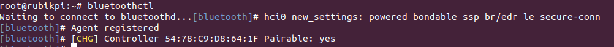

#### Enable Bluetooth
* To enable Bluetooth, run the following command:
```shell
power on
```
Sample output

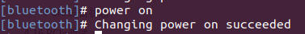


<a id="blue_scan"></a>

#### Perform a Bluetooth scan
* To start a scan for nearby Bluetooth devices, run the following command:
```shell
scan on
```
Sample output

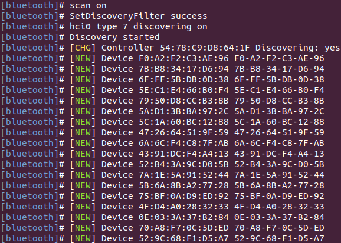

#### Stop the Bluetooth scan
* To stop the ongoing Bluetooth scan, run the following command:

```shell
scan off
```
Sample output

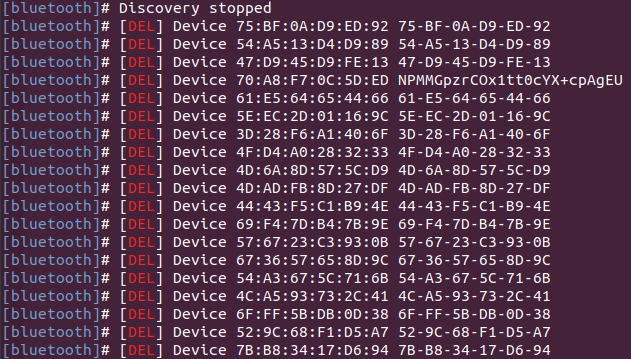

#### Pair with a remote Bluetooth device

Before pairing with the remote device, [perform a Bluetooth scan](#blue_scan) to ensure the remote device is available.
* To pair with the remote Bluetooth device, run the following command:
```shell
pair <bt_address>
```
To accept the active/passive pairing, enter 'yes'. To reject the active/passive pairing, enter 'no'. The parameter `bt_address` is the Bluetooth address of the remote device.

Example

  To pair with the remote device using `<bt_address> 00:25:02:02:7B:A4`, run the following command:

  ```shell
  pair 00:25:02:02:7B:A4
  ```
Sample output
```
[bluetooth] pair 00:25:02:02:7B:A4
Attempting to pair with 00:25:02:02:7B:A4
[bluetooth]# hci0 device_flags_changed: 00:25:02:02:7B:A4 (BR/EDR)
[bluetooth]#      supp: 0x00000001  curr: 0x00000000
[bluetooth]# hci0 00:25:02:02:7B:A4 type BR/EDR connected eir_len 20
[CHG] Device 00:25:02:02:7B:A4 Connected: yes
[OPPO Enco W31]# hci0 new_link_key 00:25:02:02:7B:A4 type 0x04 pin_len 0 store_hint 1
[OPPO Enco W31]# [CHG] Device 00:25:02:02:7B:A4 Bonded: yes
[OPPO Enco W31]# [CHG] Device 00:25:02:02:7B:A4 UUIDs: 00000001-0000-1000-8000-00805f9b34fb
[OPPO Enco W31]# [CHG] Device 00:25:02:02:7B:A4 UUIDs: 00001107-d102-11e1-9b23-00025b00a5a5
[OPPO Enco W31]# [CHG] Device 00:25:02:02:7B:A4 UUIDs: 0000110b-0000-1000-8000-00805f9b34fb
[OPPO Enco W31]# [CHG] Device 00:25:02:02:7B:A4 UUIDs: 0000110e-0000-1000-8000-00805f9b34fb
[OPPO Enco W31]# [CHG] Device 00:25:02:02:7B:A4 UUIDs: 0000110f-0000-1000-8000-00805f9b34fb
[OPPO Enco W31]# [CHG] Device 00:25:02:02:7B:A4 UUIDs: 0000111e-0000-1000-8000-00805f9b34fb
[OPPO Enco W31]# [CHG] Device 00:25:02:02:7B:A4 UUIDs: 00001203-0000-1000-8000-00805f9b34fb
[OPPO Enco W31]# [CHG] Device 00:25:02:02:7B:A4 ServicesResolved: yes
[OPPO Enco W31]# [CHG] Device 00:25:02:02:7B:A4 Paired: yes
[OPPO Enco W31]# Pairing successful
[OPPO Enco W31]# hci0 00:25:02:02:7B:A4 type BR/EDR disconnected with reason 2
[OPPO Enco W31]# [CHG] Device 00:25:02:02:7B:A4 ServicesResolved: no
[CHG] Device 00:25:02:02:7B:A4 Connected: no
[bluetooth]# hci0 00:25:02:02:7B:A4 type BR/EDR connected eir_len 20
[CHG] Device 00:25:02:02:7B:A4 Connected: yes
[OPPO Enco W31]# Authorize service
[agent] Authorize service 0000110d-0000-1000-8000-00805f9b34fb (yes/no): yes
[OPPO Enco W31]# Authorize service
[OPPO Enco W31]#   1;39m[agent] Authorize service 0000111f-0000-1000-8000-00805f9b34fb (yes/no): [CHG] Device 00:25:02:02:7B:A4 UUIDs: 00000001-0000-1000-8000-00805f9b34fb
[agent] Authorize service 0000111f-0000-1000-8000-00805f9b34fb (yes/no): [CHG] Device 00:25:02:02:7B:A4 UUIDs: 00001107-d102-11e1-9b23-00025b00a5a5
[agent] Authorize service 0000111f-0000-1000-8000-00805f9b34fb (yes/no): [CHG] Device 00:25:02:02:7B:A4 UUIDs: 0000110b-0000-1000-8000-00805f9b34fb
[agent] Authorize service 0000111f-0000-1000-8000-00805f9b34fb (yes/no): [CHG] Device 00:25:02:02:7B:A4 UUIDs: 0000110d-0000-1000-8000-00805f9b34fb
[agent] Authorize service 0000111f-0000-1000-8000-00805f9b34fb (yes/no): [CHG] Device 00:25:02:02:7B:A4 UUIDs: 0000110e-0000-1000-8000-00805f9b34fb
[agent] Authorize service 0000111f-0000-1000-8000-00805f9b34fb (yes/no): [CHG] Device 00:25:02:02:7B:A4 UUIDs: 0000110f-0000-1000-8000-00805f9b34fb
[agent] Authorize service 0000111f-0000-1000-8000-00805f9b34fb (yes/no): [CHG] Device 00:25:02:02:7B:A4 UUIDs: 0000111e-0000-1000-8000-00805f9b34fb
[agent] Authorize service 0000111f-0000-1000-8000-00805f9b34fb (yes/no): [CHG] Device 00:25:02:02:7B:A4 UUIDs: 00001203-0000-1000-8000-00805f9b34fb
[agent] Authorize service 0000111f-0000-1000-8000-00805f9b34fb (yes/no): [NEW] Endpoint /org/bluez/hci0/dev_00_25_02_02_7B_A4/sep1 
[agent] Authorize service 0000111f-0000-1000-8000-00805f9b34fb (yes/no): [NEW] Endpoint /org/bluez/hci0/dev_00_25_02_02_7B_A4/sep2       
[agent] Authorize service 0000111f-0000-1000-8000-00805f9b34fb (yes/no): yes
[OPPO Enco W31]#
```

#### Get the list of bonded/paired devices

* To get the list of bonded/paired devices, run the following command:

```shell
devices
```

Sample output

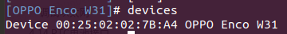

#### Connect to a remote device
* To connect to a remote device, run the following command:
```shell
connect <bt_address>
```
The `<bt_address>` parameter is the Bluetooth address of the remote device.

Example

  To connect to a paired remote device using `<bt_address> 00:25:02:02:7B:A4`, run the following command:

```shell
connect 00:25:02:02:7B:A4
```
Sample output
```
[bluetooth]# connect 00:25:02:02:7B:A4
Attempting to connect to 00:25:02:02:7B:A4
[bluetooth]# [CHG] Device 66:90:8B:13:9F:50 RSSI: 0xffffffb2 (-78)
[bluetooth]# [CHG] Device 00:25:02:02:7B:A4 AddressType: public
[bluetooth]# [CHG] Device 3F:5B:7D:73:30:9E ServiceData.0000fe95-0000-1000-8000-00805f9b34fb:
[bluetooth]#   70 20 5b 04 5e 9e 30 73 7d 5b 3f 09 04 10 02 ff  p [.^.0s}[?.....
[bluetooth]#   00                                               .               
[bluetooth]# [CHG] Device 47:6E:17:4C:2A:3C RSSI: 0xffffffb8 (-72)
[bluetooth]# [NEW] Device 54:38:90:28:DE:0A 54-38-90-28-DE-0A
[bluetooth]# [DEL] Device 28:6B:35:B5:C3:D0 CN8900578W2
[bluetooth]# hci0 00:25:02:02:7B:A4 type BR/EDR connected eir_len 15
[CHG] Device 00:25:02:02:7B:A4 Connected: yes
[OPPO Enco W31]# [NEW] Endpoint /org/bluez/hci0/dev_00_25_02_02_7B_A4/sep1 
[OPPO Enco W31]# [NEW] Endpoint /org/bluez/hci0/dev_00_25_02_02_7B_A4/sep2 
[OPPO Enco W31]# [NEW] Transport /org/bluez/hci0/dev_00_25_02_02_7B_A4/sep1/fd4 
[OPPO Enco W31]# Connection successful
[OPPO Enco W31]# [CHG] Device 00:25:02:02:7B:A4 ServicesResolved: yes
[OPPO Enco W31]# [CHG] Transport /org/bluez/hci0/dev_00_25_02_02_7B_A4/sep1/fd4 State: active
```

#### Unpair a device
* To unpair a device, run the following command:
```Shell
remove <bt_address>
```
Sample output

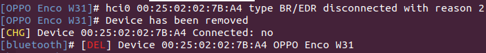

#### Enable discovery mode

* To enable discovery mode on the DUT, run the following command:
```shell
discoverable on
```
Sample output

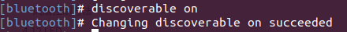

#### Disable Bluetooth

* To disable Bluetooth on the device, run the following command:
```shell
power off
```
Sample output

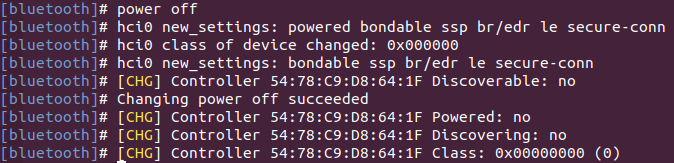


## Audio

RUBIK Pi 3 currently supports the following audio interfaces:

* 3.5mm headphone (No. 4 in the following figure)

* HDMI OUT (No. 9 in the following figure)

* Bluetooth


### Enable the audio function
    1. Add the Qualcomm and RUBIK Pi public personal package archive (PPA) to your RUBIK Pi 3 Ubuntu software sources.
    ```shell
    sudo add-apt-repository ppa:ubuntu-qcom-iot/qcom-noble-ppa
    sudo sed -i '$a deb http://apt.rubikpi.ai ppa main' /etc/apt/sources.list
    sudo apt update
    ```
    2. To install the audio-related software packages, run the following commands:
    ```shell
    sudo apt install libsndfile1 libltdl7 libspeexdsp1 qcom-fastrpc1 \
    rubikpi3-tinyalsa rubikpi3-tinycompress rubikpi3-qcom-agm rubikpi3-qcom-args rubikpi3-qcom-pal \
    rubikpi3-qcom-audio-ftm rubikpi3-qcom-audioroute rubikpi3-qcom-acdbdata rubikpi3-qcom-audio-node \
    rubikpi3-qcom-kvh2xml rubikpi3-qcom-pa-bt-audio rubikpi3-qcom-sva-capi-uv-wrapper rubikpi3-qcom-sva-cnn \
    rubikpi3-qcom-sva-listen-sound-model rubikpi3-qcom-sva-eai rubikpi3-qcom-pa-pal-voiceui rubikpi3-qcom-pa-pal-acd \
    rubikpi3-qcom-audio-plugin-headers rubikpi3-qcom-dac-mer-testapp rubikpi3-qcom-dac-plugin rubikpi3-qcom-mercury-plugin \
    rubikpi3-pulseaudio rubikpi3-diag rubikpi3-dsp rubikpi3-libdmabufheap rubikpi3-qcom-vui-interface rubikpi3-qcom-vui-interface-header \
    rubikpi3-time-genoff rubikpi3-pa-pal-plugins

    sudo usermod -aG audio,pulse,plugdev,video,render ubuntu  # Replace ubuntu with the actual user name
    ```

* Run the following command on RUBIK Pi 3 to view the mounted sound cards:
```shell
cat /proc/asound/cards
```


### Set the audio output device

To change the audio output source for pulseaudio-related commands, run the following commands:

* Set the output device to the 3.5mm headset
```shell
pactl set-default-sink low-latency0
pactl set-sink-port low-latency0 headset
```
* Set the output device to HDMI OUT
```shell
pactl set-default-sink low-latency0
pactl set-sink-port low-latency0 hdmi-out
```

* To set the output device to Bluetooth, refer to [Bluetooth](#blue) and make sure the Bluetooth connection is established.
    * To confirm the audio information supported by the current Bluetooth device, run the following command. There are differences in the audio support between different Bluetooth devices.
    ```shell
    pactl list cards
    ```
    Sample output
    

    * Run the following command to switch the Bluetooth audio output profile.
    ```shell
    pactl set-card-profile <Card-Name> <Profile>
    ```
    Example

    ```shell
    # Switch to the call mode (HFP/HSP).
    pactl set-card-profile bluez_card.00_25_02_02_7B_A4 handsfree_head_unit
    ```
    * Run the following command to view the Bluetooth-related source information.
    ```shell
    pactl list sources
    ```
    Sample output

    

    * Run the following command to switch the Bluetooth audio input interface.
    ```shell
    pactl set-default-source <Source-Name>
    ```
    Example

    ```shell
    pactl set-default-source bluez_source.00_25_02_02_7B_A4.handsfree_head_unit
    ```

### Playback

1. Run the following command to create the */opt* directory and ensure that the */opt* path is readable and writable.
2. Before running the commands, make sure to push the MP3 test file (*FileName.mp3*) to the */opt* directory.
:::

```shell
mkdir /opt
sudo chmod 777 -R /opt
```
* Run the following to test the .mp3 playback.
```shell
paplay /opt/<FileName>.mp3
```

### Recording
* Run them following command to test the .mp3 recording.
```shell
parecord /opt/<FileName>.mp3
```

### Adjust the volume
* Adjust the playback volume
    * Run the following command to check the volume of the output device:
    ```shell
    pactl list sinks | grep -e "Name" -e "Volume" -e "Active Port"
    ```
    Sample output

    

    * Run the following command to modify the volume of the current output device:
    ```shell
    pactl set-sink-volume <Sink-Name> <Volume>
    ```
    Example
    ```shell
    pactl set-sink-volume low-latency0 70%
    ```

* Adjust the recording volume
    * Run the following command to check the volume of the output device:
    ```shell
    pactl list sources | grep -e "Name" -e "Volume" -e "Active Port"
    ```
    Sample output

    

    * Run the following command to modify the volume of the current output device:
    ```shell
    pactl set-source-volume <Source-Name> <Volume>
    ```
    Example

    ```shell
    pactl set-source-volume regular0 70%
    ```

### Capture logs

* User space logs
  
  Perform the following operations to capture user space logs:

  ```shell

  cat /var/log/user.log
  ```

* Kernel audio driver logs

  To capture the kernel logs, please do the following:

  * Kernel logs

    ```shell
    dmesg
    ```

  * Disable kernel logs in a specific file:

    ```shell
    echo –n “file <filename> -p” > /sys/kernel/debug/dynamic_debug/control

    ```

  * Dynamic kernel logs

    By default, dynamic logging is disabled. To enable it, add the `CONFIG_DYNAMIC_DEBUG` kernel configuration, then recompile and reflash the device.
    To enable audio dynamic kernel logs, perform the following steps:

    ```shell
    ssh root@ip-addr
    mount -o rw,remount /
    mount -t debugfs none /sys/kernel/debug
    echo –n “file <filename> +p” > /sys/kernel/debug/dynamic_debug/control
    ```

### Analyze the captured logs

View user space logs and kernel audio driver logs to learn about playback and recording use cases.

* Playback

  The following log snippet describes the information collected for the playback use case.

  ```shell
  //Open Low latency Playback stream. Details of each stream type can be found at sources/audio/opensource/arpal-lx/inc/PalDefs.h
  2022-04-28T18:02:08.748280+00:00 pulseaudio: pal_stream_open: 224: Enter, stream type:1

  //Verify the backend device, sample rate, bitwidth, channels etc
  2022-04-28T18:02:08.748627+00:00 pulseaudio: setDeviceMediaConfig: 1056: CODEC_DMA-LPAIF_WSA-RX-0 rate ch fmt data_fmt 48000 2 2 1

  //Start playback stream
  2022-04-28T18:02:08.751947+00:00 pulseaudio: pal_stream_start: 338: Enter. Stream handle 0xffff94001040K

  //Map the metadata with kvh2xml.h file for playback usecase details.
  2022-04-28T18:02:08.853157+00:00 pulseaudio: metadata_print: 82 key:0xa1000000, value:0xa100000e//PCM_LL_PLAYBACK
  2022-04-28T18:02:08.853395+00:00 pulseaudio: metadata_print: 82 key:0xab000000, value:0x1
  2022-04-28T18:02:08.853660+00:00 pulseaudio: metadata_print: 82 key:0xa2000000, value:0xa2000001//Speaker
  2022-04-28T18:02:08.853881+00:00 pulseaudio: metadata_print: 82 key:0xac000000, value:0xac000002//DEVICEPP_RX_AUDIO_MBDRC

  //Verify the graph opened for playback usecase
  2022-04-28T18:02:08.856934+00:00 pulseaudio: print_graph_alias: 2334 GKV Alias 142 | StreamRX_PCM_LL_Playback_DeviceRX_Speaker_Instance_Instance_1_DevicePP_Rx_Audio_MBDRC
  //graph_open called
  2022-04-28T18:02:08.859509+00:00 pulseaudio: graph_open: 709 graph_handle 0x47534c

  //Configure hardware endpoint module
  2022-04-28T18:02:08.864386+00:00 pulseaudio: configure_hw_ep_media_config: 636 entry mod tag c0000004 miid 43b1 mid 7001023
  2022-04-28T18:02:08.864495+00:00 pulseaudio: configure_hw_ep_media_config: 664 rate 48000 bw 16 ch 2, data_fmt 1
  2022-04-28T18:02:08.864603+00:00 pulseaudio: configure_hw_ep_media_config: 676 exit, ret 0

  //graph_start entry
  2022-04-28T18:02:08.867234+00:00 pulseaudio: graph_start: 899 entry graph_handle 0x47534c
  //Stream started
  2022-04-28T18:02:08.867864+00:00 pulseaudio: pal_stream_start: 387: Exit. status 0

  //graph_stop entry
  2022-04-28T18:02:25.037338+00:00 pulseaudio: graph_stop: 928 entry graph_handle 0x47534c
  //Stop the PAL stream once playback completes
  2022-04-28T18:02:25.039923+00:00 pulseaudio: pal_stream_stop: 441: Exit. status 0

  //graph_close entry
  2022-04-28T18:02:25.050944+00:00 pulseaudio: graph_close: 762 entry handle 0x47534c
  //Close the PAL stream
  2022-04-28T18:02:25.054510+00:00 pulseaudio: pal_stream_close: 322: Exit. status 0

  ```

* Recording

  The following log snippet describes the information collected for the recording use case.

  ```shell
  //Open Recording stream for PAL_STREAM_RAW. Details of stream type can be found at sources/audio/opensource/arpal-lx/inc/PalDefs.h
  Apr 29 09:23:11 pulseaudio[862]: pal_stream_open: 224: Enter, stream type:9

  //Verify the backend device, sample rate, bitwidth, channels etc
  Apr 29 09:23:11 pulseaudio[862]: setDeviceMediaConfig: 1056: CODEC_DMA-LPAIF_VA-TX-0 rate ch fmt data_fmt 48000 1 2 1

  //Start recording stream
  Apr 29 09:23:11 pulseaudio[862]: pal_stream_start: 338: Enter. Stream handle 0xffff6c001040K

  //graph_open entry
  Apr 29 09:23:11 pulseaudio[862]: graph_open: 709 graph_handle 0x47534c

  //Metadata details to identify the usecase
  Apr 29 09:23:11 pulseaudio[862]: metadata_print: 82 key:0xb1000000, value:0xb1000009//RAW_RECORD
  Apr 29 09:23:11 pulseaudio[862]: metadata_print: 82 key:0xa3000000, value:0xa3000004//HANDSETMIC

  //Verify the graph opened for recording usecase
  Apr 29 09:23:11 pulseaudio[862]: print_graph_alias: 2334 GKV Alias 29 | DeviceTX_Handset_Mic_StreamTX_RAW_Record

  //Configure hardware endpoint module
  Apr 29 09:23:11 pulseaudio[862]: configure_hw_ep_media_config: 636 entry mod tag c0000005 miid 43af mid 7001024
  Apr 29 09:23:11 pulseaudio[862]: configure_hw_ep_media_config: 664 rate 48000 bw 16 ch 1, data_fmt 1
  Apr 29 09:23:11 pulseaudio[862]: configure_hw_ep_media_config: 676 exit, ret 0

  //graph_start entry
  Apr 29 09:23:11 pulseaudio[862]: graph_start: 899 entry graph_handle 0x47534c
  //Stream recording started
  Apr 29 09:23:11 pulseaudio[862]: pal_stream_start: 387: Exit. status 0


  //graph_stop entry
  Apr 29 09:23:26 pulseaudio[862]: graph_stop: 928 entry graph_handle 0x47534c
  //Stop the PAL stream once user stops recording
  Apr 29 09:23:26 pulseaudio[862]: D: [regular2] pal-source.c: pal_stream_stop returned 0

  //Close the PAL stream
  Apr 29 09:23:26 pulseaudio[862]: pal_stream_close: 284: Enter. Stream handle :0xffff6c001040K
  //graph_close entry
  Apr 29 09:23:26 pulseaudio[862]: graph_close: 762 entry handle 0x47534c
  //Close the PAL stream
  Apr 29 09:23:26 pulseaudio[862]: pal_stream_close: 322: Exit. status 0

  ```


## Fan

RUBIK Pi 3 is compatible with [Raspberry Pi Active Cooler](https://www.raspberrypi.com/products/active-cooler/):

:::warning

When using RUBIK Pi 3 in high-load or high-performance scenarios, use cooling measures to ensure that the performance of the device is stable. Otherwise, performance may fluctuate due to high CPU temperatures.
:::

### Install the fan

1. **Remove all the thermal pads on the back of the cooler**. Cut the following two pads in the shape of SoC and uMCP of RUBIK Pi 3.


The dimensions of the two pieces are about 14 x 12mm and 13 x 11.5mm.


2. Paste the two thermal pads to the corresponding positions on RUBIK Pi 3.


3. Install the cooler and connect the fan cable.

  

  :::warning
  
  We recommend that you do not remove the fan after installing it on your RUBIK Pi 3. Removal will cause the fan's push pins and thermal pads to degrade and may result in product damage. If the push pins are damaged or deformed or if they do not clip securely, stop using the fan.
  :::

### Control the fan

The fan of RUBIK Pi 3 controls the speed according to the CPU temperature. You can also run the following commands on RUBIK Pi 3 to control the fan speed. 0 and 255 indicate the minimum and maximum speed of the fan respectively.

```shell
echo 100 >  /sys/devices/platform/pwm-fan/hwmon/hwmon*/pwm1
echo 255 >  /sys/devices/platform/pwm-fan/hwmon/hwmon*/pwm1
echo 0 >  /sys/devices/platform/pwm-fan/hwmon/hwmon*/pwm1
```

:::note
Before setting the fan speed to a fixed value, disable CPU thermal management using the `systemctl stop rubikpi-thermal` command.
:::

## LED

RUBIK Pi 3 features an RGB tri-color LED driven by the Power Management IC (PMIC). By default, the green LED is set as a heartbeat indicator to reflect the system's operation status and CPU load. 

LED indicator descriptions:
- Blue LED (solid on): fastboot mode
- Green LED (heartbeat blinking): normal operation
- Red LED (heartbeat blinking): low-power mode (power input is less than 12V 2.25A).
- Rapid heartbeat: high CPU load
- No heartbeat:
  - System crash
  - Sleep mode
  - Booting up

Use the following commands to operate the LED:

* Turn off the heartbeat LED

  ```shell
  echo none > /sys/class/leds/green/trigger
  ```

* Turn on the heartbeat LED

  ```shell
  echo heartbeat > /sys/class/leds/green/trigger
  ```

* Set the brightness of the green LED (from 0 to 511. The following example sets it to 100)

  ```shell
  echo 100 >  /sys/class/leds/green/brightness
  ```

* Set the brightness of the red LED (from 0 to 511. The following example sets it to 100)

  ```shell
  echo 100 >  /sys/class/leds/red/brightness
  ```

* Set the brightness of the blue LED (from 0 to 511. The following example sets it to 100)

  ```shell
  echo 100 >  /sys/class/leds/blue/brightness
  ```

## Ethernet

Ethernet technology is designed to transmit data over a channel using wired technology at different link speeds. It uses cables to transmit data in network models, such as Local Area Network (LAN) and Wide Area Network (WAN) for a reliable, secure, and better network connectivity.

Ethernet connectivity is integrated into IoT devices and sensors, enabling them to transmit data to the network. It is defined under IEEE 802.3 standards and provides a standardized interface for these devices to communicate with gateways.

The Ethernet interface is port 8 in the following figure. RUBIK Pi 3 supports Gigabit Ethernet.

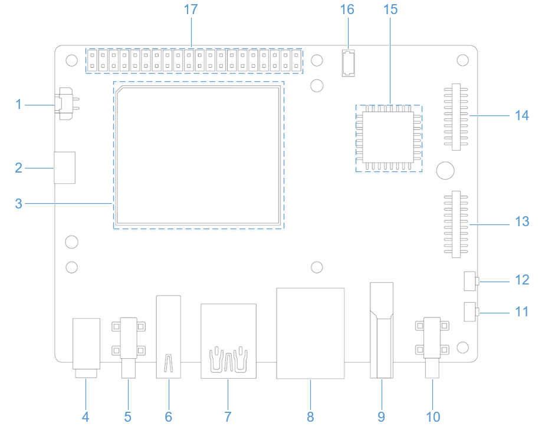

Connect the network cable, as shown in the following figure:


Run the `ifconfig` command on RUBIK Pi 3 to check the network connection. As shown in the following figure, the IP address has been successfully assigned, indicating that the network connection is successful:

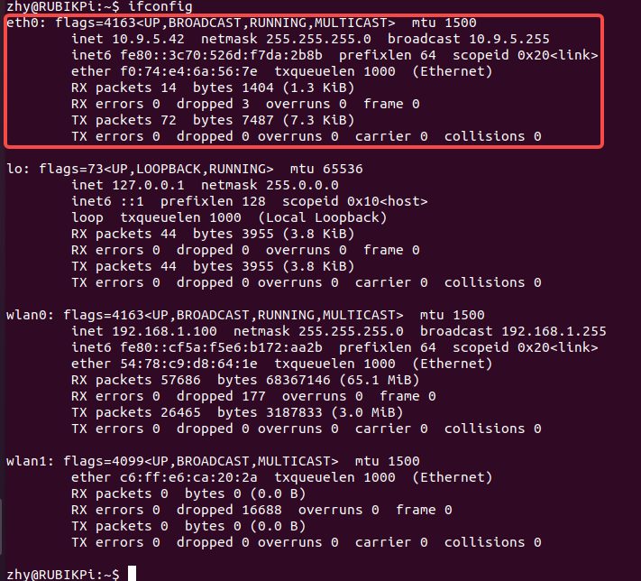
:::note

To install the ifconfig command, run the `sudo apt install net-tools` command.
:::

### Ethernet debugging

Use the following types of logs to record and debug Ethernet-related issues.

* `dmesg`: Debug issues related to kernel drivers.

* `tcpdump`: Verify packet transmission.

To debug potential issues that may occur during Ethernet setup, perform the following steps:

1. To collect `dmesg`  logs and debug issues related to the kernel driver, run the following command:

   ```shell
   dmesg > /var/log/dmesg_logs.txt
   ```

2. To collect `tcpdump` logs and verify packet transmission, run the following command:

   ```shell
   tcpdump -i any -s 0 -w /var/log/tcpdump.pcap
   ```

3. Collect the output from the `ethtool`, `ifconfig`, `netstat`, and IP routing table for debugging.

## RTC battery connector

The real-time clock (RTC) battery connector is port 1 in the following figure.


Connect the RTC battery as shown in the following figure and write the time into the system hardware clock of RUBIK Pi 3. This way, the system time of RUBIK Pi 3 can be saved even if it is completely powered off.


Write the system time to the system hardware clock on RUBIK Pi 3 as follows:

```shell
sudo timedatectl set-time "2025-06-03 21:12:11"
sudo timedatectl set-local-rtc true
```

## M.2 Key M connector

RUBIK Pi 3 provides an M.2 slot for NVMe storage, which can be used to install a 2280 (22 x 80mm) SSD hard drive. The M.2 Key M slot supports PCIe Gen3 x 2 and can deliver an output of up to 3.3V 2A. The switch of the M.2 connector can be individually controlled.

The M.2 Key M connector uses the PCIe1 bus of the QCS6490. The device path is: */sys/bus/pci/devices/0001:00:00.0*

The M.2 Key M connector is connector 18 in the following figure:


The M.2 Key M connector is compatible with the 2280 SSD, as shown in the following figures:


### Verify the PCIe bus functionality
After connecting the 2280 form factor SSD, the device node generated is `/dev/nvme*`.

Use a command similar to the following to mount the SSD. Verify the PCIe bus interface by accessing the contents of the */opt* directory:

```shell
sudo mount /dev/nvme0n1p1 /opt/
```

### PCIe power management

PCIe defines two types of power management methods:

* Software power management, which determines the power management features for each device and manages them individually.

* Systems that do not require software intervention, such as Active State Power Management (ASPM).

When no data packets are being transmitted on the PCIe link, the device puts the PCIe link into a low-power state.

#### PCIe L0 link states

PCIe power management defines the following L0 link states:

* L0: working state

* L0s: ASPM state with low-resume latency (energy saving standby state) 

#### PCIe device states

PCIe power management defines the following device states:

* D0 (mandatory): The device is fully ON. There are two sub-states.

  * D0 (uninitialized): The function is in D0 (uninitialized) state when waiting for enumeration and configuration after exiting the reset state.

  * D0 (active)

    * The function enters the D0 (active) state once the enumeration and configuration process is completed.

    * The function enters the D0 (active) state when the system software enables one or more (in any combination) function parameters, such as memory space enable, I/O space enable, or BME bits.

* D1 (optional): light sleep state

  * The function can only initiate the PME message and cannot initiate other TLPs.

  * The function can only serve as the target for configuration transactions, not for other transactions.

  * The function enters the D1 state via a software command that sets the PM control and status registers.

* D2 (optional): deep sleep state

  * The function can only issue PME messages and cannot issue other TLPs.

  * The function can only serve as the target for configuration transactions, not for other transactions.

  * The function enters the D2 state via software commands that set the PM control and status registers.

* D3 (mandatory): The device is in the lowest power state, and this function must support two types of D3 states:

* D3 (hot)

  * The function can only issue PME messages and cannot issue other TLPs.

  * The function can only serve as the target for configuration transactions, not for other transactions.

  * The function enters D3 (hot) state by issuing a software command that sets the power state field.

* D3(cold): The device enters the D3 (cold) state and is powered off. When power is restored, the device enters the D0 (uninitialized) state.

### PCIe debugging

The M.2 Key M connector uses the PCIe1 bus of the QCS6490. The device path is: */sys/bus/pci/devices/0001:00:00.0*

The `lspci` and `setpci` commands are native to Linux distributions. These two commands provide multiple levels of output and can also be used to view the capabilities and states of different components trained on the PCI bus at a given time. Most of these capabilities reflect the configuration space registers required by the PCIe basic specification. For more detailed information, visit https://pcisig.com/specifications. To view the usage instructions, run the following command:

```shell
lspci --help
```

The following features help in debugging PCIe issues:

* Display device information.

  ```shell
  lspci
  ```

  Sample output

  ```shell
  0000:00:00.0 PCI bridge: Qualcomm Device 010b
  0000:01:00.0 USB controller: Renesas Technology Corp. uPD720201 USB 3.0 Host Controller (rev 03)
  0001:00:00.0 PCI bridge: Qualcomm Device 010b
  ```

* Show PCIe device and vendor IDs in the device control registers.

  ```shell
  lspci -nvmm
  ```

  Sample output

  ```shell
  Slot:        00:00.0
  Class:        0604
  Vendor:        17cb
  Device:        010b
  IOMMUGroup:        6

  Slot:        01:00.0
  Class:        0c03
  Vendor:        1912
  Device:        0014
  Rev:        03
  ProgIf:        30
  IOMMUGroup:        6

  Slot:        0001:00:00.0
  Class:        0604
  Vendor:        17cb
  Device:        010b
  DTNode:        /sys/firmware/devicetree/base/soc@0/pci@1c08000/pcie@1
  IOMMUGroup:        7

  ```
