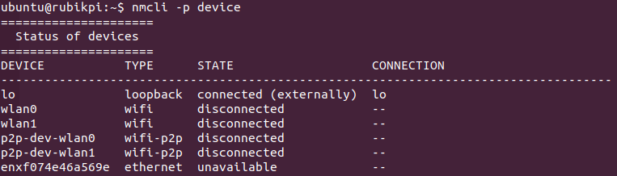

# FAQ

* How can I restore the device?

  1. Download the software.

  2. Force the device into Emergency Download (EDL) mode.

  3. Flash the downloaded software.

* How can I flash the Configuration Data Table (CDT)?

  The CDT provides platform or device-related data, such as the platform ID, subtype, and version. Various software (driver/firmware) modules can use this information to dynamically detect and initialize the platform. It is already integrated into the software package by default, and the following steps can be performed if needed.

  :::note
  
  Ensure that the device is in EDL mode. For more information, refer to [Enter EDL mode.](./5.update-software.md#enter-edl-mode)
  :::

  1. Click [here](https://thundercomm.s3.dualstack.ap-northeast-1.amazonaws.com/uploads/web/rubik-pi-3/tools/RUBIKPI_CDT.zip) to download the required CDT.

  2. To flash the CDT, run the following command:

  ```xml
  ./qdl prog_firehose_ddr.elf rawprogram3.xml patch3.xml
  ```

* How can I configure Universal Flash Storage (UFS)?

  * Refer to [Flash using the QDL tool.](./5.update-software.md#flash-using-the-qdl-tool)

* How can I force the device into Emergency Download (EDL) mode?

  * Refer to [Enter EDL mode.](./5.update-software.md#enter-edl-mode)

* How can I install and connect Android Debug Bridge (ADB) on the host?

  The `adb` command can simplify various device operations, such as debugging, capturing kernel logs, and pushing applications and files to the target device.

  1. Click [here](https://thundercomm.s3.ap-northeast-1.amazonaws.com/uploads/web/rubik-pi-3/tools/qud/qud.win.1.1_installer_10061.1.zip) to download the QUD driver.

  2. Run the following command on the Linux host.

  ```powershell
  sudo apt install git android-tools-adb android-tools-fastboot wget
  ```

  3. To verify the version of ADB on the Linux host, run the following command:

  ```css
  adb --version
  ```

  4. Connect the RUBIK Pi device to the host using a USB Type-C cable. Ensure that the device is displayed as an ADB device.

  ```plaintext
  adb devices
  ```

  5. Run the following command to enter the shell:

  ```plaintext
  adb shell
  ```

* When already connected to a network, how do I reconnect to a different one?

  1. To disconnect from the current network, run the following command:

  ```plaintext
  sudo nmcli c down <WiFi-SSID>
  ```

  Example

  ```shell
  sudo nmcli c down RUBIKPiWiFi
  ```
  ```shell
  Connection 'RUBIKPiWiFi' successfully deactivated (D-Bus active path: /org/freedesktop/NetworkManager/ActiveConnection/2)
  ```

  2. To verify that you have disconnected, run the following command:

  ```css
  nmcli -p device
  ```

  

  3. To connect to a different Wi-Fi network, run the following command:

  ```shell
  nmcli dev wifi connect <WiFi-SSID> password <WiFi-password>
  ```

  Example

  ```shell
  nmcli dev wifi connect RUBIKPiWiFi password 1234567890
  ```
  ```shell
  Device 'wlan0' successfully activated with 'd7b990bd-3b77-4b13-b239-b706553abaf8'.
  ```

* How can I use Minicom to set up the debug UART?

  * Refer to [Set up the debug UART](./2.setup-device.md#set-up-the-debug-uart).

* How do I switch to the root user?

  Run the following command:

  ```shell
  sudo -i
  ```

* How can I switch from the desktop version to the service version?

  1. Refer to [Connect to the network.](./2.setup-device.md#connect-to-the-network) Ensure that the network connection is normal.

  2. Run the following commands to switch from the desktop version to service version.

  ```shell
  sudo add-apt-repository ppa:ubuntu-qcom-iot/qcom-noble-ppa 
  sudo apt update
  sudo apt upgrade -y
  sudo apt-get install qcom-adreno1
  sudo apt-get remove ubuntu-desktop
  sudo apt remove gdm3
  sudo reboot
  ```

* How can I switch from the service version to the desktop version?

  1. Refer to [Connect to the network.](./2.setup-device.md#connect-to-the-network) Ensure that the network connection is normal.

  2. Run the following commands to switch from the service version to desktop version.

  ```shell
  sudo add-apt-repository ppa:ubuntu-qcom-iot/qcom-noble-ppa
  sudo apt update
  sudo apt upgrade -y
  sudo apt install qcom-adreno1- libgbm-msm1- libegl-mesa0 libegl1 libgles2 libglvnd0 libvulkan1
  sudo apt install ubuntu-desktop
  sudo reboot
  ```

* How do I update the USB and Ethernet controller firmware?

  1. To download the firmware, register and log in to the [Renesas](https://www.renesas.com/) website. After logging in, you can access the firmware from this [link](https://www.renesas.com/us/en/products/interface/usb-switches-hubs/upd720201-usb-30-host-controller#design_development).

  2. On the Linux host, use the scp command to copy the firmware to the device.

  ```python
  scp renesas_usb_fw.mem ubuntu@<WIFI-IP>:~
  ```

  3. Add the firmware to the device's image.

  ```python
  sudo cp ~ubuntu/renesas_usb_fw.mem /lib/firmware
  sudo mkinitramfs -o /boot/initrd.img-$(uname -r)
  sudo reboot
  ```

  4. Check that the firmware is added successfully.

  ```python
  sudo lsinitramfs /boot/initrd.img-$(uname -r) | grep renesas
  ```

* How do I troubleshoot issues related to flashing?

    :::note
    Ensure that the host is not running the ModemManager tool, as it can interfere with QDL flashing.
    :::

  If you are using a Linux distribution with systemd, use the following command to stop the ModemManager tool:

  ```css
  sudo systemctl stop ModemManager
  ```

  * If you need to use the ModemManager tool, restart it after the flashing process is complete.

  If the flashing process fails, follow these steps and then retry the flashing procedure:

  1. Power off the device.

  2. Disconnect the device from the host.

  3. Restart the host.

* How can I do 3D printing using the case design material provided by RUBIK Pi?

## Further support

Post your questions on the [RUBIK Pi forum](https://community.rubikpi.ai/). 