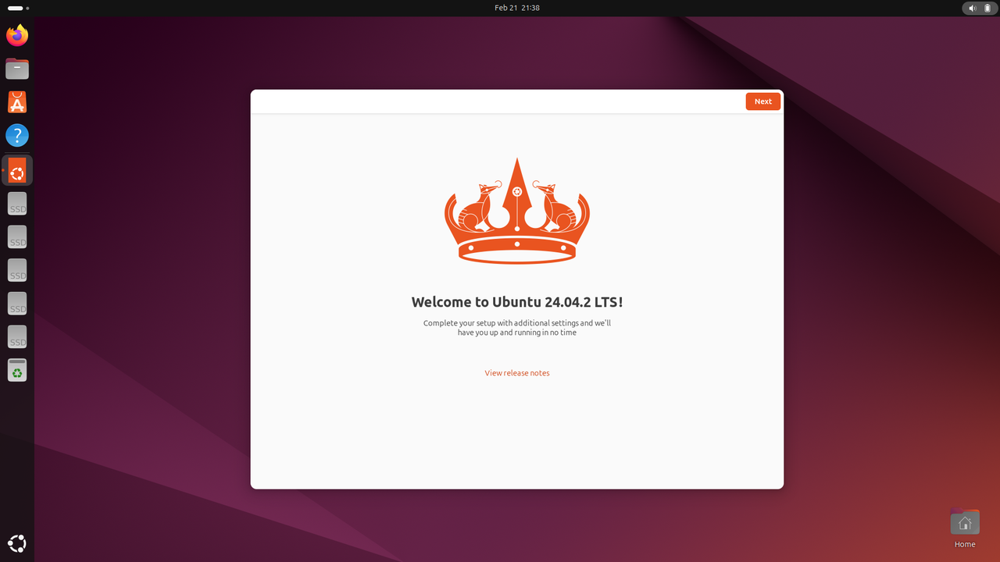

---
# Display h2 to h4 headings
toc_min_heading_level: 2
toc_max_heading_level: 4
---

import Tabs from '@theme/Tabs';
import TabItem from '@theme/TabItem';

# Comparison Between Ubuntu Desktop Version and Server Version

Ubuntu Desktop and Server are the two primary versions of the Ubuntu operating system, each tailored for distinct usage scenarios and requirements.The following are the main differences between them:

| Dimension         | Ubuntu 24.04 Desktop Version                   | Ubuntu 24.04 Server Version                   |
|--------------|-----------------------------------------|-------------------------------------------|
| Design goal     | Interactive experience, multitasking                    | Service stability, resource efficiency                      |
| User interface     | Graphical (GNOME)                         | Command line interface (CLI)                             |
| Memory usage     | Relatively high (GUI resident)                         | Relatively low                                  |
| Qualcomm AI support | Supports non-graphical AI                     | Supported                   |
| GPU driver     | Uses freedreno                          | Uses adreno                           |
| CSI camera   | Supported                                    | Supported (requires Weston for preview)                           |


## Conversion between Ubuntu desktop and server Versions

### Switch from Ubuntu desktop version to server version

  1. Refer to [Connect to the network](1.quick-start/2.set-up-your-device.md#connect-to-the-network) to ensure proper network connectivity.

  2. Execute the following commands to switch from the desktop version to the server version:

  ```shell
  sudo add-apt-repository ppa:ubuntu-qcom-iot/qcom-noble-ppa
  sudo apt update
  sudo apt upgrade -y
  sudo apt-get install qcom-adreno1
  sudo apt-get remove ubuntu-desktop
  sudo apt remove gdm3
  sudo reboot
  ```
  3. After the system boots, the following interface appears, indicating a successful switch:
  

### Switch from Ubuntu server version to desktop version

  1. Refer to [Connect to the network](1.quick-start/2.set-up-your-device.md#connect-to-the-network) to ensure proper network connectivity.

  2. Execute the following commands to switch from the server version to the desktop version:

  ```shell
  sudo add-apt-repository ppa:ubuntu-qcom-iot/qcom-noble-ppa
  sudo apt update
  sudo apt upgrade -y
  sudo apt install qcom-adreno1- libgbm-msm1- libegl-mesa0 libegl1 libgles2 libglvnd0 libvulkan1
  sudo apt install ubuntu-desktop
  sudo reboot
  ```
  3. After the system boots, the following interface appears, indicating a successful switch:
    
